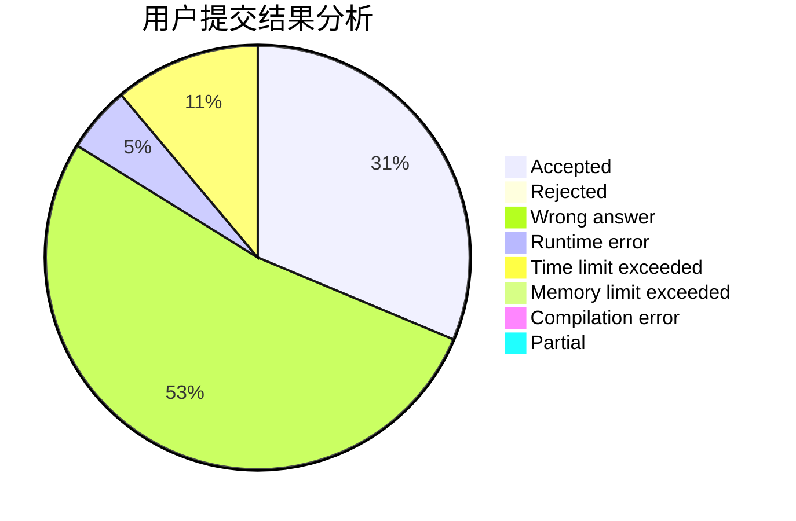
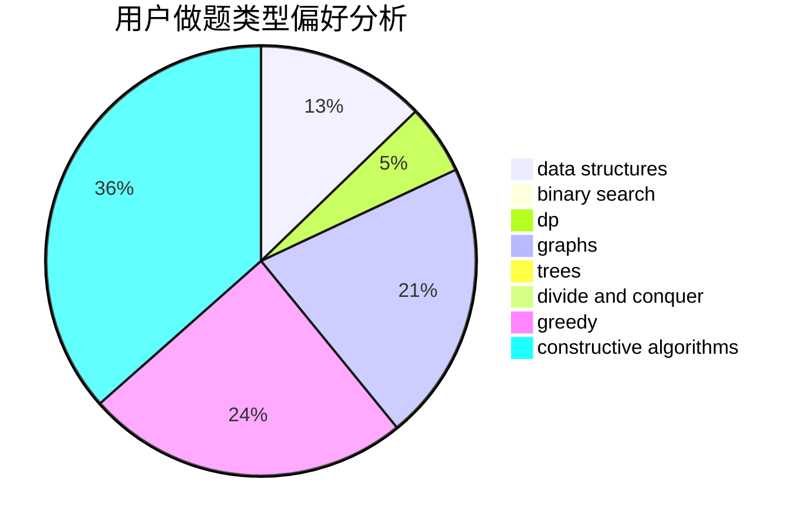
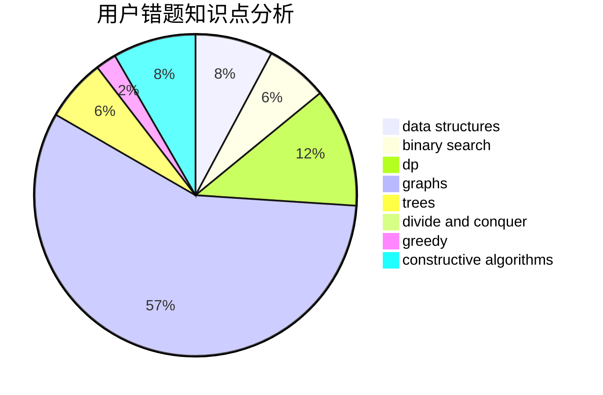

# TrembingFly

<!-- tabs:start -->

#### **用户提交结果分析**

#### **用户做题类型偏好分析**

#### **用户错题知识点分析**

<!-- tabs:end -->
# 推荐题目
[1504B](https://codeforces.com/contest/1504/problem/B)		constructive algorithms,
                        greedy,
                        implementation,
                        math		  
[289D](https://codeforces.com/contest/289/problem/D)		dsu,graphs,sortings,trees		  
[631E](https://codeforces.com/contest/631/problem/E)		data structures,
                        dp,
                        geometry		  
[558E](https://codeforces.com/contest/558/problem/E)		data structures,
                        sortings,
                        strings		  
[263A](https://codeforces.com/contest/263/problem/A)		implementation		  
[940B](https://codeforces.com/contest/940/problem/B)		dp,
                        greedy		  
[1413C](https://codeforces.com/contest/1413/problem/C)		binary search,
                        brute force,
                        dp,
                        implementation,
                        sortings,
                        two pointers		  
[876C](https://codeforces.com/contest/876/problem/C)		dsu,graphs,sortings,trees		  
[357B](https://codeforces.com/contest/357/problem/B)		constructive algorithms,
                        implementation		  
[520E](https://codeforces.com/contest/520/problem/E)		combinatorics,
                        dp,
                        math,
                        number theory		  
