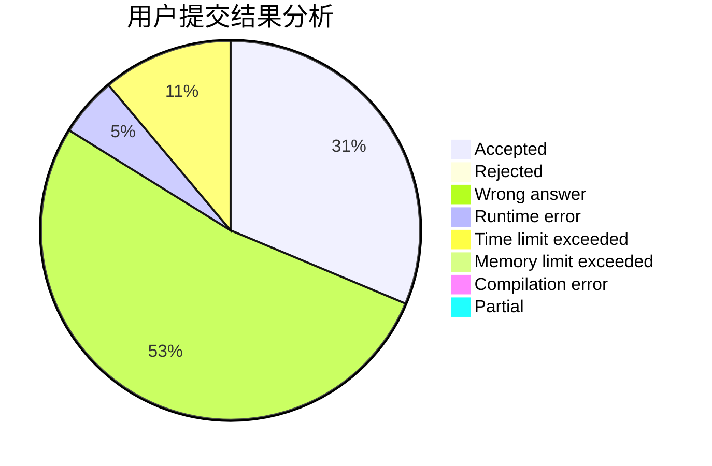
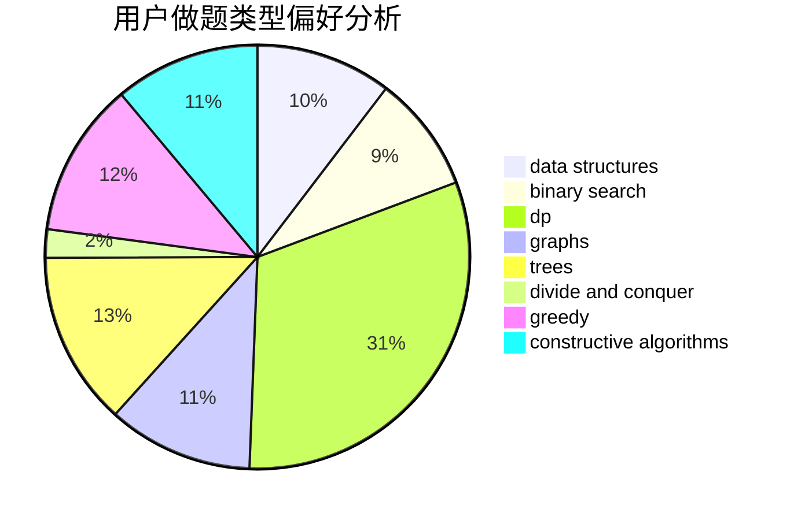
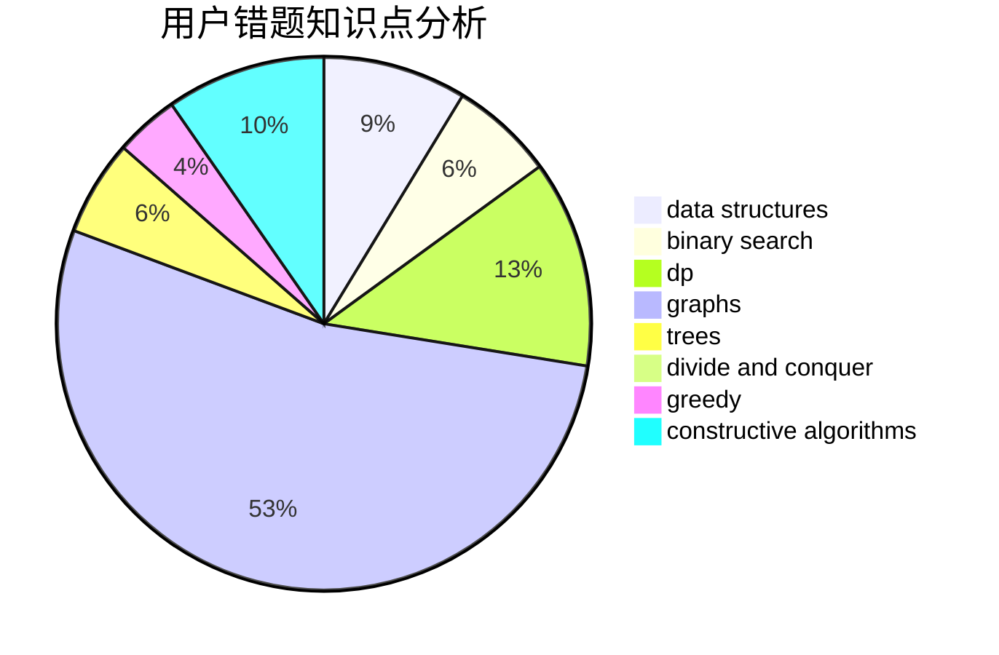

# TrembingFly

<!-- tabs:start -->

#### **用户提交结果分析**

#### **用户做题类型偏好分析**

#### **用户错题知识点分析**

<!-- tabs:end -->
# 推荐题目
[1495B](https://codeforces.com/contest/1495/problem/B)		games,
                        greedy		  
[273E](https://codeforces.com/contest/273/problem/E)		dp,
                        games		  
[612C](https://codeforces.com/contest/612/problem/C)		data structures,
                        expression parsing,
                        math		  
[535E](https://codeforces.com/contest/535/problem/E)		geometry,
                        math		  
[241D](https://codeforces.com/contest/241/problem/D)		nan		  
[920B](https://codeforces.com/contest/920/problem/B)		implementation		  
[1402A](https://codeforces.com/contest/1402/problem/A)		*special problem,
                        data structures,
                        dsu,
                        implementation,
                        math,
                        sortings		  
[858F](https://codeforces.com/contest/858/problem/F)		constructive algorithms,
                        dfs and similar,
                        graphs		  
[329E](https://codeforces.com/contest/329/problem/E)		math		  
[4D](https://codeforces.com/contest/4/problem/D)		dp,
                        sortings		  
