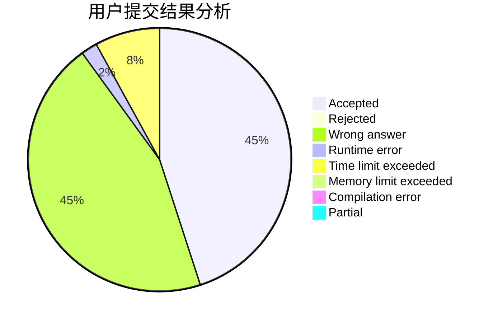
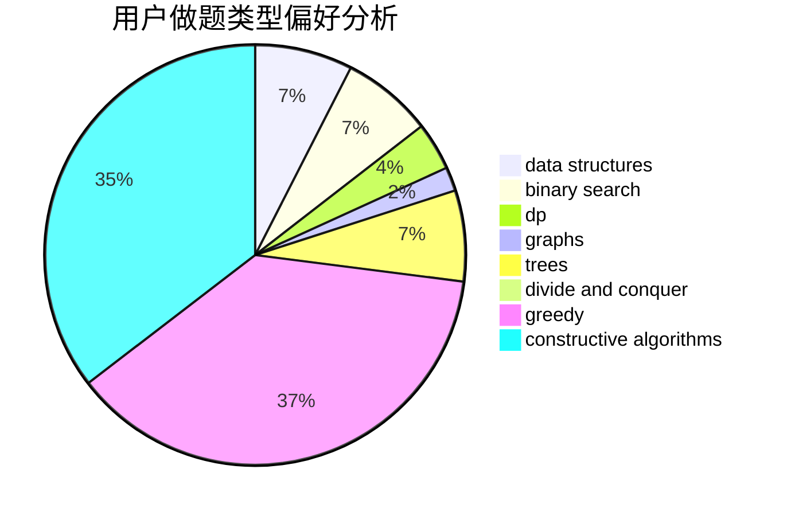

# Trote_w

<!-- tabs:start -->

#### **用户提交结果分析**

#### **用户做题类型偏好分析**

#### **用户错题知识点分析**

<!-- tabs:end -->
# 推荐题目
[543C](https://codeforces.com/contest/543/problem/C)		bitmasks,
                        dp		  
[317D](https://codeforces.com/contest/317/problem/D)		dp,
                        games		  
[274C](https://codeforces.com/contest/274/problem/C)		brute force,
                        geometry		  
[8D](https://codeforces.com/contest/8/problem/D)		binary search,
                        geometry		  
[825C](https://codeforces.com/contest/825/problem/C)		greedy,
                        implementation		  
[860D](https://codeforces.com/contest/860/problem/D)		dsu,graphs,sortings,trees		  
[851D](https://codeforces.com/contest/851/problem/D)		dsu,graphs,sortings,trees		  
[1375C](https://codeforces.com/contest/1375/problem/C)		constructive algorithms,
                        data structures,
                        greedy		  
[62E](https://codeforces.com/contest/62/problem/E)		dp,
                        flows		  
[924E](https://codeforces.com/contest/924/problem/E)		nan		  
