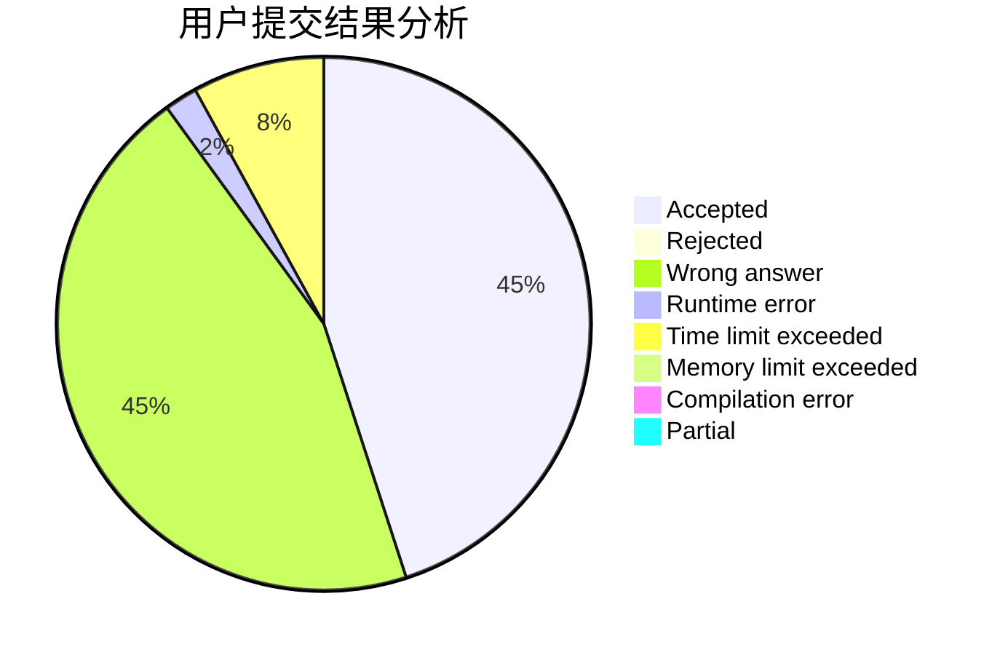
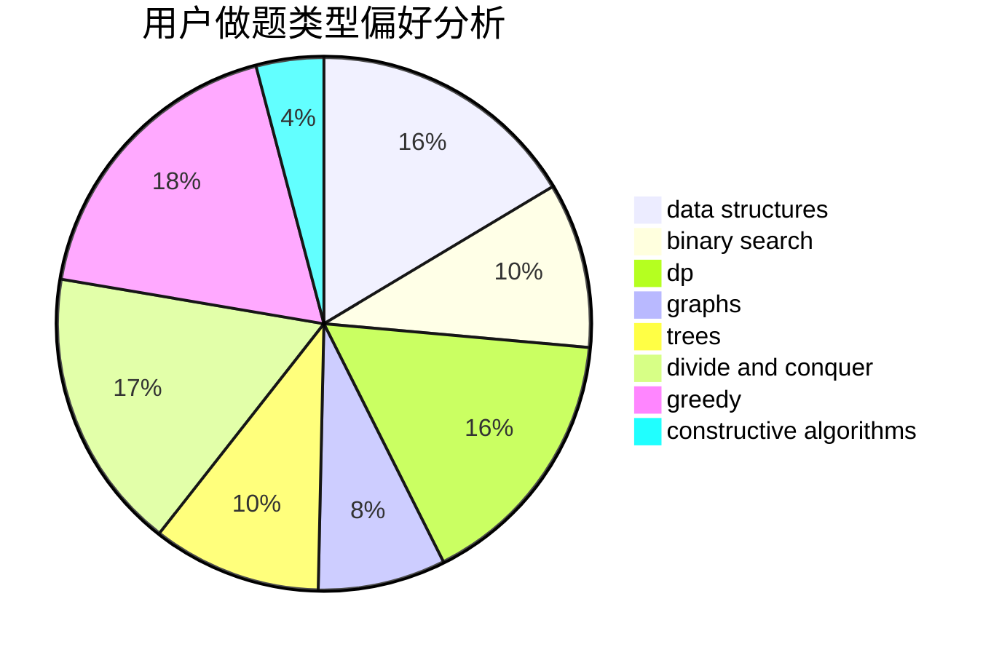

# Trote_w

<!-- tabs:start -->

#### **用户提交结果分析**

#### **用户做题类型偏好分析**

#### **用户错题知识点分析**

<!-- tabs:end -->
# 推荐题目
[567E](https://codeforces.com/contest/567/problem/E)		dfs and similar,
                        graphs,
                        hashing,
                        shortest paths		  
[347A](https://codeforces.com/contest/347/problem/A)		constructive algorithms,
                        implementation,
                        sortings		  
[28B](https://codeforces.com/contest/28/problem/B)		dfs and similar,
                        dsu,
                        graphs		  
[916B](https://codeforces.com/contest/916/problem/B)		bitmasks,
                        greedy,
                        math		  
[843D](https://codeforces.com/contest/843/problem/D)		graphs,
                        shortest paths		  
[878D](https://codeforces.com/contest/878/problem/D)		bitmasks		  
[870A](https://codeforces.com/contest/870/problem/A)		brute force,
                        implementation		  
[1384A](https://codeforces.com/contest/1384/problem/A)		constructive algorithms,
                        greedy,
                        strings		  
[659G](https://codeforces.com/contest/659/problem/G)		combinatorics,
                        dp,
                        number theory		  
[948C](https://codeforces.com/contest/948/problem/C)		dsu,graphs,sortings,trees		  
