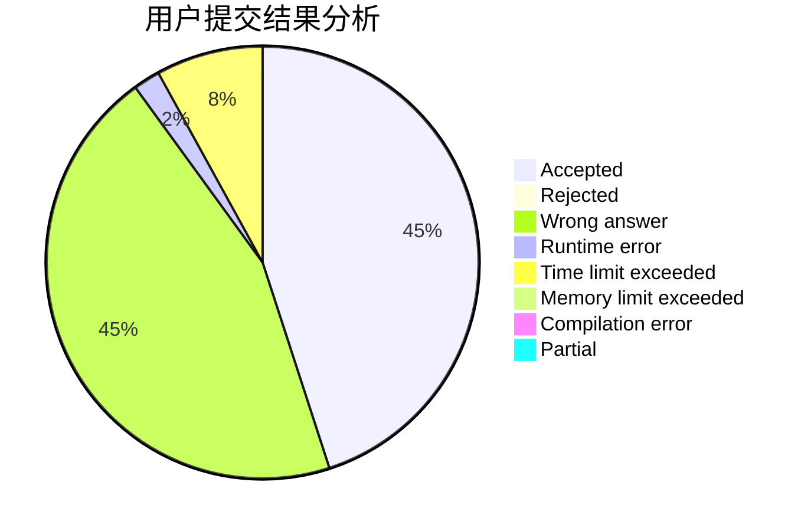
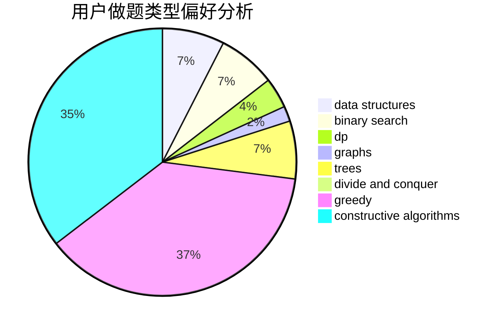

# Trote_w
<!-- tabs:start -->
#### **用户提交结果分析**

#### **用户做题类型偏好分析**

#### **用户错题知识点分析**

<!-- tabs:end -->
# 推荐题目
[Ehab and a weird weight formula](http://codeforces.com/problemset/problem/1088/F)		data structures,
                        trees		  
[DZY Loves Games](http://codeforces.com/problemset/problem/446/D)		math,
                        matrices,
                        probabilities		  
[Remembering Strings](http://codeforces.com/problemset/problem/543/C)		bitmasks,
                        dp		  
[Plate Game](http://codeforces.com/problemset/problem/197/A)		constructive algorithms,
                        games,
                        math		  
[Game with Powers](http://codeforces.com/problemset/problem/317/D)		dp,
                        games		  
[Big Secret](https://codeforces.com/contest/966/problem/C)		constructive algorithms,
                        math		  
[Joysticks](http://codeforces.com/problemset/problem/651/A)		dp,
                        greedy,
                        implementation,
                        math		  
[May Holidays](https://codeforces.com/contest/966/problem/E)		data structures,
                        trees		  
[World Evil](http://codeforces.com/problemset/problem/62/E)		dp,
                        flows		  
[Marco and GCD Sequence](http://codeforces.com/problemset/problem/894/C)		constructive algorithms,
                        math		  
<!-- tabs:start -->
#### **data structures**
[Ehab and a weird weight formula](http://codeforces.com/problemset/problem/1088/F)		data structures,
                        trees		  
[DZY Loves Games](https://codeforces.com/contest/966/problem/E)		data structures,
                        trees		  
[Remembering Strings](https://codeforces.com/contest/635/problem/E)		data structures,
                        divide and conquer,
                        greedy		  
[Plate Game](https://codeforces.com/contest/947/problem/C)		data structures,
                        greedy,
                        strings,
                        trees		  
[Game with Powers](http://codeforces.com/problemset/problem/452/F)		data structures,
                        divide and conquer,
                        hashing		  
[Big Secret](https://codeforces.com/contest/1261/problem/B2)		data structures,
                        greedy		  
[Joysticks](http://codeforces.com/problemset/problem/1320/E)		data structures,
                        dfs and similar,
                        dp,
                        shortest paths,
                        trees		  
[May Holidays](http://codeforces.com/problemset/problem/549/F)		data structures,
                        divide and conquer		  
[World Evil](http://codeforces.com/problemset/problem/1379/D)		binary search,
                        brute force,
                        data structures,
                        sortings,
                        two pointers		  
[Marco and GCD Sequence](http://codeforces.com/problemset/problem/1508/C)		data structures,
                        dfs and similar,
                        dsu,
                        graphs,
                        greedy,
                        math		  
#### **binary search**
[Ehab and a weird weight formula](http://codeforces.com/problemset/problem/8/D)		binary search,
                        geometry		  
[DZY Loves Games](http://codeforces.com/problemset/problem/1379/D)		binary search,
                        brute force,
                        data structures,
                        sortings,
                        two pointers		  
[Remembering Strings](http://codeforces.com/problemset/problem/1491/F)		binary search,
                        constructive algorithms,
                        interactive		  
[Plate Game](http://codeforces.com/problemset/problem/1250/J)		binary search,
                        greedy		  
[Game with Powers](http://codeforces.com/problemset/problem/1492/C)		binary search,
                        data structures,
                        dp,
                        greedy,
                        two pointers		  
[Big Secret](http://codeforces.com/problemset/problem/1463/D)		binary search,
                        constructive algorithms,
                        greedy,
                        two pointers		  
[Joysticks](http://codeforces.com/problemset/problem/1490/G)		binary search,
                        data structures,
                        math		  
[May Holidays](http://codeforces.com/problemset/problem/1479/D)		binary search,
                        bitmasks,
                        brute force,
                        data structures,
                        probabilities,
                        trees		  
[World Evil](http://codeforces.com/problemset/problem/1436/E)		binary search,
                        data structures,
                        two pointers		  
[Marco and GCD Sequence](http://codeforces.com/problemset/problem/1461/D)		binary search,
                        brute force,
                        data structures,
                        divide and conquer,
                        implementation,
                        sortings		  
#### **dp**
[Ehab and a weird weight formula](http://codeforces.com/problemset/problem/543/C)		bitmasks,
                        dp		  
[DZY Loves Games](http://codeforces.com/problemset/problem/317/D)		dp,
                        games		  
[Remembering Strings](http://codeforces.com/problemset/problem/651/A)		dp,
                        greedy,
                        implementation,
                        math		  
[Plate Game](http://codeforces.com/problemset/problem/62/E)		dp,
                        flows		  
[Game with Powers](http://codeforces.com/problemset/problem/1040/B)		dp,
                        greedy,
                        math		  
[Big Secret](http://codeforces.com/problemset/problem/894/E)		dp,
                        graphs		  
[Joysticks](http://codeforces.com/problemset/problem/1140/E)		combinatorics,
                        divide and conquer,
                        dp		  
[May Holidays](http://codeforces.com/problemset/problem/1264/D1)		combinatorics,
                        dp,
                        probabilities		  
[World Evil](http://codeforces.com/problemset/problem/1320/E)		data structures,
                        dfs and similar,
                        dp,
                        shortest paths,
                        trees		  
[Marco and GCD Sequence](http://codeforces.com/problemset/problem/13/C)		dp,
                        sortings		  
#### **graph**
[Ehab and a weird weight formula](https://codeforces.com/contest/860/problem/D)		constructive algorithms,
                        dfs and similar,
                        graphs		  
[DZY Loves Games](http://codeforces.com/problemset/problem/894/E)		dp,
                        graphs		  
[Remembering Strings](https://codeforces.com/contest/1161/problem/A)		graphs		  
[Plate Game](http://codeforces.com/problemset/problem/1508/C)		data structures,
                        dfs and similar,
                        dsu,
                        graphs,
                        greedy,
                        math		  
[Game with Powers](https://codeforces.com/contest/709/problem/E)		data structures,
                        dfs and similar,
                        dp,
                        graphs,
                        greedy,
                        trees		  
[Big Secret](http://codeforces.com/problemset/problem/1485/D)		constructive algorithms,
                        graphs,
                        math,
                        number theory		  
[Joysticks](http://codeforces.com/problemset/problem/1428/B)		graphs,
                        implementation		  
[May Holidays](http://codeforces.com/problemset/problem/1487/C)		brute force,
                        constructive algorithms,
                        dfs and similar,
                        graphs,
                        greedy,
                        implementation,
                        math		  
[World Evil](http://codeforces.com/problemset/problem/1437/C)		dp,
                        flows,
                        graph matchings,
                        greedy,
                        math,
                        sortings		  
[Marco and GCD Sequence](http://codeforces.com/problemset/problem/1470/D)		constructive algorithms,
                        dfs and similar,
                        graph matchings,
                        graphs,
                        greedy		  
#### **trees**
[Ehab and a weird weight formula](http://codeforces.com/problemset/problem/1088/F)		data structures,
                        trees		  
[DZY Loves Games](https://codeforces.com/contest/966/problem/E)		data structures,
                        trees		  
[Remembering Strings](https://codeforces.com/contest/947/problem/C)		data structures,
                        greedy,
                        strings,
                        trees		  
[Plate Game](http://codeforces.com/problemset/problem/1320/E)		data structures,
                        dfs and similar,
                        dp,
                        shortest paths,
                        trees		  
[Game with Powers](https://codeforces.com/contest/709/problem/E)		data structures,
                        dfs and similar,
                        dp,
                        graphs,
                        greedy,
                        trees		  
[Big Secret](http://codeforces.com/problemset/problem/1479/D)		binary search,
                        bitmasks,
                        brute force,
                        data structures,
                        probabilities,
                        trees		  
[Joysticks](http://codeforces.com/problemset/problem/1511/C)		brute force,
                        data structures,
                        implementation,
                        trees		  
[May Holidays](http://codeforces.com/problemset/problem/1499/F)		combinatorics,
                        dfs and similar,
                        dp,
                        trees		  
[World Evil](http://codeforces.com/problemset/problem/1491/E)		brute force,
                        dfs and similar,
                        divide and conquer,
                        number theory,
                        trees		  
[Marco and GCD Sequence](http://codeforces.com/problemset/problem/1466/D)		data structures,
                        greedy,
                        sortings,
                        trees		  
#### **divide and conquer**
[Ehab and a weird weight formula](https://codeforces.com/contest/635/problem/E)		data structures,
                        divide and conquer,
                        greedy		  
[DZY Loves Games](http://codeforces.com/problemset/problem/1140/E)		combinatorics,
                        divide and conquer,
                        dp		  
[Remembering Strings](http://codeforces.com/problemset/problem/452/F)		data structures,
                        divide and conquer,
                        hashing		  
[Plate Game](http://codeforces.com/problemset/problem/549/F)		data structures,
                        divide and conquer		  
[Game with Powers](http://codeforces.com/problemset/problem/678/F)		data structures,
                        divide and conquer,
                        geometry		  
[Big Secret](http://codeforces.com/problemset/problem/1461/D)		binary search,
                        brute force,
                        data structures,
                        divide and conquer,
                        implementation,
                        sortings		  
[Joysticks](http://codeforces.com/problemset/problem/1466/G)		combinatorics,
                        divide and conquer,
                        hashing,
                        math,
                        string suffix structures,
                        strings		  
[May Holidays](http://codeforces.com/problemset/problem/1490/D)		dfs and similar,
                        divide and conquer,
                        implementation		  
[World Evil](https://codeforces.com/contest/1483/problem/C)		data structures,
                        divide and conquer,
                        dp		  
[Marco and GCD Sequence](http://codeforces.com/problemset/problem/1491/E)		brute force,
                        dfs and similar,
                        divide and conquer,
                        number theory,
                        trees		  
#### **greedy**
[Ehab and a weird weight formula](http://codeforces.com/problemset/problem/651/A)		dp,
                        greedy,
                        implementation,
                        math		  
[DZY Loves Games](https://codeforces.com/contest/635/problem/E)		data structures,
                        divide and conquer,
                        greedy		  
[Remembering Strings](https://codeforces.com/contest/947/problem/C)		data structures,
                        greedy,
                        strings,
                        trees		  
[Plate Game](http://codeforces.com/problemset/problem/1040/B)		dp,
                        greedy,
                        math		  
[Game with Powers](http://codeforces.com/problemset/problem/1144/D)		constructive algorithms,
                        greedy		  
[Big Secret](http://codeforces.com/problemset/problem/1038/C)		greedy,
                        sortings		  
[Joysticks](http://codeforces.com/problemset/problem/1178/C)		combinatorics,
                        greedy,
                        math		  
[May Holidays](https://codeforces.com/contest/1261/problem/B2)		data structures,
                        greedy		  
[World Evil](https://codeforces.com/contest/146/problem/C)		greedy,
                        implementation		  
[Marco and GCD Sequence](http://codeforces.com/problemset/problem/1250/J)		binary search,
                        greedy		  
#### **constructive algorithms**
[Ehab and a weird weight formula](http://codeforces.com/problemset/problem/197/A)		constructive algorithms,
                        games,
                        math		  
[DZY Loves Games](https://codeforces.com/contest/966/problem/C)		constructive algorithms,
                        math		  
[Remembering Strings](http://codeforces.com/problemset/problem/894/C)		constructive algorithms,
                        math		  
[Plate Game](https://codeforces.com/contest/860/problem/D)		constructive algorithms,
                        dfs and similar,
                        graphs		  
[Game with Powers](http://codeforces.com/problemset/problem/1144/D)		constructive algorithms,
                        greedy		  
[Big Secret](http://codeforces.com/problemset/problem/1491/F)		binary search,
                        constructive algorithms,
                        interactive		  
[Joysticks](http://codeforces.com/problemset/problem/1375/C)		constructive algorithms,
                        data structures,
                        greedy		  
[May Holidays](http://codeforces.com/problemset/problem/1485/D)		constructive algorithms,
                        graphs,
                        math,
                        number theory		  
[World Evil](http://codeforces.com/problemset/problem/1493/A)		constructive algorithms,
                        greedy		  
[Marco and GCD Sequence](http://codeforces.com/problemset/problem/1463/D)		binary search,
                        constructive algorithms,
                        greedy,
                        two pointers		  
#### **sortings**
[Ehab and a weird weight formula](http://codeforces.com/problemset/problem/15/A)		implementation,
                        sortings		  
[DZY Loves Games](http://codeforces.com/problemset/problem/1038/C)		greedy,
                        sortings		  
[Remembering Strings](http://codeforces.com/problemset/problem/1379/D)		binary search,
                        brute force,
                        data structures,
                        sortings,
                        two pointers		  
[Plate Game](http://codeforces.com/problemset/problem/981/B)		sortings		  
[Game with Powers](http://codeforces.com/problemset/problem/13/C)		dp,
                        sortings		  
[Big Secret](https://codeforces.com/contest/1496/problem/C)		geometry,
                        greedy,
                        math,
                        sortings		  
[Joysticks](http://codeforces.com/problemset/problem/1495/A)		geometry,
                        greedy,
                        math,
                        sortings		  
[May Holidays](http://codeforces.com/problemset/problem/1497/A)		brute force,
                        data structures,
                        greedy,
                        sortings		  
[World Evil](http://codeforces.com/problemset/problem/1427/A)		math,
                        sortings		  
[Marco and GCD Sequence](http://codeforces.com/problemset/problem/1461/D)		binary search,
                        brute force,
                        data structures,
                        divide and conquer,
                        implementation,
                        sortings		  
<!-- tabs:end -->
