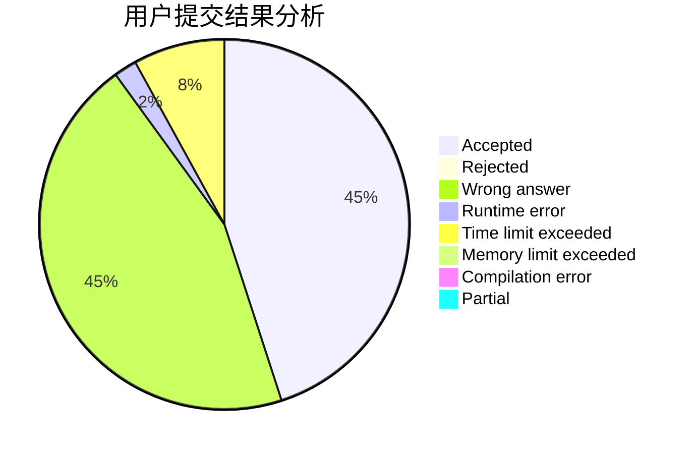
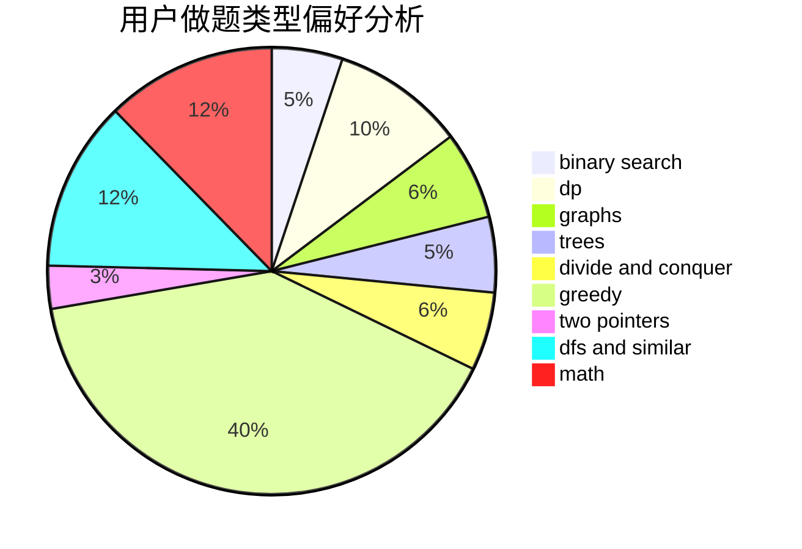

# Trote_w

<!-- tabs:start -->

#### **用户提交结果分析**

#### **用户做题类型偏好分析**

<!-- tabs:end -->
# 推荐题目
[567E](https://codeforces.com/contest/567/problem/E)
[347A](https://codeforces.com/contest/347/problem/A)
[28B](https://codeforces.com/contest/28/problem/B)
[916B](https://codeforces.com/contest/916/problem/B)
[843D](https://codeforces.com/contest/843/problem/D)
[878D](https://codeforces.com/contest/878/problem/D)
[870A](https://codeforces.com/contest/870/problem/A)
[1384A](https://codeforces.com/contest/1384/problem/A)
[659G](https://codeforces.com/contest/659/problem/G)
[948C](https://codeforces.com/contest/948/problem/C)
