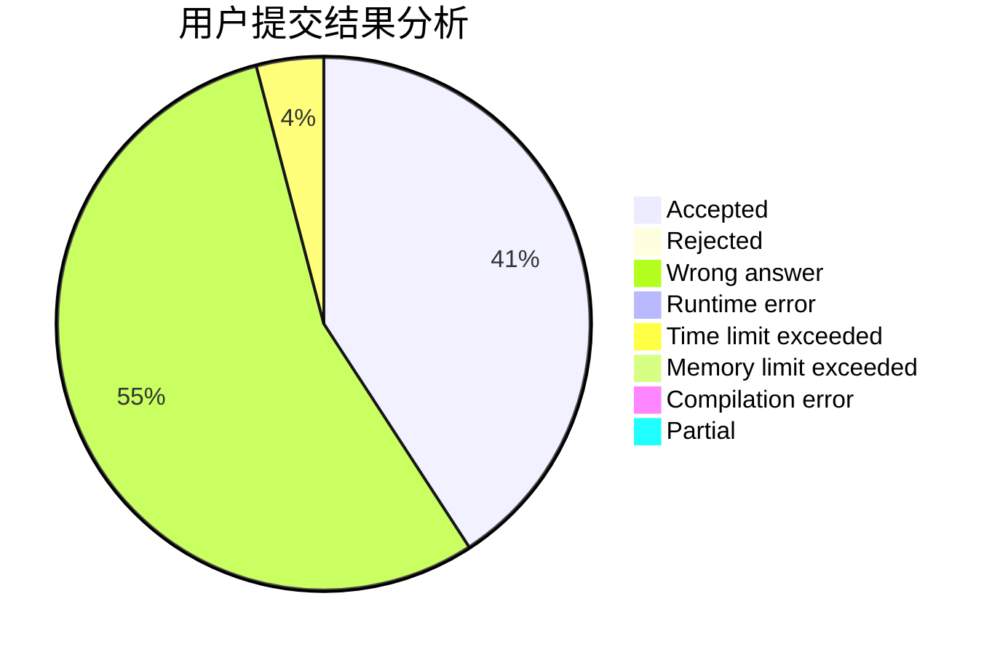
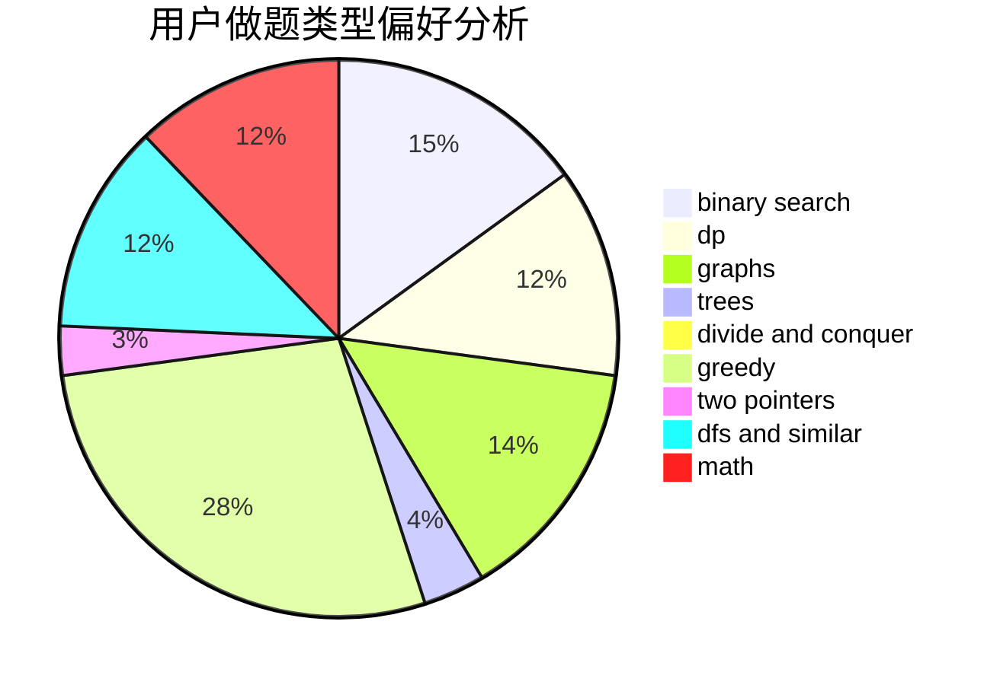

# Troublez

<!-- tabs:start -->

#### **用户提交结果分析**

#### **用户做题类型偏好分析**

<!-- tabs:end -->
# 推荐题目
[787B](https://codeforces.com/contest/787/problem/B)
[873B](https://codeforces.com/contest/873/problem/B)
[566A](https://codeforces.com/contest/566/problem/A)
[793D](https://codeforces.com/contest/793/problem/D)
[1081A](https://codeforces.com/contest/1081/problem/A)
[1181D](https://codeforces.com/contest/1181/problem/D)
[1320B](https://codeforces.com/contest/1320/problem/B)
[167B](https://codeforces.com/contest/167/problem/B)
[1513B](https://codeforces.com/contest/1513/problem/B)
[1365C](https://codeforces.com/contest/1365/problem/C)
