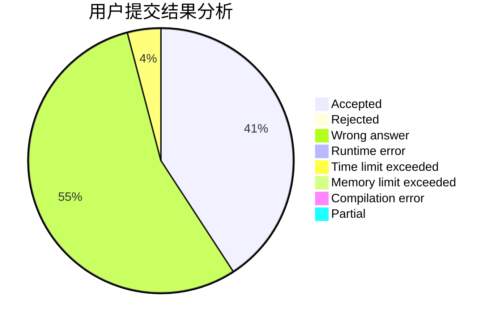
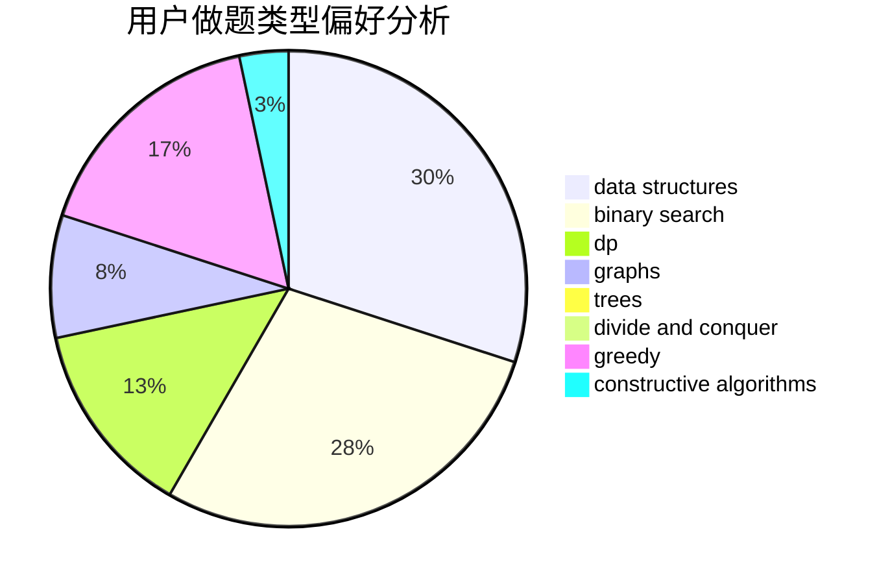

# Troublez

<!-- tabs:start -->

#### **用户提交结果分析**

#### **用户做题类型偏好分析**

#### **用户错题知识点分析**

<!-- tabs:end -->
# 推荐题目
[787B](https://codeforces.com/contest/787/problem/B)		greedy,
                        implementation,
                        math		  
[873B](https://codeforces.com/contest/873/problem/B)		dp,
                        implementation		  
[566A](https://codeforces.com/contest/566/problem/A)		dfs and similar,
                        strings,
                        trees		  
[793D](https://codeforces.com/contest/793/problem/D)		dp,
                        graphs,
                        shortest paths		  
[1081A](https://codeforces.com/contest/1081/problem/A)		constructive algorithms,
                        math		  
[1181D](https://codeforces.com/contest/1181/problem/D)		binary search,
                        data structures,
                        implementation,
                        sortings,
                        trees,
                        two pointers		  
[1320B](https://codeforces.com/contest/1320/problem/B)		dfs and similar,
                        graphs,
                        shortest paths		  
[167B](https://codeforces.com/contest/167/problem/B)		dp,
                        math,
                        probabilities		  
[1513B](https://codeforces.com/contest/1513/problem/B)		bitmasks,
                        combinatorics,
                        constructive algorithms,
                        math		  
[1365C](https://codeforces.com/contest/1365/problem/C)		constructive algorithms,
                        data structures,
                        greedy,
                        implementation		  
