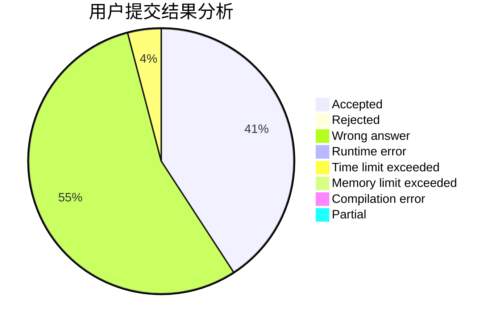
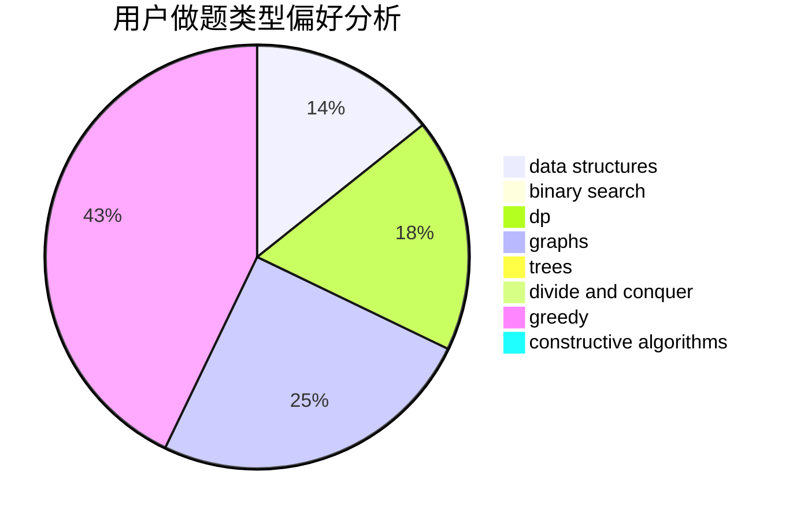
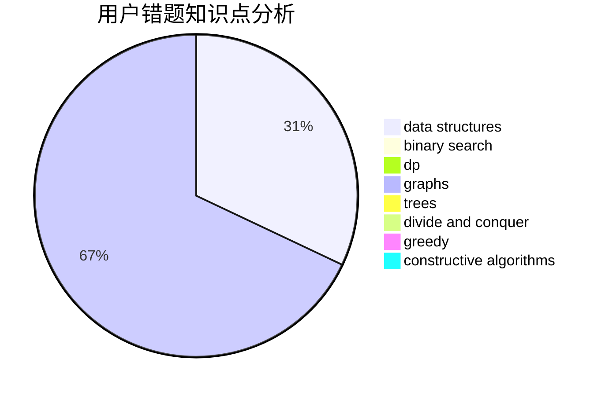

# Troublez

<!-- tabs:start -->

#### **用户提交结果分析**

#### **用户做题类型偏好分析**

#### **用户错题知识点分析**

<!-- tabs:end -->
# 推荐题目
[767E](https://codeforces.com/contest/767/problem/E)		greedy		  
[855A](https://codeforces.com/contest/855/problem/A)		brute force,
                        implementation,
                        strings		  
[540A](https://codeforces.com/contest/540/problem/A)		implementation		  
[774C](https://codeforces.com/contest/774/problem/C)		*special problem,
                        constructive algorithms,
                        greedy,
                        implementation		  
[1080D](https://codeforces.com/contest/1080/problem/D)		constructive algorithms,
                        implementation,
                        math		  
[1179A](https://codeforces.com/contest/1179/problem/A)		data structures,
                        implementation		  
[1311A](https://codeforces.com/contest/1311/problem/A)		greedy,
                        implementation,
                        math		  
[1511A](https://codeforces.com/contest/1511/problem/A)		greedy		  
[1504C](https://codeforces.com/contest/1504/problem/C)		dsu,graphs,sortings,trees		  
[1357D1](https://codeforces.com/contest/1357D/problem/1)		nan		  
