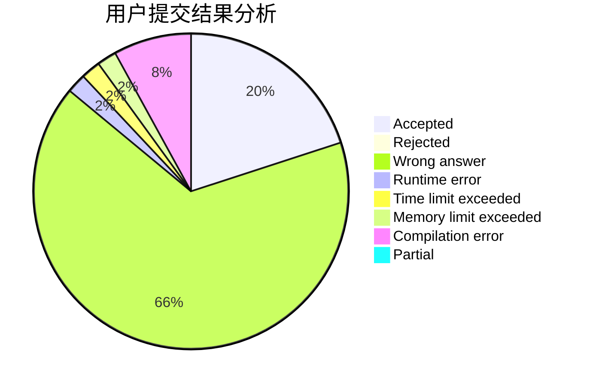
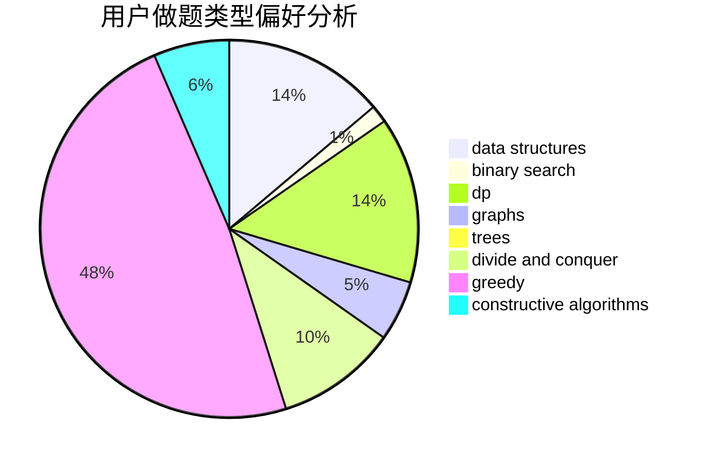
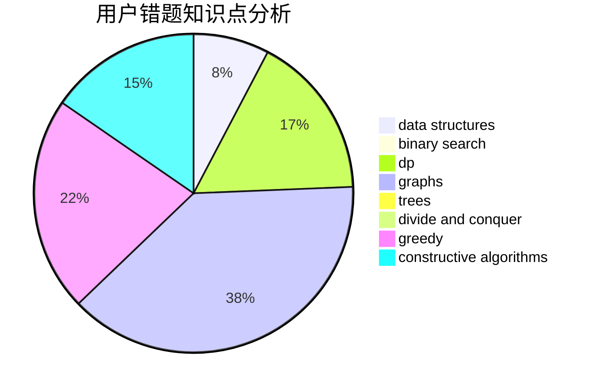

# Trump_Constructs_China

<!-- tabs:start -->

#### **用户提交结果分析**

#### **用户做题类型偏好分析**

#### **用户错题知识点分析**

<!-- tabs:end -->
# 推荐题目
[37A](https://codeforces.com/contest/37/problem/A)		sortings		  
[1027G](https://codeforces.com/contest/1027/problem/G)		bitmasks,
                        math,
                        number theory		  
[1098C](https://codeforces.com/contest/1098/problem/C)		binary search,
                        constructive algorithms,
                        dfs and similar,
                        graphs,
                        greedy,
                        trees		  
[1362A](https://codeforces.com/contest/1362/problem/A)		implementation		  
[1260D](https://codeforces.com/contest/1260/problem/D)		binary search,
                        dp,
                        greedy,
                        sortings		  
[567F](https://codeforces.com/contest/567/problem/F)		dp		  
[346A](https://codeforces.com/contest/346/problem/A)		games,
                        math,
                        number theory		  
[342C](https://codeforces.com/contest/342/problem/C)		geometry		  
[1197D](https://codeforces.com/contest/1197/problem/D)		dp,
                        greedy,
                        math		  
[196E](https://codeforces.com/contest/196/problem/E)		dsu,
                        graphs,
                        shortest paths		  
