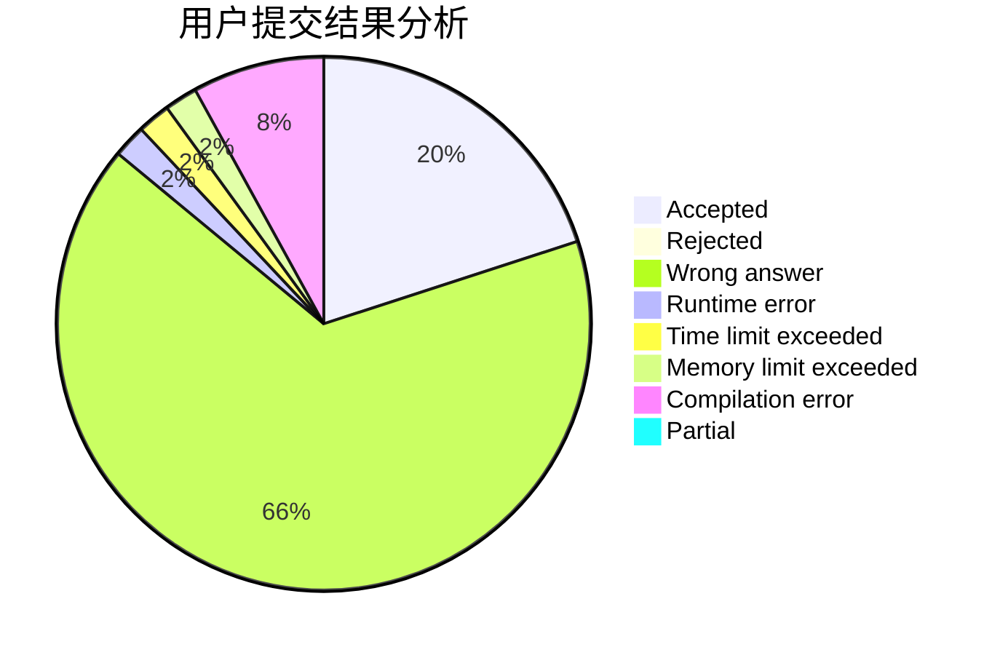
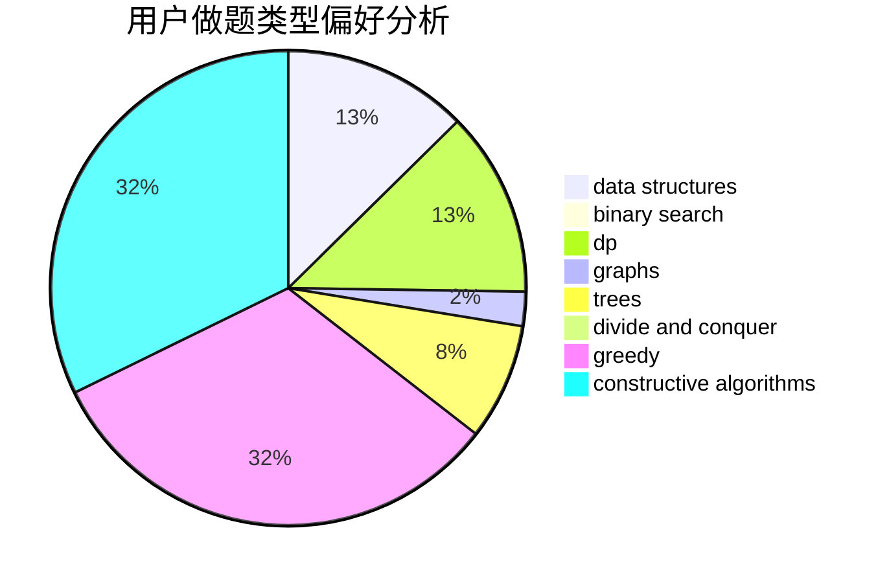
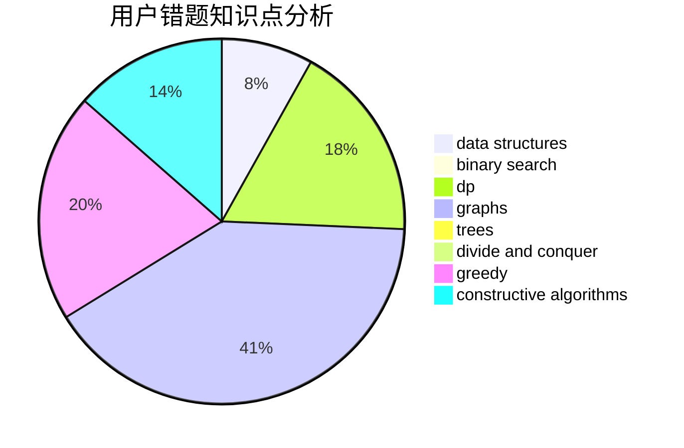

# Trump_Constructs_China

<!-- tabs:start -->

#### **用户提交结果分析**

#### **用户做题类型偏好分析**

#### **用户错题知识点分析**

<!-- tabs:end -->
# 推荐题目
[409F](https://codeforces.com/contest/409/problem/F)		*special problem		  
[1028C](https://codeforces.com/contest/1028/problem/C)		geometry,
                        implementation,
                        sortings		  
[1098F](https://codeforces.com/contest/1098/problem/F)		string suffix structures,
                        strings		  
[1369F](https://codeforces.com/contest/1369/problem/F)		dfs and similar,
                        dp,
                        games		  
[1266D](https://codeforces.com/contest/1266/problem/D)		constructive algorithms,
                        data structures,
                        graphs,
                        greedy,
                        implementation,
                        math,
                        two pointers		  
[587E](https://codeforces.com/contest/587/problem/E)		data structures		  
[371D](https://codeforces.com/contest/371/problem/D)		data structures,
                        dsu,
                        implementation,
                        trees		  
[369C](https://codeforces.com/contest/369/problem/C)		dfs and similar,
                        graphs,
                        trees		  
[1201A](https://codeforces.com/contest/1201/problem/A)		implementation,
                        strings		  
[218D](https://codeforces.com/contest/218/problem/D)		dsu,graphs,sortings,trees		  
