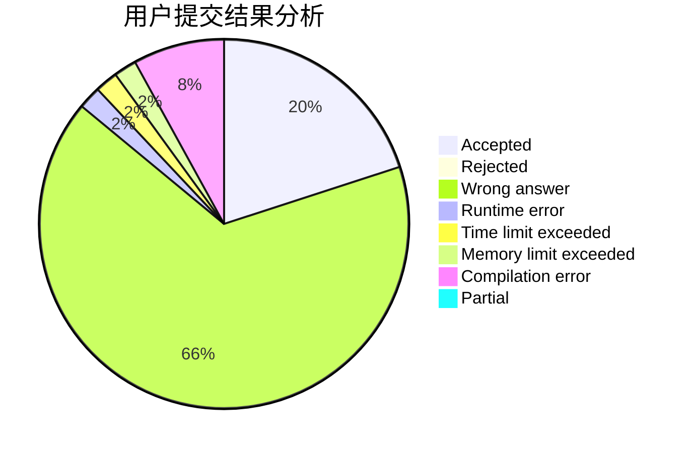
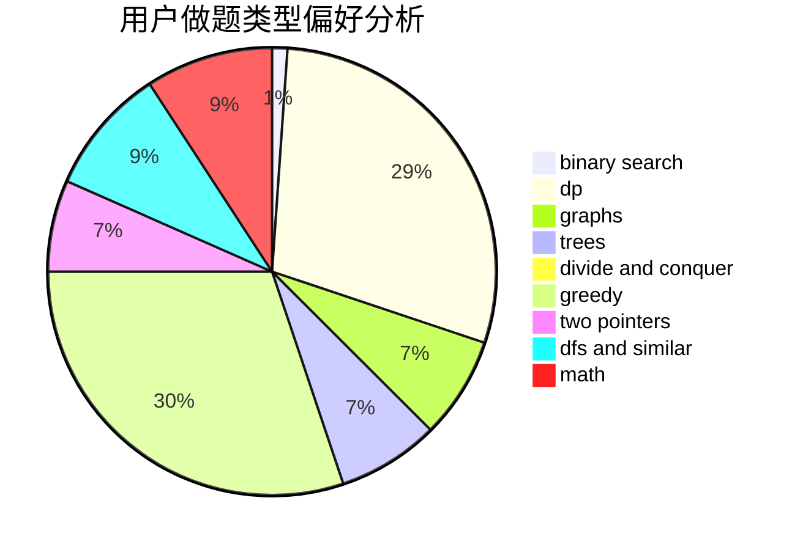

# Trump_Constructs_China

<!-- tabs:start -->

#### **用户提交结果分析**

#### **用户做题类型偏好分析**

<!-- tabs:end -->
# 推荐题目
[409F](https://codeforces.com/contest/409/problem/F)
[1028C](https://codeforces.com/contest/1028/problem/C)
[1098F](https://codeforces.com/contest/1098/problem/F)
[1369F](https://codeforces.com/contest/1369/problem/F)
[1266D](https://codeforces.com/contest/1266/problem/D)
[587E](https://codeforces.com/contest/587/problem/E)
[371D](https://codeforces.com/contest/371/problem/D)
[369C](https://codeforces.com/contest/369/problem/C)
[1201A](https://codeforces.com/contest/1201/problem/A)
[218D](https://codeforces.com/contest/218/problem/D)
