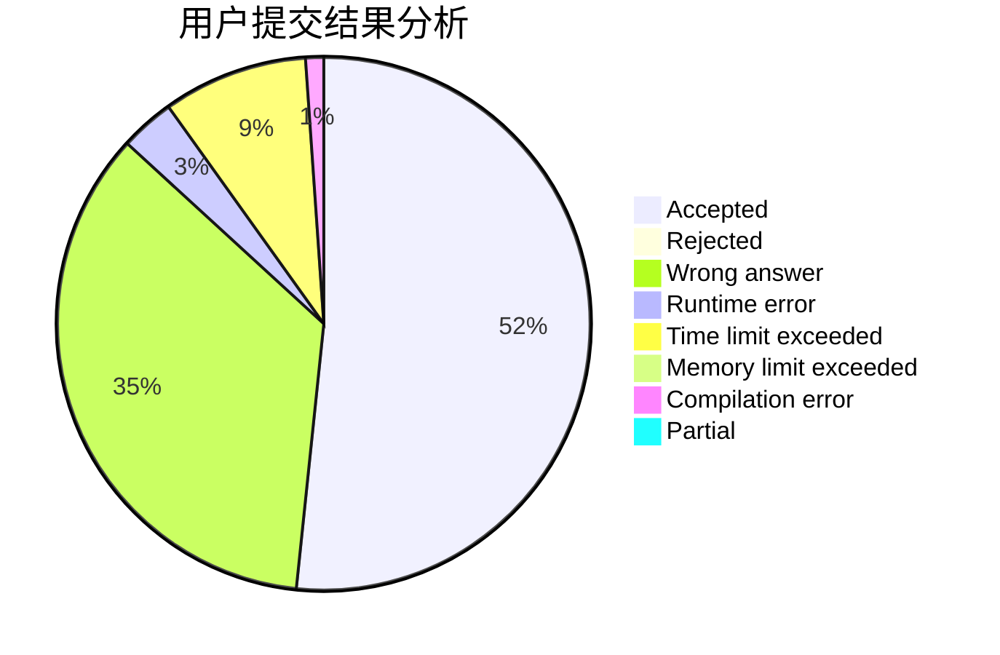
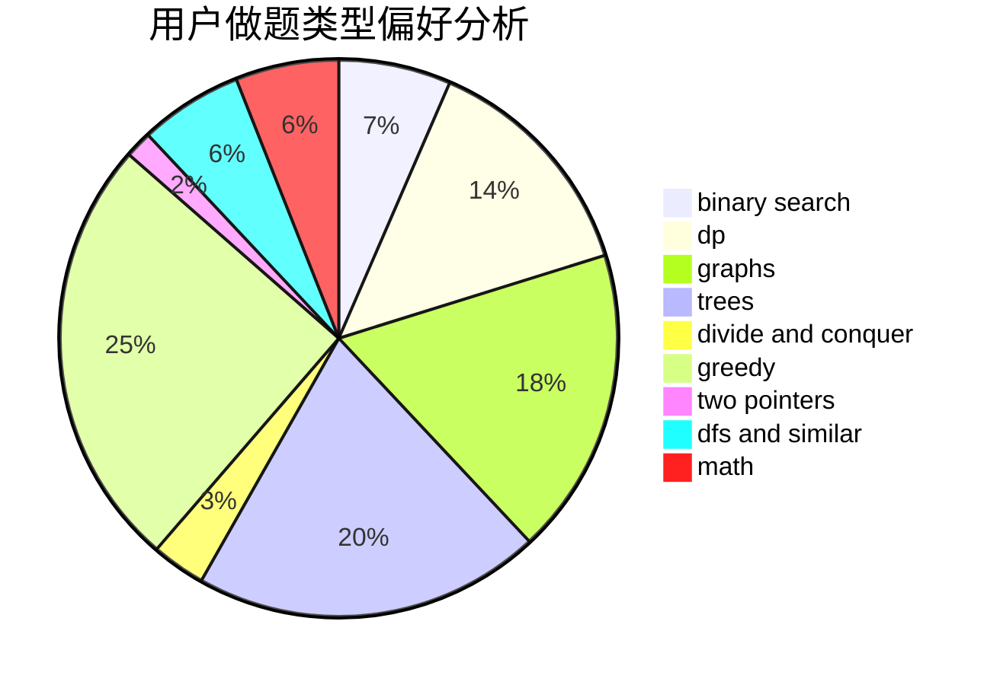

# Tryna1

<!-- tabs:start -->

#### **用户提交结果分析**

#### **用户做题类型偏好分析**

<!-- tabs:end -->
# 推荐题目
[1510G](https://codeforces.com/contest/1510/problem/G)
[11881](https://codeforces.com/contest/1188/problem/1)
[20A](https://codeforces.com/contest/20/problem/A)
[1437D](https://codeforces.com/contest/1437/problem/D)
[1413E](https://codeforces.com/contest/1413/problem/E)
[730B](https://codeforces.com/contest/730/problem/B)
[1227A](https://codeforces.com/contest/1227/problem/A)
[1156A](https://codeforces.com/contest/1156/problem/A)
[894E](https://codeforces.com/contest/894/problem/E)
[160B](https://codeforces.com/contest/160/problem/B)
