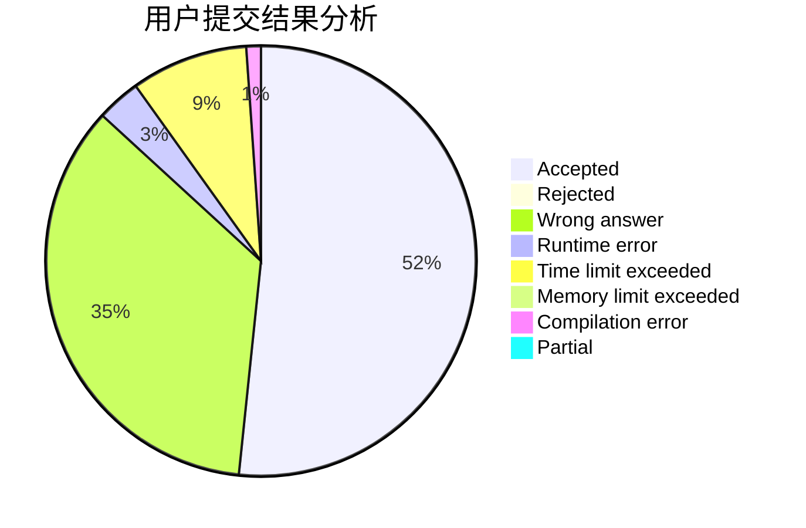
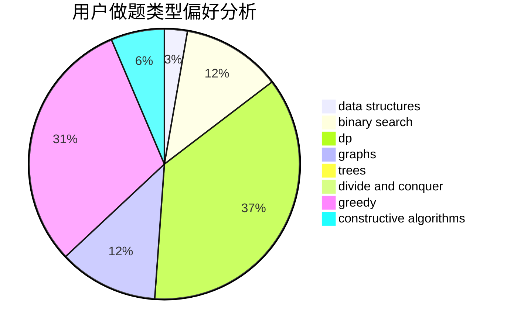

# Tryna1

<!-- tabs:start -->

#### **用户提交结果分析**

#### **用户做题类型偏好分析**

#### **用户错题知识点分析**

<!-- tabs:end -->
# 推荐题目
[1510G](https://codeforces.com/contest/1510/problem/G)		nan		  
[11881](https://codeforces.com/contest/1188/problem/1)		dsu,graphs,sortings,trees		  
[20A](https://codeforces.com/contest/20/problem/A)		implementation		  
[1437D](https://codeforces.com/contest/1437/problem/D)		graphs,
                        greedy,
                        shortest paths,
                        trees		  
[1413E](https://codeforces.com/contest/1413/problem/E)		greedy,
                        math,
                        ternary search		  
[730B](https://codeforces.com/contest/730/problem/B)		constructive algorithms,
                        interactive		  
[1227A](https://codeforces.com/contest/1227/problem/A)		math		  
[1156A](https://codeforces.com/contest/1156/problem/A)		geometry		  
[894E](https://codeforces.com/contest/894/problem/E)		dp,
                        graphs		  
[160B](https://codeforces.com/contest/160/problem/B)		greedy,
                        sortings		  
