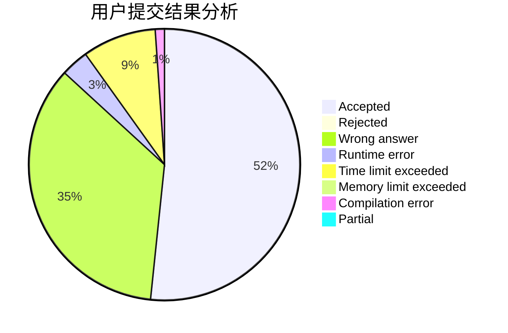
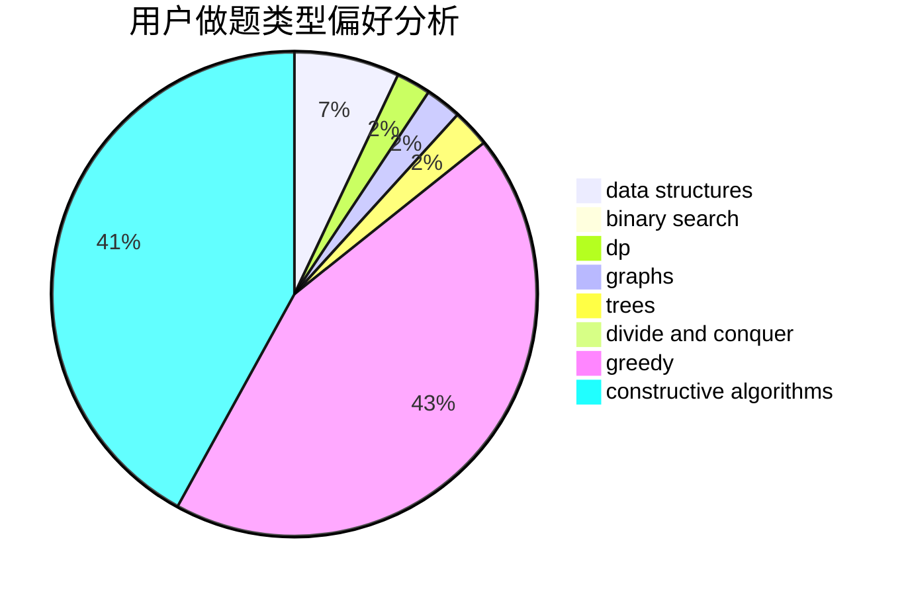
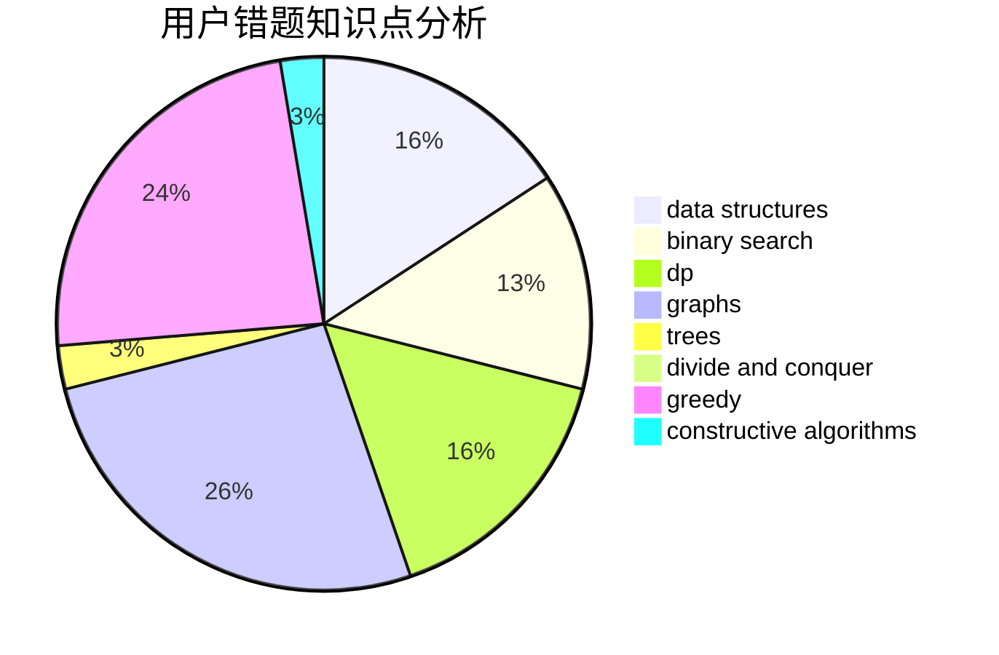

# Tryna1

<!-- tabs:start -->

#### **用户提交结果分析**

#### **用户做题类型偏好分析**

#### **用户错题知识点分析**

<!-- tabs:end -->
# 推荐题目
[1500A](https://codeforces.com/contest/1500/problem/A)		brute force,
                        hashing,
                        implementation,
                        math		  
[1184C2](https://codeforces.com/contest/1184C/problem/2)		data structures		  
[183D](https://codeforces.com/contest/183/problem/D)		dp,
                        greedy,
                        probabilities		  
[1428D](https://codeforces.com/contest/1428/problem/D)		constructive algorithms,
                        greedy,
                        implementation		  
[1402C](https://codeforces.com/contest/1402/problem/C)		*special problem,
                        combinatorics,
                        dfs and similar,
                        dp,
                        games,
                        graphs,
                        matrices,
                        trees		  
[70D](https://codeforces.com/contest/70/problem/D)		data structures,
                        geometry		  
[121C](https://codeforces.com/contest/121/problem/C)		brute force,
                        combinatorics,
                        number theory		  
[1154A](https://codeforces.com/contest/1154/problem/A)		math		  
[875A](https://codeforces.com/contest/875/problem/A)		brute force,
                        math		  
[1509D](https://codeforces.com/contest/1509/problem/D)		dsu,graphs,sortings,trees		  
