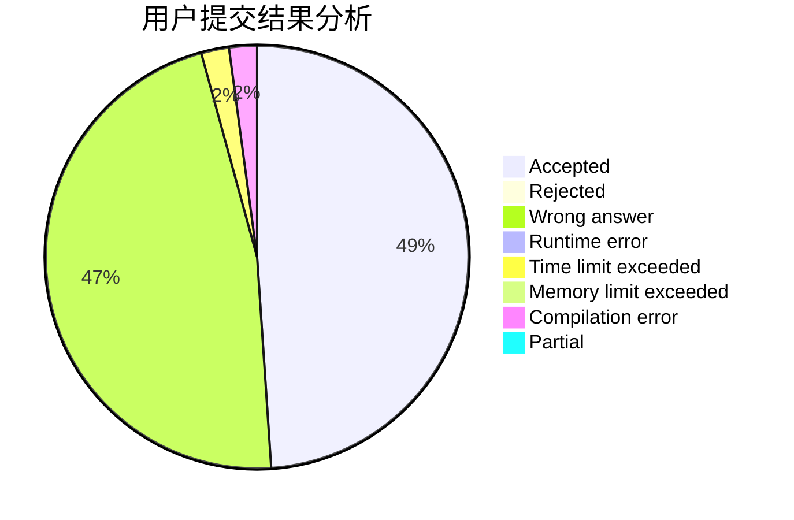
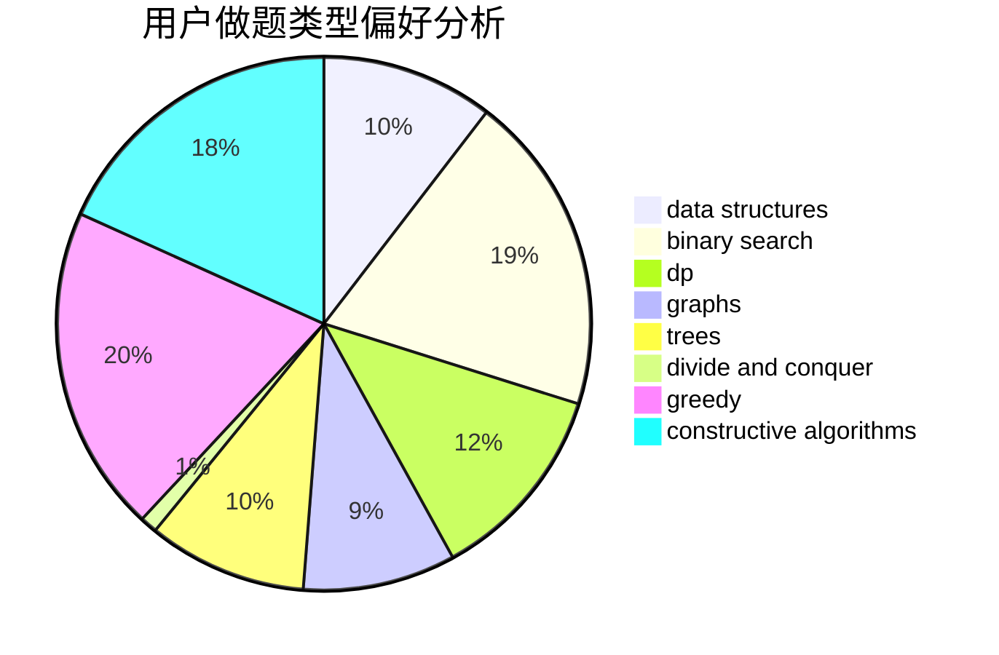
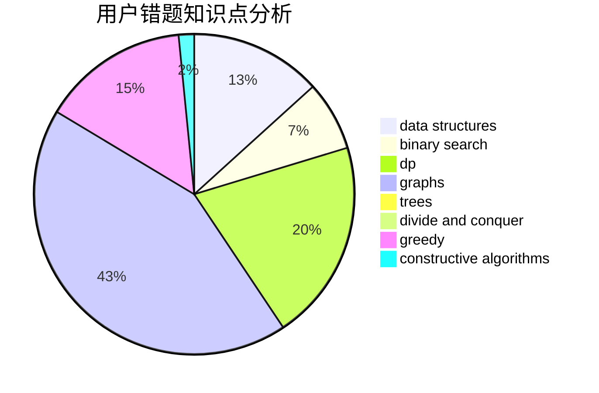

# Tsuku_Yomi_

<!-- tabs:start -->

#### **用户提交结果分析**

#### **用户做题类型偏好分析**

#### **用户错题知识点分析**

<!-- tabs:end -->
# 推荐题目
[1463C](https://codeforces.com/contest/1463/problem/C)		implementation		  
[813C](https://codeforces.com/contest/813/problem/C)		dfs and similar,
                        graphs		  
[1038D](https://codeforces.com/contest/1038/problem/D)		dp,
                        greedy,
                        implementation		  
[38A](https://codeforces.com/contest/38/problem/A)		implementation		  
[277A](https://codeforces.com/contest/277/problem/A)		dfs and similar,
                        dsu		  
[1107C](https://codeforces.com/contest/1107/problem/C)		greedy,
                        sortings,
                        two pointers		  
[741E](https://codeforces.com/contest/741/problem/E)		data structures,
                        string suffix structures		  
[708E](https://codeforces.com/contest/708/problem/E)		dp,
                        math		  
[572A](https://codeforces.com/contest/572/problem/A)		sortings		  
[759D](https://codeforces.com/contest/759/problem/D)		dsu,graphs,sortings,trees		  
