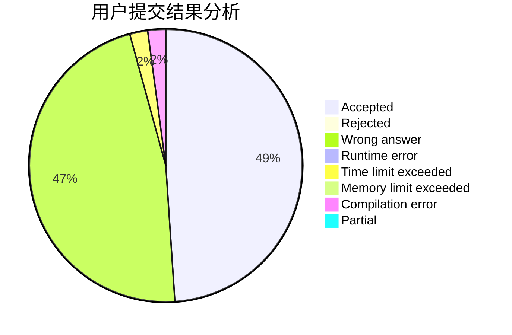
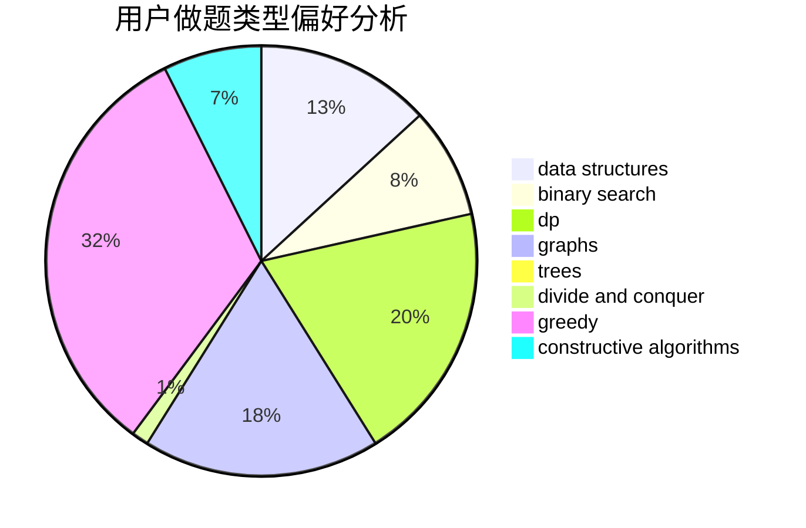
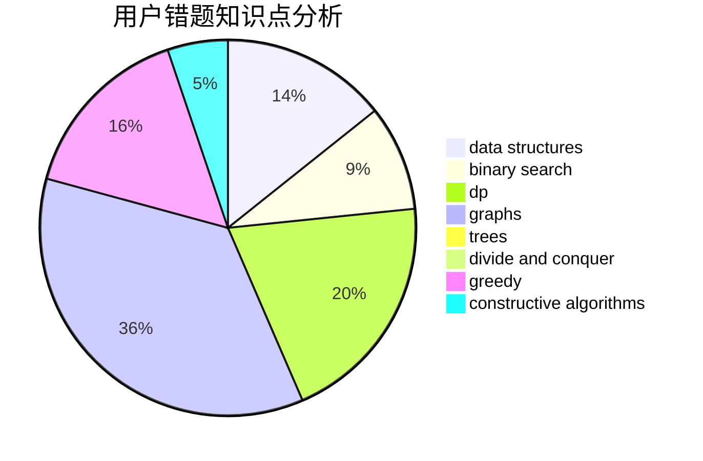

# Tsuku_Yomi_
<!-- tabs:start -->
#### **用户提交结果分析**

#### **用户做题类型偏好分析**

#### **用户错题知识点分析**

<!-- tabs:end -->
# 推荐题目
[Ring Road 2](http://codeforces.com/problemset/problem/27/D)		2-sat,
                        dfs and similar,
                        dsu,
                        graphs		  
[Ayoub and Lost Array](http://codeforces.com/problemset/problem/1105/C)		combinatorics,
                        dp,
                        math		  
[Football](http://codeforces.com/problemset/problem/1240/F)		graphs		  
[NP-Hard Problem](http://codeforces.com/problemset/problem/687/A)		dfs and similar,
                        graphs		  
[Lunar New Year and a Recursive Sequence](http://codeforces.com/problemset/problem/1106/F)		math,
                        matrices,
                        number theory		  
[Fence](http://codeforces.com/problemset/problem/363/B)		brute force,
                        dp		  
[Mike and Fish](http://codeforces.com/problemset/problem/547/D)		constructive algorithms,
                        dfs and similar,
                        graphs		  
[Goods transportation](http://codeforces.com/problemset/problem/724/E)		dp,
                        flows,
                        greedy		  
[Sea Battle](https://codeforces.com/contest/738/problem/D)		math		  
[Equality](http://codeforces.com/problemset/problem/1038/A)		implementation,
                        strings		  
<!-- tabs:start -->
#### **data structures**
[Ring Road 2](http://codeforces.com/problemset/problem/799/B)		data structures,
                        implementation		  
[Ayoub and Lost Array](http://codeforces.com/problemset/problem/689/D)		binary search,
                        data structures		  
[Football](http://codeforces.com/problemset/problem/733/D)		data structures,
                        hashing		  
[NP-Hard Problem](https://codeforces.com/contest/1086/problem/E)		combinatorics,
                        data structures,
                        dp		  
[Lunar New Year and a Recursive Sequence](http://codeforces.com/problemset/problem/1051/G)		data structures,
                        dsu,
                        greedy		  
[Fence](http://codeforces.com/problemset/problem/813/F)		data structures,
                        dsu,
                        graphs		  
[Mike and Fish](http://codeforces.com/problemset/problem/1214/C)		data structures,
                        greedy		  
[Goods transportation](http://codeforces.com/problemset/problem/702/B)		brute force,
                        data structures,
                        implementation,
                        math		  
[Sea Battle](http://codeforces.com/problemset/problem/1398/C)		data structures,
                        dp,
                        math		  
[Equality](http://codeforces.com/problemset/problem/1492/C)		binary search,
                        data structures,
                        dp,
                        greedy,
                        two pointers		  
#### **binary search**
[Ring Road 2](http://codeforces.com/problemset/problem/689/D)		binary search,
                        data structures		  
[Ayoub and Lost Array](http://codeforces.com/problemset/problem/912/E)		binary search,
                        dfs and similar,
                        math,
                        meet-in-the-middle,
                        number theory,
                        two pointers		  
[Football](http://codeforces.com/problemset/problem/1492/C)		binary search,
                        data structures,
                        dp,
                        greedy,
                        two pointers		  
[NP-Hard Problem](http://codeforces.com/problemset/problem/1463/D)		binary search,
                        constructive algorithms,
                        greedy,
                        two pointers		  
[Lunar New Year and a Recursive Sequence](http://codeforces.com/problemset/problem/1490/G)		binary search,
                        data structures,
                        math		  
[Fence](http://codeforces.com/problemset/problem/1479/D)		binary search,
                        bitmasks,
                        brute force,
                        data structures,
                        probabilities,
                        trees		  
[Mike and Fish](http://codeforces.com/problemset/problem/1436/E)		binary search,
                        data structures,
                        two pointers		  
[Goods transportation](http://codeforces.com/problemset/problem/1461/D)		binary search,
                        brute force,
                        data structures,
                        divide and conquer,
                        implementation,
                        sortings		  
[Sea Battle](http://codeforces.com/problemset/problem/1493/C)		binary search,
                        brute force,
                        constructive algorithms,
                        greedy,
                        strings		  
[Equality](http://codeforces.com/problemset/problem/1487/D)		binary search,
                        brute force,
                        math,
                        number theory		  
#### **dp**
[Ring Road 2](http://codeforces.com/problemset/problem/1105/C)		combinatorics,
                        dp,
                        math		  
[Ayoub and Lost Array](http://codeforces.com/problemset/problem/363/B)		brute force,
                        dp		  
[Football](http://codeforces.com/problemset/problem/724/E)		dp,
                        flows,
                        greedy		  
[NP-Hard Problem](https://codeforces.com/contest/861/problem/C)		dp,
                        greedy,
                        implementation		  
[Lunar New Year and a Recursive Sequence](http://codeforces.com/problemset/problem/599/E)		bitmasks,
                        dp,
                        trees		  
[Fence](https://codeforces.com/contest/1086/problem/E)		combinatorics,
                        data structures,
                        dp		  
[Mike and Fish](http://codeforces.com/problemset/problem/288/E)		dp,
                        implementation,
                        math		  
[Goods transportation](http://codeforces.com/problemset/problem/1453/F)		dp		  
[Sea Battle](http://codeforces.com/problemset/problem/1398/C)		data structures,
                        dp,
                        math		  
[Equality](http://codeforces.com/problemset/problem/1492/C)		binary search,
                        data structures,
                        dp,
                        greedy,
                        two pointers		  
#### **graph**
[Ring Road 2](http://codeforces.com/problemset/problem/27/D)		2-sat,
                        dfs and similar,
                        dsu,
                        graphs		  
[Ayoub and Lost Array](http://codeforces.com/problemset/problem/1240/F)		graphs		  
[Football](http://codeforces.com/problemset/problem/687/A)		dfs and similar,
                        graphs		  
[NP-Hard Problem](http://codeforces.com/problemset/problem/547/D)		constructive algorithms,
                        dfs and similar,
                        graphs		  
[Lunar New Year and a Recursive Sequence](http://codeforces.com/problemset/problem/1089/D)		graphs		  
[Fence](http://codeforces.com/problemset/problem/1184/E1)		graphs,
                        trees		  
[Mike and Fish](http://codeforces.com/problemset/problem/762/F)		combinatorics,
                        graphs,
                        trees		  
[Goods transportation](http://codeforces.com/problemset/problem/813/F)		data structures,
                        dsu,
                        graphs		  
[Sea Battle](http://codeforces.com/problemset/problem/1487/C)		brute force,
                        constructive algorithms,
                        dfs and similar,
                        graphs,
                        greedy,
                        implementation,
                        math		  
[Equality](http://codeforces.com/problemset/problem/1437/C)		dp,
                        flows,
                        graph matchings,
                        greedy,
                        math,
                        sortings		  
#### **trees**
[Ring Road 2](http://codeforces.com/problemset/problem/599/E)		bitmasks,
                        dp,
                        trees		  
[Ayoub and Lost Array](http://codeforces.com/problemset/problem/979/C)		dfs and similar,
                        trees		  
[Football](http://codeforces.com/problemset/problem/1184/E1)		graphs,
                        trees		  
[NP-Hard Problem](http://codeforces.com/problemset/problem/762/F)		combinatorics,
                        graphs,
                        trees		  
[Lunar New Year and a Recursive Sequence](http://codeforces.com/problemset/problem/1254/E)		combinatorics,
                        dfs and similar,
                        dsu,
                        trees		  
[Fence](http://codeforces.com/problemset/problem/1479/D)		binary search,
                        bitmasks,
                        brute force,
                        data structures,
                        probabilities,
                        trees		  
[Mike and Fish](http://codeforces.com/problemset/problem/1511/C)		brute force,
                        data structures,
                        implementation,
                        trees		  
[Goods transportation](http://codeforces.com/problemset/problem/1499/F)		combinatorics,
                        dfs and similar,
                        dp,
                        trees		  
[Sea Battle](http://codeforces.com/problemset/problem/1491/E)		brute force,
                        dfs and similar,
                        divide and conquer,
                        number theory,
                        trees		  
[Equality](http://codeforces.com/problemset/problem/1466/D)		data structures,
                        greedy,
                        sortings,
                        trees		  
#### **divide and conquer**
[Ring Road 2](http://codeforces.com/problemset/problem/1461/D)		binary search,
                        brute force,
                        data structures,
                        divide and conquer,
                        implementation,
                        sortings		  
[Ayoub and Lost Array](http://codeforces.com/problemset/problem/1466/G)		combinatorics,
                        divide and conquer,
                        hashing,
                        math,
                        string suffix structures,
                        strings		  
[Football](http://codeforces.com/problemset/problem/1490/D)		dfs and similar,
                        divide and conquer,
                        implementation		  
[NP-Hard Problem](https://codeforces.com/contest/1483/problem/C)		data structures,
                        divide and conquer,
                        dp		  
[Lunar New Year and a Recursive Sequence](http://codeforces.com/problemset/problem/1491/E)		brute force,
                        dfs and similar,
                        divide and conquer,
                        number theory,
                        trees		  
[Fence](http://codeforces.com/problemset/problem/1303/G)		data structures,
                        divide and conquer,
                        geometry,
                        trees		  
[Mike and Fish](http://codeforces.com/problemset/problem/1494/D)		constructive algorithms,
                        data structures,
                        dfs and similar,
                        divide and conquer,
                        dsu,
                        greedy,
                        sortings,
                        trees		  
[Goods transportation](http://codeforces.com/problemset/problem/1482/E)		data structures,
                        divide and conquer,
                        dp		  
[Sea Battle](http://codeforces.com/problemset/problem/566/C)		dfs and similar,
                        divide and conquer,
                        trees		  
[Equality](http://codeforces.com/problemset/problem/1428/F)		binary search,
                        data structures,
                        divide and conquer,
                        dp,
                        two pointers		  
#### **greedy**
[Ring Road 2](http://codeforces.com/problemset/problem/724/E)		dp,
                        flows,
                        greedy		  
[Ayoub and Lost Array](https://codeforces.com/contest/861/problem/C)		dp,
                        greedy,
                        implementation		  
[Football](http://codeforces.com/problemset/problem/231/B)		constructive algorithms,
                        greedy		  
[NP-Hard Problem](http://codeforces.com/problemset/problem/1023/C)		greedy		  
[Lunar New Year and a Recursive Sequence](http://codeforces.com/problemset/problem/387/C)		greedy,
                        implementation		  
[Fence](http://codeforces.com/problemset/problem/1139/B)		greedy,
                        implementation		  
[Mike and Fish](https://codeforces.com/contest/516/problem/A)		greedy,
                        math,
                        sortings		  
[Goods transportation](http://codeforces.com/problemset/problem/1031/D)		greedy		  
[Sea Battle](http://codeforces.com/problemset/problem/437/B)		bitmasks,
                        greedy,
                        implementation,
                        sortings		  
[Equality](http://codeforces.com/problemset/problem/535/D)		greedy,
                        hashing,
                        string suffix structures,
                        strings		  
#### **constructive algorithms**
[Ring Road 2](http://codeforces.com/problemset/problem/547/D)		constructive algorithms,
                        dfs and similar,
                        graphs		  
[Ayoub and Lost Array](http://codeforces.com/problemset/problem/231/B)		constructive algorithms,
                        greedy		  
[Football](http://codeforces.com/problemset/problem/1254/C)		constructive algorithms,
                        geometry,
                        interactive,
                        math		  
[NP-Hard Problem](http://codeforces.com/problemset/problem/1499/A)		combinatorics,
                        constructive algorithms,
                        math		  
[Lunar New Year and a Recursive Sequence](http://codeforces.com/problemset/problem/1493/A)		constructive algorithms,
                        greedy		  
[Fence](http://codeforces.com/problemset/problem/1463/D)		binary search,
                        constructive algorithms,
                        greedy,
                        two pointers		  
[Mike and Fish](https://codeforces.com/contest/1456/problem/B)		bitmasks,
                        brute force,
                        constructive algorithms		  
[Goods transportation](http://codeforces.com/problemset/problem/1492/D)		bitmasks,
                        constructive algorithms,
                        greedy,
                        math		  
[Sea Battle](https://codeforces.com/contest/1504/problem/D)		constructive algorithms,
                        games,
                        interactive		  
[Equality](https://codeforces.com/contest/1483/problem/A)		brute force,
                        constructive algorithms,
                        greedy,
                        implementation		  
#### **sortings**
[Ring Road 2](http://codeforces.com/problemset/problem/551/A)		brute force,
                        implementation,
                        sortings		  
[Ayoub and Lost Array](https://codeforces.com/contest/516/problem/A)		greedy,
                        math,
                        sortings		  
[Football](http://codeforces.com/problemset/problem/437/B)		bitmasks,
                        greedy,
                        implementation,
                        sortings		  
[NP-Hard Problem](http://codeforces.com/problemset/problem/1420/A)		math,
                        sortings		  
[Lunar New Year and a Recursive Sequence](http://codeforces.com/problemset/problem/1132/B)		greedy,
                        sortings		  
[Fence](http://codeforces.com/problemset/problem/1185/C1)		greedy,
                        sortings		  
[Mike and Fish](https://codeforces.com/contest/1496/problem/C)		geometry,
                        greedy,
                        math,
                        sortings		  
[Goods transportation](http://codeforces.com/problemset/problem/1495/A)		geometry,
                        greedy,
                        math,
                        sortings		  
[Sea Battle](http://codeforces.com/problemset/problem/1497/A)		brute force,
                        data structures,
                        greedy,
                        sortings		  
[Equality](http://codeforces.com/problemset/problem/1427/A)		math,
                        sortings		  
<!-- tabs:end -->
