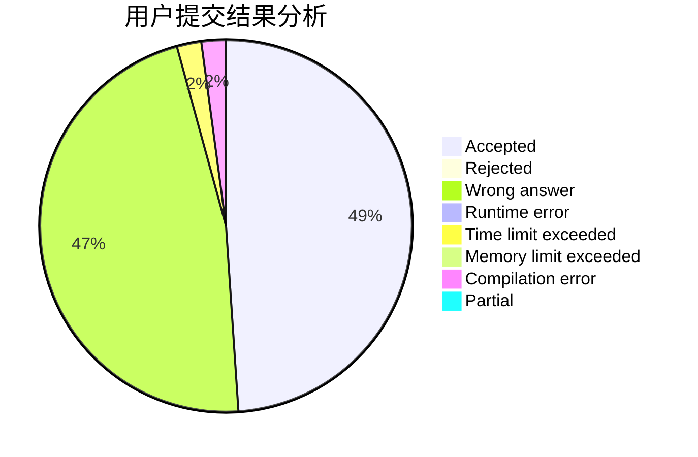
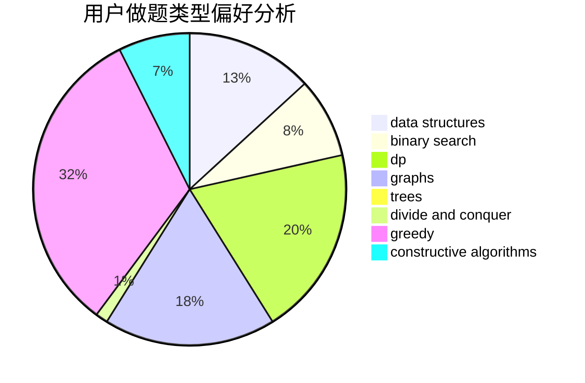
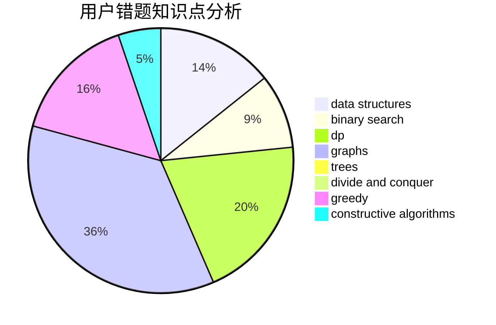

# Tsuku_Yomi_

<!-- tabs:start -->

#### **用户提交结果分析**

#### **用户做题类型偏好分析**

#### **用户错题知识点分析**

<!-- tabs:end -->
# 推荐题目
[1453F](https://codeforces.com/contest/1453/problem/F)		dp		  
[799B](https://codeforces.com/contest/799/problem/B)		data structures,
                        implementation		  
[1038A](https://codeforces.com/contest/1038/problem/A)		implementation,
                        strings		  
[363B](https://codeforces.com/contest/363/problem/B)		brute force,
                        dp		  
[25A](https://codeforces.com/contest/25/problem/A)		brute force		  
[1106F](https://codeforces.com/contest/1106/problem/F)		math,
                        matrices,
                        number theory		  
[724E](https://codeforces.com/contest/724/problem/E)		dp,
                        flows,
                        greedy		  
[687A](https://codeforces.com/contest/687/problem/A)		dfs and similar,
                        graphs		  
[547D](https://codeforces.com/contest/547/problem/D)		constructive algorithms,
                        dfs and similar,
                        graphs		  
[738D](https://codeforces.com/contest/738/problem/D)		dsu,graphs,sortings,trees		  
