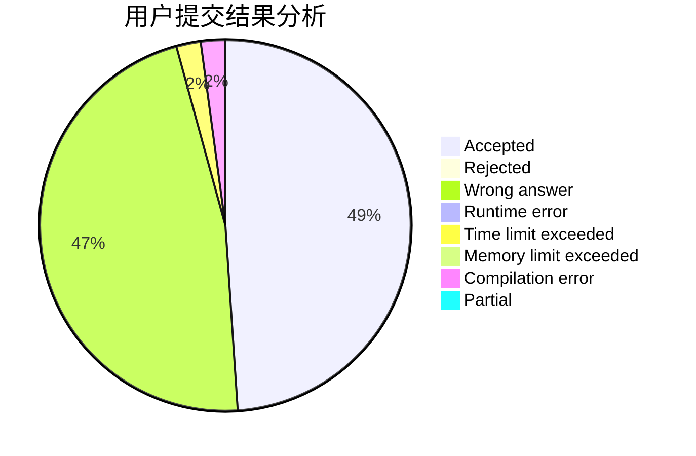
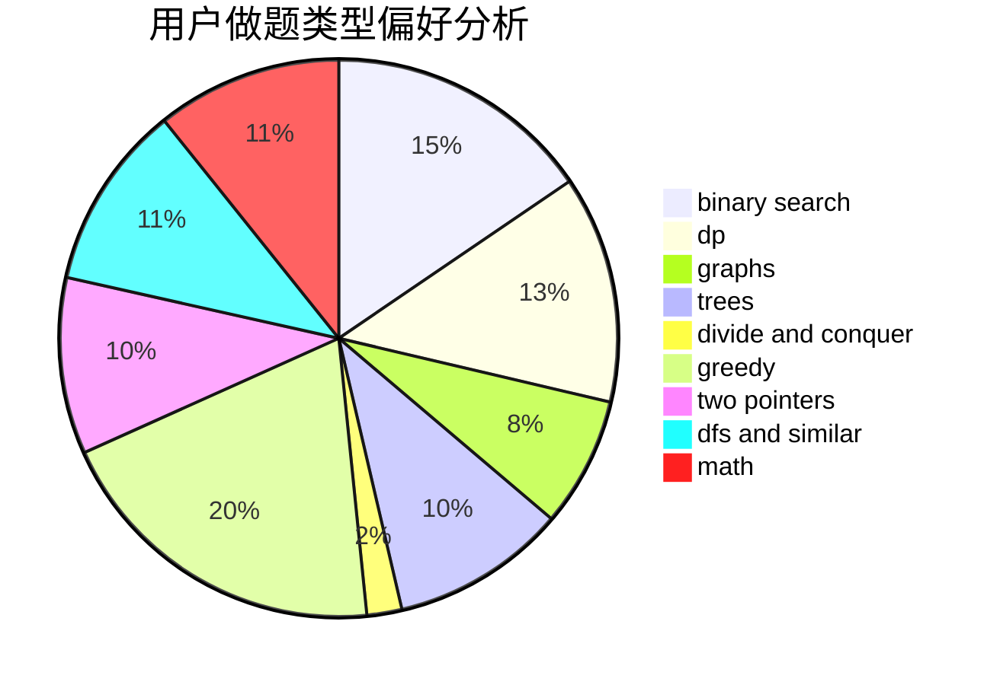

# Tsuku_Yomi_

<!-- tabs:start -->

#### **用户提交结果分析**

#### **用户做题类型偏好分析**

<!-- tabs:end -->
# 推荐题目
[1463C](https://codeforces.com/contest/1463/problem/C)
[813C](https://codeforces.com/contest/813/problem/C)
[1038D](https://codeforces.com/contest/1038/problem/D)
[38A](https://codeforces.com/contest/38/problem/A)
[277A](https://codeforces.com/contest/277/problem/A)
[1107C](https://codeforces.com/contest/1107/problem/C)
[741E](https://codeforces.com/contest/741/problem/E)
[708E](https://codeforces.com/contest/708/problem/E)
[572A](https://codeforces.com/contest/572/problem/A)
[759D](https://codeforces.com/contest/759/problem/D)
