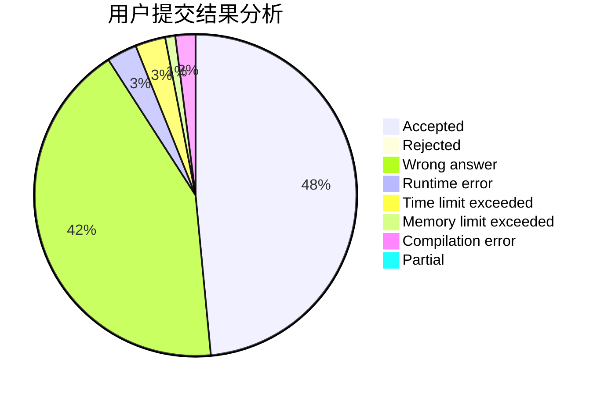
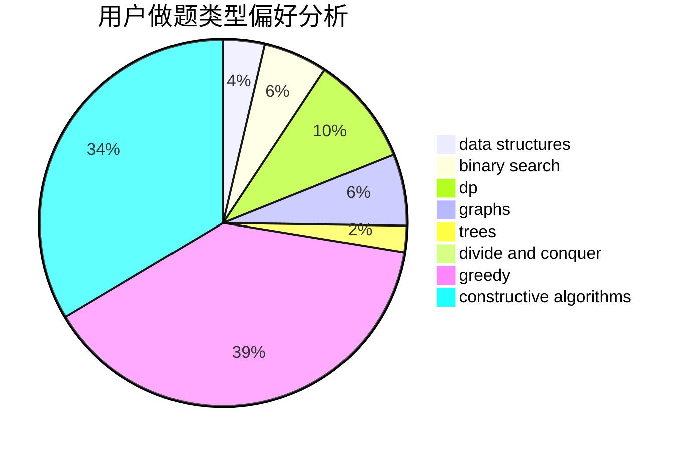
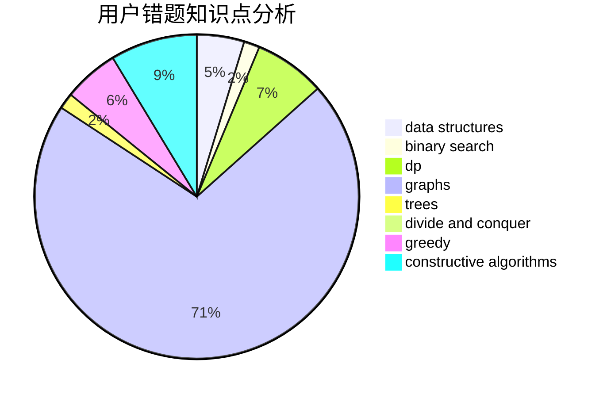

# TuanGe

<!-- tabs:start -->

#### **用户提交结果分析**

#### **用户做题类型偏好分析**

#### **用户错题知识点分析**

<!-- tabs:end -->
# 推荐题目
[940D](https://codeforces.com/contest/940/problem/D)		binary search,
                        implementation		  
[558D](https://codeforces.com/contest/558/problem/D)		data structures,
                        implementation,
                        sortings		  
[1250F](https://codeforces.com/contest/1250/problem/F)		brute force,
                        implementation		  
[306B](https://codeforces.com/contest/306/problem/B)		data structures,
                        greedy,
                        sortings		  
[621B](https://codeforces.com/contest/621/problem/B)		combinatorics,
                        implementation		  
[335F](https://codeforces.com/contest/335/problem/F)		dp,
                        greedy		  
[523D](https://codeforces.com/contest/523/problem/D)		*special problem,
                        data structures,
                        implementation		  
[1189A](https://codeforces.com/contest/1189/problem/A)		strings		  
[177A2](https://codeforces.com/contest/177A/problem/2)		implementation		  
[797B](https://codeforces.com/contest/797/problem/B)		dp,
                        greedy,
                        implementation		  
