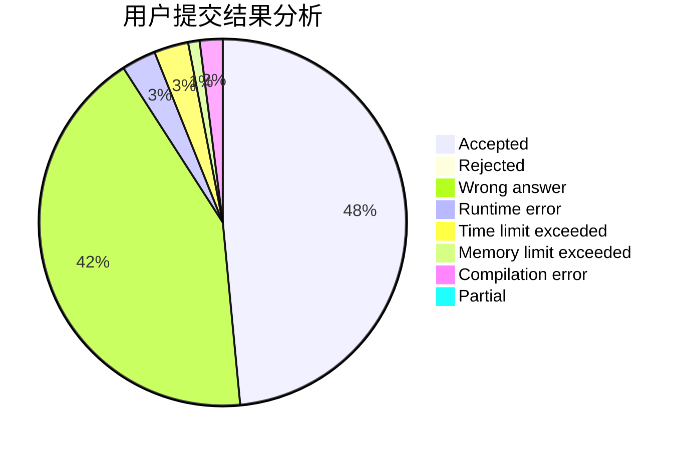
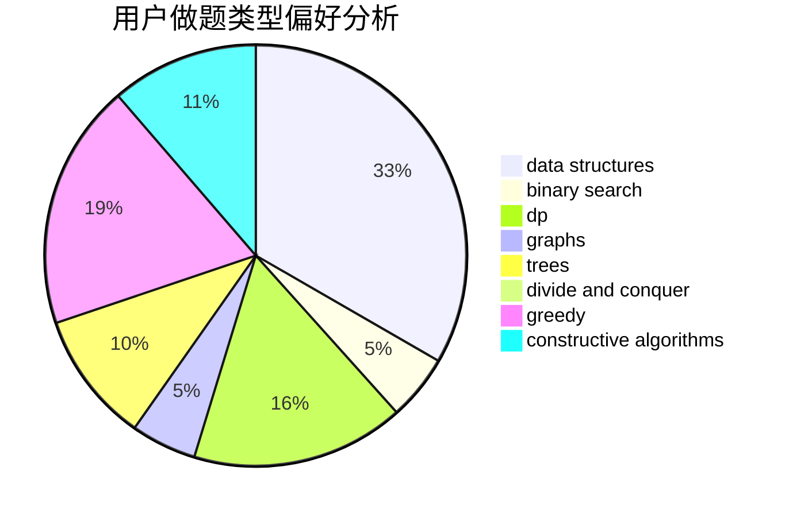
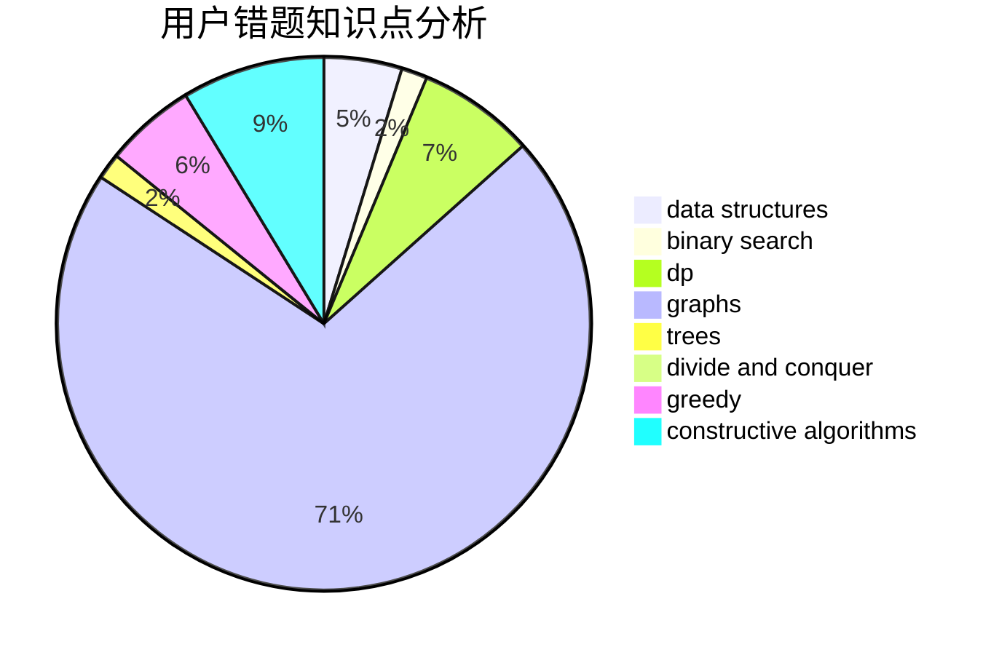

# TuanGe

<!-- tabs:start -->

#### **用户提交结果分析**

#### **用户做题类型偏好分析**

#### **用户错题知识点分析**

<!-- tabs:end -->
# 推荐题目
[962A](https://codeforces.com/contest/962/problem/A)		implementation		  
[581B](https://codeforces.com/contest/581/problem/B)		implementation,
                        math		  
[1254E](https://codeforces.com/contest/1254/problem/E)		combinatorics,
                        dfs and similar,
                        dsu,
                        trees		  
[327D](https://codeforces.com/contest/327/problem/D)		constructive algorithms,
                        dfs and similar,
                        graphs		  
[645D](https://codeforces.com/contest/645/problem/D)		binary search,
                        dp,
                        graphs		  
[363B](https://codeforces.com/contest/363/problem/B)		brute force,
                        dp		  
[548C](https://codeforces.com/contest/548/problem/C)		dsu,graphs,sortings,trees		  
[1194C](https://codeforces.com/contest/1194/problem/C)		implementation,
                        strings		  
[203B](https://codeforces.com/contest/203/problem/B)		brute force,
                        implementation		  
[811A](https://codeforces.com/contest/811/problem/A)		brute force,
                        implementation		  
