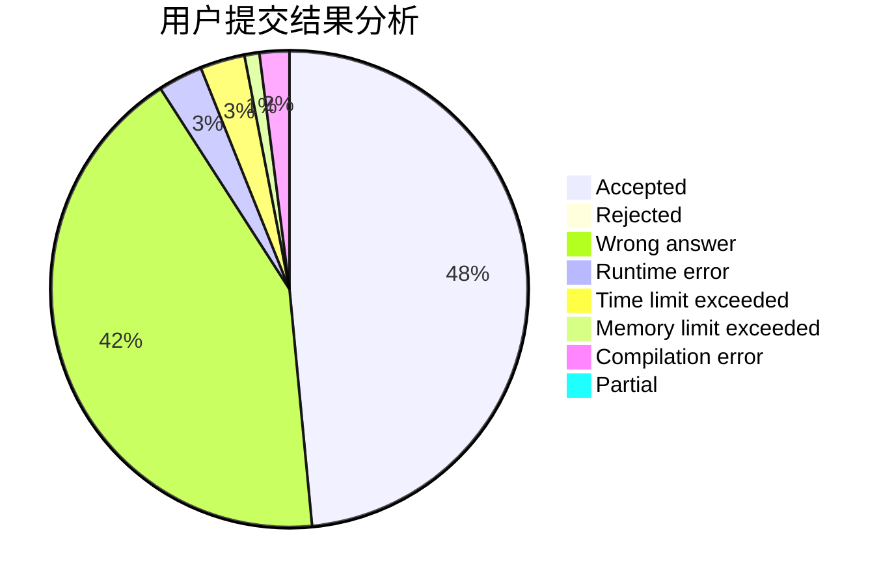
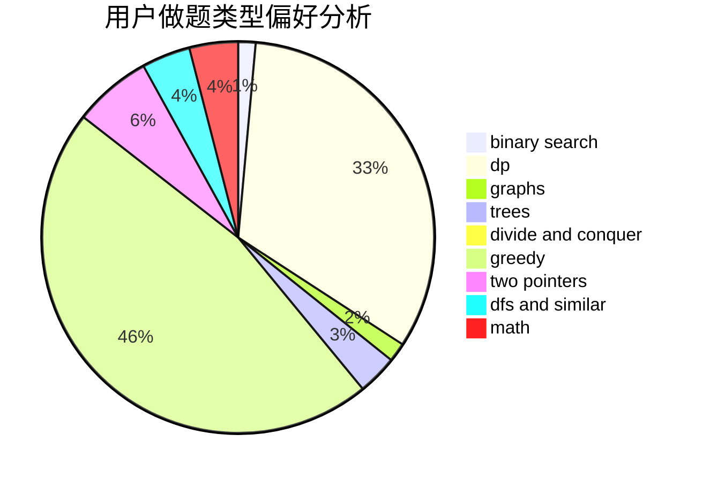

# TuanGe

<!-- tabs:start -->

#### **用户提交结果分析**

#### **用户做题类型偏好分析**

<!-- tabs:end -->
# 推荐题目
[962A](https://codeforces.com/contest/962/problem/A)
[581B](https://codeforces.com/contest/581/problem/B)
[1254E](https://codeforces.com/contest/1254/problem/E)
[327D](https://codeforces.com/contest/327/problem/D)
[645D](https://codeforces.com/contest/645/problem/D)
[363B](https://codeforces.com/contest/363/problem/B)
[548C](https://codeforces.com/contest/548/problem/C)
[1194C](https://codeforces.com/contest/1194/problem/C)
[203B](https://codeforces.com/contest/203/problem/B)
[811A](https://codeforces.com/contest/811/problem/A)
