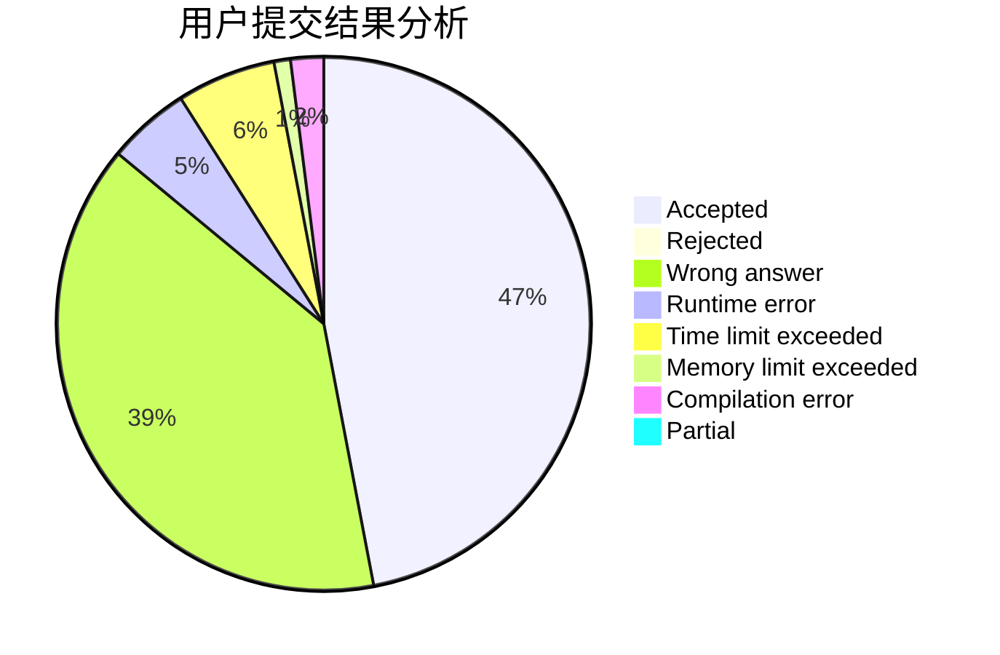
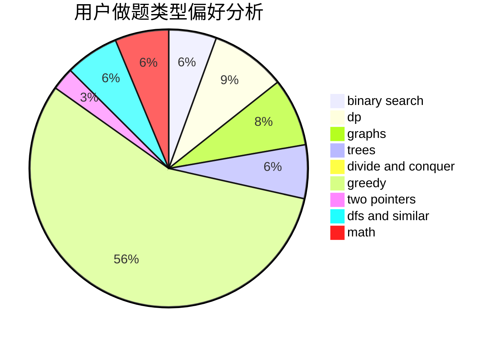

# 10185102153

<!-- tabs:start -->

#### **用户提交结果分析**

#### **用户做题类型偏好分析**

<!-- tabs:end -->
# 推荐题目
[1079B](https://codeforces.com/contest/1079/problem/B)
[1079D](https://codeforces.com/contest/1079/problem/D)
[1081D](https://codeforces.com/contest/1081/problem/D)
[107B](https://codeforces.com/contest/107/problem/B)
[1083B](https://codeforces.com/contest/1083/problem/B)
[1082F](https://codeforces.com/contest/1082/problem/F)
[107A](https://codeforces.com/contest/107/problem/A)
[1080B](https://codeforces.com/contest/1080/problem/B)
[1080E](https://codeforces.com/contest/1080/problem/E)
[107C](https://codeforces.com/contest/107/problem/C)
