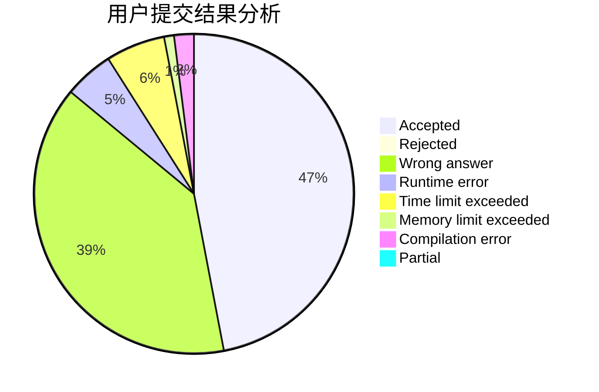
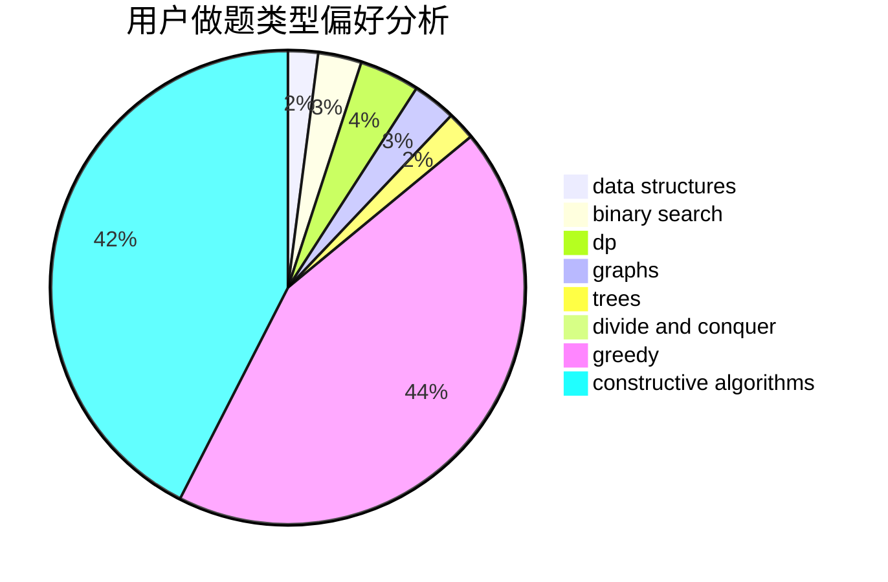
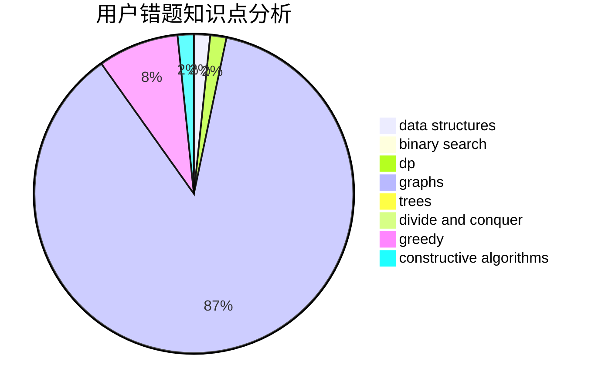

# 10185102153

<!-- tabs:start -->

#### **用户提交结果分析**

#### **用户做题类型偏好分析**

#### **用户错题知识点分析**

<!-- tabs:end -->
# 推荐题目
[1079B](https://codeforces.com/contest/1079/problem/B)		dsu,graphs,sortings,trees		  
[1079D](https://codeforces.com/contest/1079/problem/D)		dsu,graphs,sortings,trees		  
[1081D](https://codeforces.com/contest/1081/problem/D)		dsu,
                        graphs,
                        shortest paths,
                        sortings		  
[107B](https://codeforces.com/contest/107/problem/B)		combinatorics,
                        dp,
                        math,
                        probabilities		  
[1083B](https://codeforces.com/contest/1083/problem/B)		greedy,
                        strings		  
[1082F](https://codeforces.com/contest/1082/problem/F)		dp,
                        strings,
                        trees		  
[107A](https://codeforces.com/contest/107/problem/A)		dfs and similar,
                        graphs		  
[1080B](https://codeforces.com/contest/1080/problem/B)		math		  
[1080E](https://codeforces.com/contest/1080/problem/E)		strings		  
[107C](https://codeforces.com/contest/107/problem/C)		bitmasks,
                        dp		  
