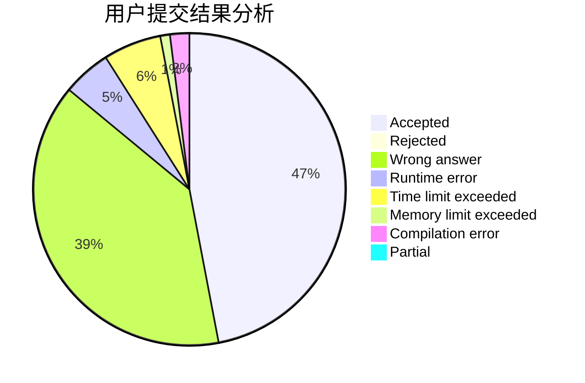
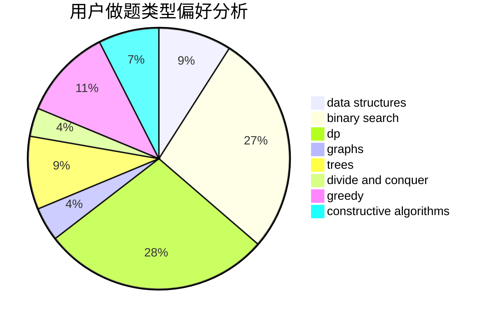
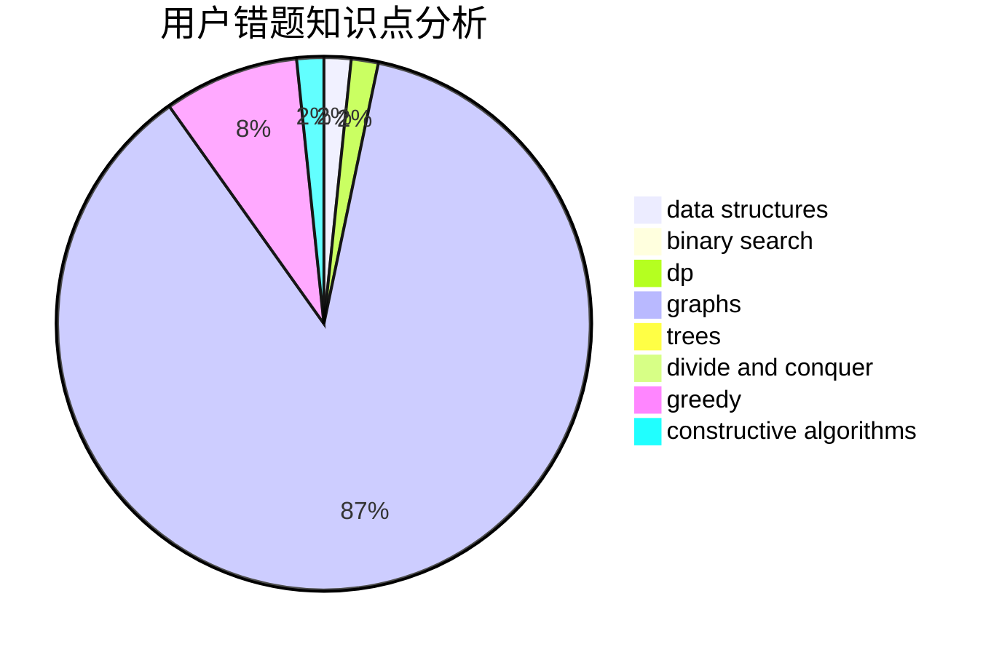

# 10185102153
<!-- tabs:start -->
#### **用户提交结果分析**

#### **用户做题类型偏好分析**

#### **用户错题知识点分析**

<!-- tabs:end -->
# 推荐题目
[Tricky Interactor](http://codeforces.com/problemset/problem/1081/F)		constructive algorithms,
                        implementation,
                        interactive		  
[Playing Piano](https://codeforces.com/contest/1079/problem/C)		constructive algorithms,
                        dp		  
[Multi-Subject Competition](http://codeforces.com/problemset/problem/1082/C)		greedy,
                        sortings		  
[Margarite and the best present](http://codeforces.com/problemset/problem/1080/B)		math		  
[Max Mex](http://codeforces.com/problemset/problem/1083/C)		data structures,
                        trees		  
[Definite Game](http://codeforces.com/problemset/problem/1081/A)		constructive algorithms,
                        math		  
[The Fair Nut and the Best Path](http://codeforces.com/problemset/problem/1083/A)		data structures,
                        dp,
                        trees		  
[Speed Dial](http://codeforces.com/problemset/problem/1082/F)		dp,
                        strings,
                        trees		  
[Olya and magical square](http://codeforces.com/problemset/problem/1080/D)		constructive algorithms,
                        implementation,
                        math		  
[Barcelonian Distance](https://codeforces.com/contest/1079/problem/D)		geometry,
                        implementation		  
<!-- tabs:start -->
#### **data structures**
[Tricky Interactor](http://codeforces.com/problemset/problem/1083/C)		data structures,
                        trees		  
[Playing Piano](http://codeforces.com/problemset/problem/1083/A)		data structures,
                        dp,
                        trees		  
[Multi-Subject Competition](http://codeforces.com/problemset/problem/1083/D)		data structures,
                        implementation		  
[Margarite and the best present](http://codeforces.com/problemset/problem/1083/F)		data structures		  
[Max Mex](http://codeforces.com/problemset/problem/1083/E)		data structures,
                        dp,
                        geometry		  
[Definite Game](http://codeforces.com/problemset/problem/1080/F)		data structures,
                        interactive,
                        sortings		  
[The Fair Nut and the Best Path](http://codeforces.com/problemset/problem/1492/C)		binary search,
                        data structures,
                        dp,
                        greedy,
                        two pointers		  
[Speed Dial](http://codeforces.com/problemset/problem/1490/G)		binary search,
                        data structures,
                        math		  
[Olya and magical square](http://codeforces.com/problemset/problem/1479/D)		binary search,
                        bitmasks,
                        brute force,
                        data structures,
                        probabilities,
                        trees		  
[Barcelonian Distance](http://codeforces.com/problemset/problem/1497/A)		brute force,
                        data structures,
                        greedy,
                        sortings		  
#### **binary search**
[Tricky Interactor](http://codeforces.com/problemset/problem/1082/E)		binary search,
                        dp,
                        greedy		  
[Playing Piano](http://codeforces.com/problemset/problem/1081/E)		binary search,
                        constructive algorithms,
                        greedy,
                        math,
                        number theory		  
[Multi-Subject Competition](http://codeforces.com/problemset/problem/1492/C)		binary search,
                        data structures,
                        dp,
                        greedy,
                        two pointers		  
[Margarite and the best present](http://codeforces.com/problemset/problem/1463/D)		binary search,
                        constructive algorithms,
                        greedy,
                        two pointers		  
[Max Mex](http://codeforces.com/problemset/problem/1490/G)		binary search,
                        data structures,
                        math		  
[Definite Game](http://codeforces.com/problemset/problem/1479/D)		binary search,
                        bitmasks,
                        brute force,
                        data structures,
                        probabilities,
                        trees		  
[The Fair Nut and the Best Path](http://codeforces.com/problemset/problem/1436/E)		binary search,
                        data structures,
                        two pointers		  
[Speed Dial](http://codeforces.com/problemset/problem/1461/D)		binary search,
                        brute force,
                        data structures,
                        divide and conquer,
                        implementation,
                        sortings		  
[Olya and magical square](http://codeforces.com/problemset/problem/1493/C)		binary search,
                        brute force,
                        constructive algorithms,
                        greedy,
                        strings		  
[Barcelonian Distance](http://codeforces.com/problemset/problem/1487/D)		binary search,
                        brute force,
                        math,
                        number theory		  
#### **dp**
[Tricky Interactor](https://codeforces.com/contest/1079/problem/C)		constructive algorithms,
                        dp		  
[Playing Piano](http://codeforces.com/problemset/problem/1083/A)		data structures,
                        dp,
                        trees		  
[Multi-Subject Competition](http://codeforces.com/problemset/problem/1082/F)		dp,
                        strings,
                        trees		  
[Margarite and the best present](http://codeforces.com/problemset/problem/107/B)		combinatorics,
                        dp,
                        math,
                        probabilities		  
[Max Mex](http://codeforces.com/problemset/problem/107/C)		bitmasks,
                        dp		  
[Definite Game](http://codeforces.com/problemset/problem/1081/C)		combinatorics,
                        dp,
                        math		  
[The Fair Nut and the Best Path](https://codeforces.com/contest/1078/problem/B)		dp,
                        math		  
[Speed Dial](http://codeforces.com/problemset/problem/1037/C)		dp,
                        greedy,
                        strings		  
[Olya and magical square](https://codeforces.com/contest/1078/problem/C)		dp,
                        trees		  
[Barcelonian Distance](http://codeforces.com/problemset/problem/1082/E)		binary search,
                        dp,
                        greedy		  
#### **graph**
[Tricky Interactor](http://codeforces.com/problemset/problem/1082/D)		constructive algorithms,
                        graphs,
                        implementation		  
[Playing Piano](http://codeforces.com/problemset/problem/107/A)		dfs and similar,
                        graphs		  
[Multi-Subject Competition](http://codeforces.com/problemset/problem/1081/D)		dsu,
                        graphs,
                        shortest paths,
                        sortings		  
[Margarite and the best present](http://codeforces.com/problemset/problem/107/D)		dp,
                        graphs,
                        matrices		  
[Max Mex](http://codeforces.com/problemset/problem/1051/F)		graphs,
                        shortest paths,
                        trees		  
[Definite Game](http://codeforces.com/problemset/problem/1082/G)		flows,
                        graphs		  
[The Fair Nut and the Best Path](http://codeforces.com/problemset/problem/1487/C)		brute force,
                        constructive algorithms,
                        dfs and similar,
                        graphs,
                        greedy,
                        implementation,
                        math		  
[Speed Dial](http://codeforces.com/problemset/problem/1437/C)		dp,
                        flows,
                        graph matchings,
                        greedy,
                        math,
                        sortings		  
[Olya and magical square](http://codeforces.com/problemset/problem/1470/D)		constructive algorithms,
                        dfs and similar,
                        graph matchings,
                        graphs,
                        greedy		  
[Barcelonian Distance](http://codeforces.com/problemset/problem/1476/C)		dp,
                        graphs,
                        greedy		  
#### **trees**
[Tricky Interactor](http://codeforces.com/problemset/problem/1083/C)		data structures,
                        trees		  
[Playing Piano](http://codeforces.com/problemset/problem/1083/A)		data structures,
                        dp,
                        trees		  
[Multi-Subject Competition](http://codeforces.com/problemset/problem/1082/F)		dp,
                        strings,
                        trees		  
[Margarite and the best present](https://codeforces.com/contest/1078/problem/C)		dp,
                        trees		  
[Max Mex](http://codeforces.com/problemset/problem/1051/F)		graphs,
                        shortest paths,
                        trees		  
[Definite Game](http://codeforces.com/problemset/problem/1479/D)		binary search,
                        bitmasks,
                        brute force,
                        data structures,
                        probabilities,
                        trees		  
[The Fair Nut and the Best Path](http://codeforces.com/problemset/problem/1511/C)		brute force,
                        data structures,
                        implementation,
                        trees		  
[Speed Dial](http://codeforces.com/problemset/problem/1499/F)		combinatorics,
                        dfs and similar,
                        dp,
                        trees		  
[Olya and magical square](http://codeforces.com/problemset/problem/1491/E)		brute force,
                        dfs and similar,
                        divide and conquer,
                        number theory,
                        trees		  
[Barcelonian Distance](http://codeforces.com/problemset/problem/1466/D)		data structures,
                        greedy,
                        sortings,
                        trees		  
#### **divide and conquer**
[Tricky Interactor](http://codeforces.com/problemset/problem/1461/D)		binary search,
                        brute force,
                        data structures,
                        divide and conquer,
                        implementation,
                        sortings		  
[Playing Piano](http://codeforces.com/problemset/problem/1466/G)		combinatorics,
                        divide and conquer,
                        hashing,
                        math,
                        string suffix structures,
                        strings		  
[Multi-Subject Competition](http://codeforces.com/problemset/problem/1490/D)		dfs and similar,
                        divide and conquer,
                        implementation		  
[Margarite and the best present](https://codeforces.com/contest/1483/problem/C)		data structures,
                        divide and conquer,
                        dp		  
[Max Mex](http://codeforces.com/problemset/problem/1491/E)		brute force,
                        dfs and similar,
                        divide and conquer,
                        number theory,
                        trees		  
[Definite Game](http://codeforces.com/problemset/problem/1303/G)		data structures,
                        divide and conquer,
                        geometry,
                        trees		  
[The Fair Nut and the Best Path](http://codeforces.com/problemset/problem/1494/D)		constructive algorithms,
                        data structures,
                        dfs and similar,
                        divide and conquer,
                        dsu,
                        greedy,
                        sortings,
                        trees		  
[Speed Dial](http://codeforces.com/problemset/problem/1482/E)		data structures,
                        divide and conquer,
                        dp		  
[Olya and magical square](http://codeforces.com/problemset/problem/566/C)		dfs and similar,
                        divide and conquer,
                        trees		  
[Barcelonian Distance](http://codeforces.com/problemset/problem/1428/F)		binary search,
                        data structures,
                        divide and conquer,
                        dp,
                        two pointers		  
#### **greedy**
[Tricky Interactor](http://codeforces.com/problemset/problem/1082/C)		greedy,
                        sortings		  
[Playing Piano](http://codeforces.com/problemset/problem/1082/B)		greedy		  
[Multi-Subject Competition](http://codeforces.com/problemset/problem/1023/C)		greedy		  
[Margarite and the best present](http://codeforces.com/problemset/problem/1037/C)		dp,
                        greedy,
                        strings		  
[Max Mex](http://codeforces.com/problemset/problem/1082/E)		binary search,
                        dp,
                        greedy		  
[Definite Game](http://codeforces.com/problemset/problem/1081/E)		binary search,
                        constructive algorithms,
                        greedy,
                        math,
                        number theory		  
[The Fair Nut and the Best Path](http://codeforces.com/problemset/problem/1042/C)		constructive algorithms,
                        greedy,
                        math		  
[Speed Dial](http://codeforces.com/problemset/problem/1083/B)		greedy,
                        strings		  
[Olya and magical square](http://codeforces.com/problemset/problem/1492/C)		binary search,
                        data structures,
                        dp,
                        greedy,
                        two pointers		  
[Barcelonian Distance](https://codeforces.com/contest/1496/problem/C)		geometry,
                        greedy,
                        math,
                        sortings		  
#### **constructive algorithms**
[Tricky Interactor](http://codeforces.com/problemset/problem/1081/F)		constructive algorithms,
                        implementation,
                        interactive		  
[Playing Piano](https://codeforces.com/contest/1079/problem/C)		constructive algorithms,
                        dp		  
[Multi-Subject Competition](http://codeforces.com/problemset/problem/1081/A)		constructive algorithms,
                        math		  
[Margarite and the best present](http://codeforces.com/problemset/problem/1080/D)		constructive algorithms,
                        implementation,
                        math		  
[Max Mex](http://codeforces.com/problemset/problem/1082/D)		constructive algorithms,
                        graphs,
                        implementation		  
[Definite Game](http://codeforces.com/problemset/problem/1081/E)		binary search,
                        constructive algorithms,
                        greedy,
                        math,
                        number theory		  
[The Fair Nut and the Best Path](http://codeforces.com/problemset/problem/1042/C)		constructive algorithms,
                        greedy,
                        math		  
[Speed Dial](http://codeforces.com/problemset/problem/1078/E)		constructive algorithms		  
[Olya and magical square](http://codeforces.com/problemset/problem/1081/B)		constructive algorithms,
                        implementation		  
[Barcelonian Distance](http://codeforces.com/problemset/problem/1493/A)		constructive algorithms,
                        greedy		  
#### **sortings**
[Tricky Interactor](http://codeforces.com/problemset/problem/1082/C)		greedy,
                        sortings		  
[Playing Piano](http://codeforces.com/problemset/problem/1081/D)		dsu,
                        graphs,
                        shortest paths,
                        sortings		  
[Multi-Subject Competition](http://codeforces.com/problemset/problem/1080/F)		data structures,
                        interactive,
                        sortings		  
[Margarite and the best present](https://codeforces.com/contest/1496/problem/C)		geometry,
                        greedy,
                        math,
                        sortings		  
[Max Mex](http://codeforces.com/problemset/problem/1495/A)		geometry,
                        greedy,
                        math,
                        sortings		  
[Definite Game](http://codeforces.com/problemset/problem/1497/A)		brute force,
                        data structures,
                        greedy,
                        sortings		  
[The Fair Nut and the Best Path](http://codeforces.com/problemset/problem/1427/A)		math,
                        sortings		  
[Speed Dial](http://codeforces.com/problemset/problem/1461/D)		binary search,
                        brute force,
                        data structures,
                        divide and conquer,
                        implementation,
                        sortings		  
[Olya and magical square](http://codeforces.com/problemset/problem/1437/C)		dp,
                        flows,
                        graph matchings,
                        greedy,
                        math,
                        sortings		  
[Barcelonian Distance](http://codeforces.com/problemset/problem/1473/A)		greedy,
                        implementation,
                        math,
                        sortings		  
<!-- tabs:end -->
