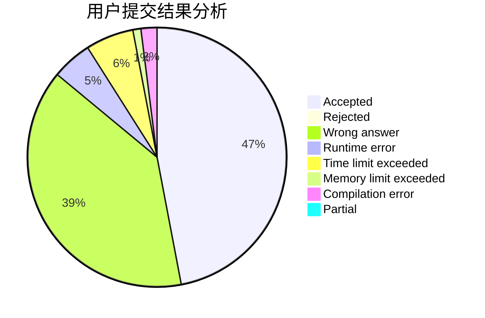
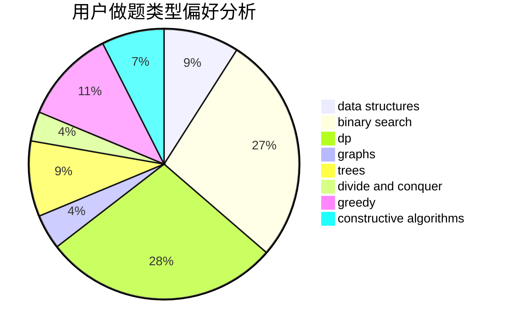
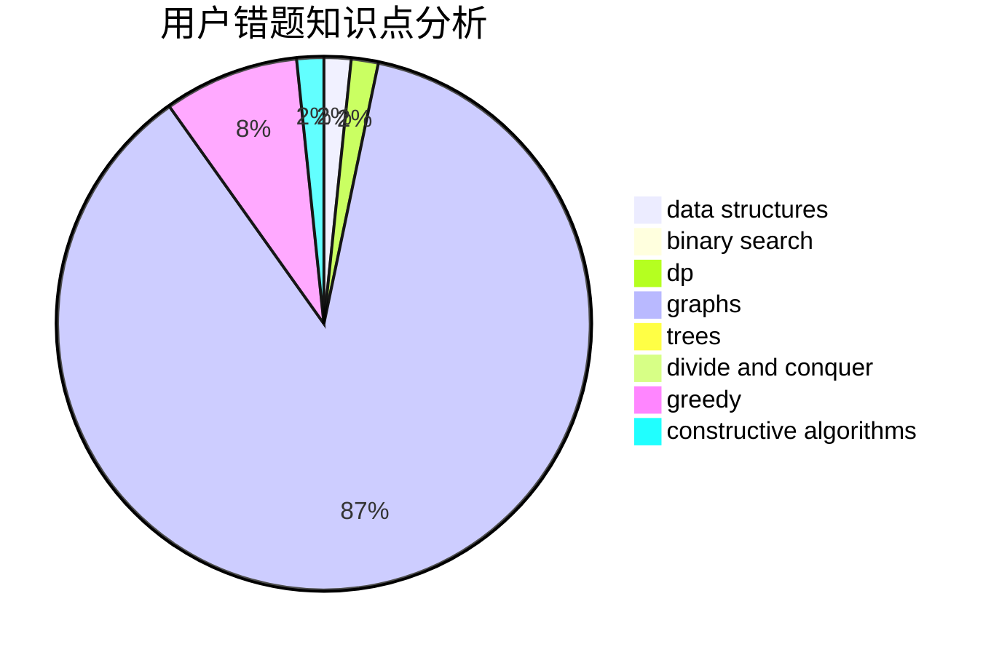

# 10185102153

<!-- tabs:start -->

#### **用户提交结果分析**

#### **用户做题类型偏好分析**

#### **用户错题知识点分析**

<!-- tabs:end -->
# 推荐题目
[1078D](https://codeforces.com/contest/1078/problem/D)		dsu,graphs,sortings,trees		  
[1079A](https://codeforces.com/contest/1079/problem/A)		dsu,graphs,sortings,trees		  
[1081A](https://codeforces.com/contest/1081/problem/A)		constructive algorithms,
                        math		  
[1079C](https://codeforces.com/contest/1079/problem/C)		dsu,graphs,sortings,trees		  
[1082F](https://codeforces.com/contest/1082/problem/F)		dp,
                        strings,
                        trees		  
[1082C](https://codeforces.com/contest/1082/problem/C)		greedy,
                        sortings		  
[1079B](https://codeforces.com/contest/1079/problem/B)		dsu,graphs,sortings,trees		  
[107C](https://codeforces.com/contest/107/problem/C)		bitmasks,
                        dp		  
[1080B](https://codeforces.com/contest/1080/problem/B)		math		  
[1079D](https://codeforces.com/contest/1079/problem/D)		dsu,graphs,sortings,trees		  
