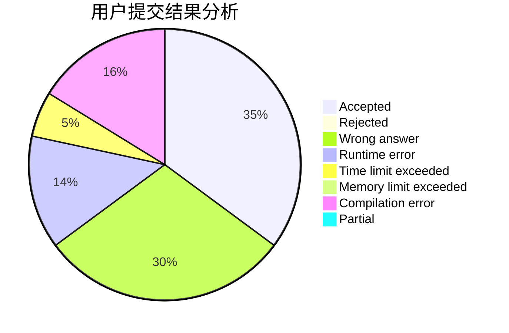
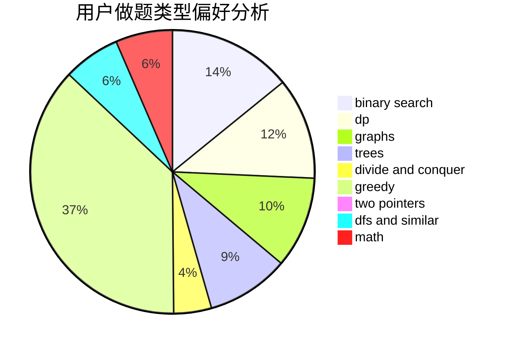

# AgNO3

<!-- tabs:start -->

#### **用户提交结果分析**

#### **用户做题类型偏好分析**

<!-- tabs:end -->
# 推荐题目
[1463A](https://codeforces.com/contest/1463/problem/A)
[1416B](https://codeforces.com/contest/1416/problem/B)
[212E](https://codeforces.com/contest/212/problem/E)
[1133A](https://codeforces.com/contest/1133/problem/A)
[215C](https://codeforces.com/contest/215/problem/C)
[109A](https://codeforces.com/contest/109/problem/A)
[215A](https://codeforces.com/contest/215/problem/A)
[1078D](https://codeforces.com/contest/1078/problem/D)
[213E](https://codeforces.com/contest/213/problem/E)
[215E](https://codeforces.com/contest/215/problem/E)
