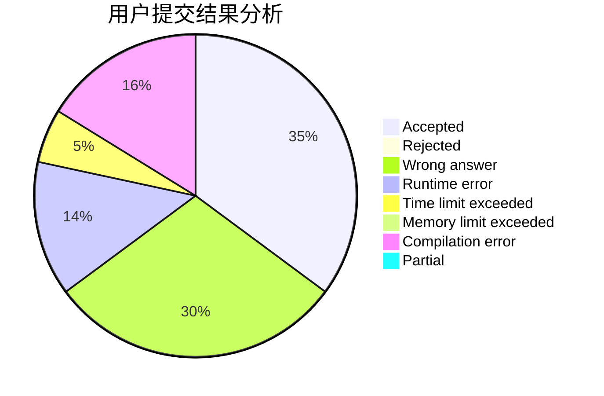
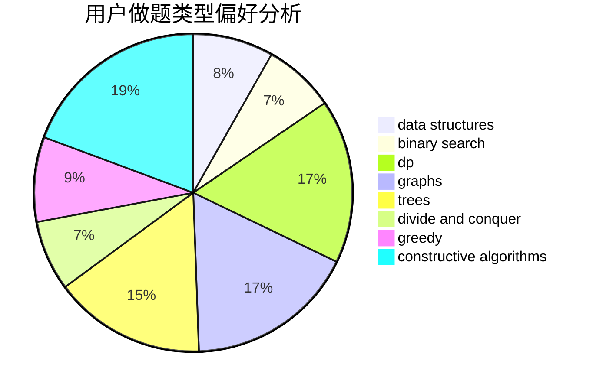

# AgNO3

<!-- tabs:start -->

#### **用户提交结果分析**

#### **用户做题类型偏好分析**

#### **用户错题知识点分析**

<!-- tabs:end -->
# 推荐题目
[1463A](https://codeforces.com/contest/1463/problem/A)		binary search,
                        math		  
[1416B](https://codeforces.com/contest/1416/problem/B)		constructive algorithms,
                        greedy,
                        math		  
[212E](https://codeforces.com/contest/212/problem/E)		dfs and similar,
                        dp,
                        trees		  
[1133A](https://codeforces.com/contest/1133/problem/A)		implementation		  
[215C](https://codeforces.com/contest/215/problem/C)		brute force,
                        implementation		  
[109A](https://codeforces.com/contest/109/problem/A)		brute force,
                        implementation		  
[215A](https://codeforces.com/contest/215/problem/A)		brute force,
                        implementation		  
[1078D](https://codeforces.com/contest/1078/problem/D)		dsu,graphs,sortings,trees		  
[213E](https://codeforces.com/contest/213/problem/E)		data structures,
                        hashing,
                        strings		  
[215E](https://codeforces.com/contest/215/problem/E)		combinatorics,
                        dp,
                        number theory		  
