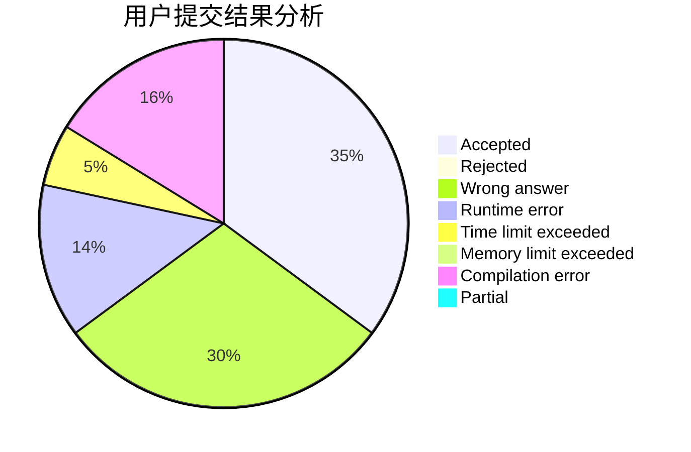
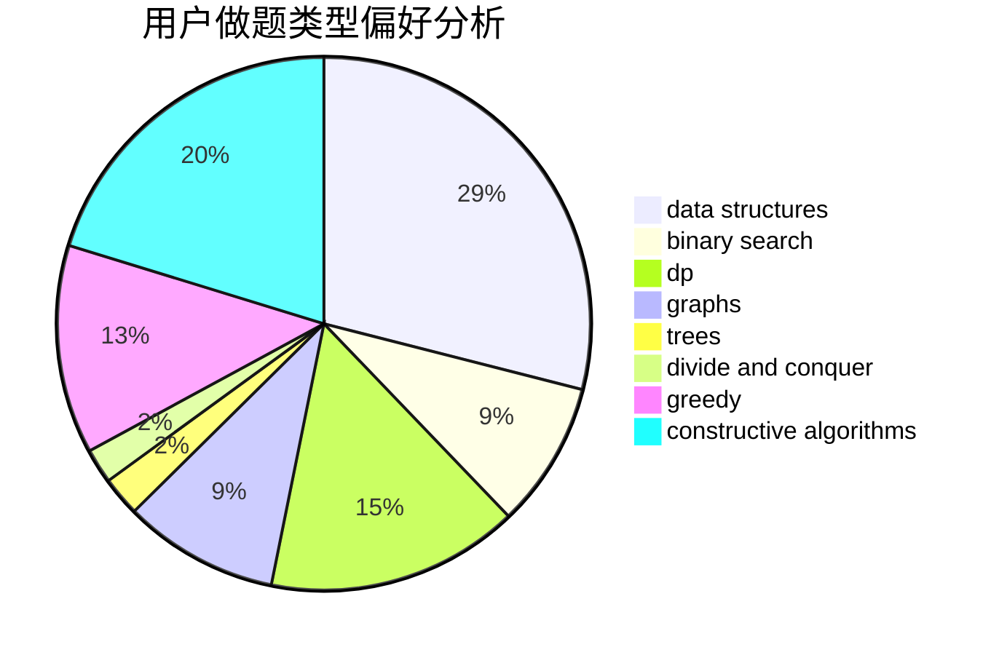
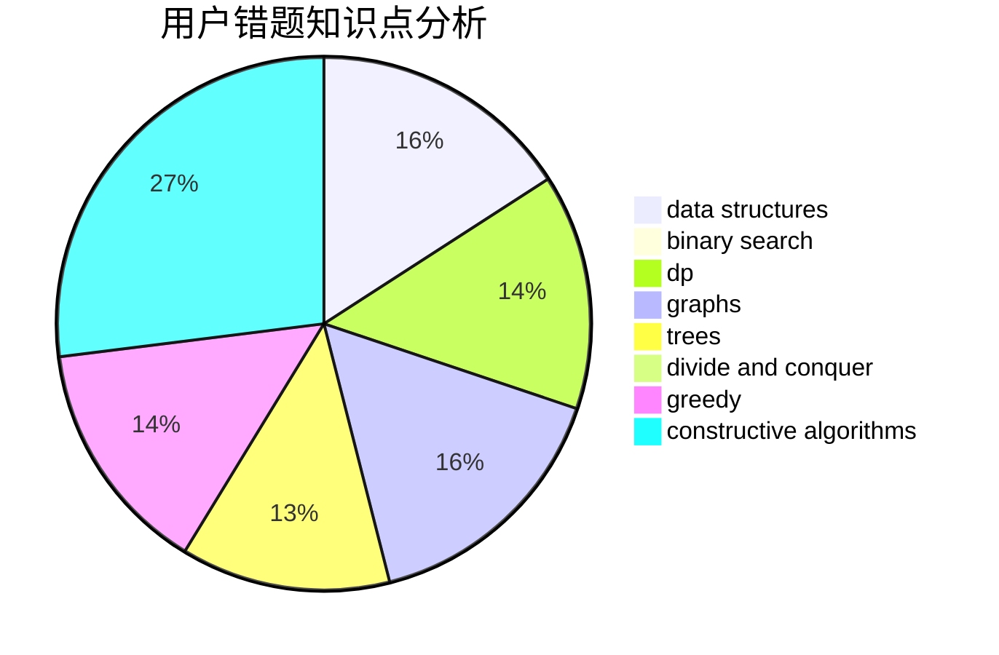

# AgNO3

<!-- tabs:start -->

#### **用户提交结果分析**

#### **用户做题类型偏好分析**

#### **用户错题知识点分析**

<!-- tabs:end -->
# 推荐题目
[1453D](https://codeforces.com/contest/1453/problem/D)		brute force,
                        constructive algorithms,
                        greedy,
                        math,
                        probabilities		  
[1405A](https://codeforces.com/contest/1405/problem/A)		constructive algorithms		  
[189A](https://codeforces.com/contest/189/problem/A)		brute force,
                        dp		  
[1131D](https://codeforces.com/contest/1131/problem/D)		dfs and similar,
                        dp,
                        dsu,
                        graphs,
                        greedy		  
[18E](https://codeforces.com/contest/18/problem/E)		dp		  
[1099D](https://codeforces.com/contest/1099/problem/D)		dsu,graphs,sortings,trees		  
[18A](https://codeforces.com/contest/18/problem/A)		brute force,
                        geometry		  
[1078A](https://codeforces.com/contest/1078/problem/A)		dsu,graphs,sortings,trees		  
[189E](https://codeforces.com/contest/189/problem/E)		dsu,graphs,sortings,trees		  
[190E](https://codeforces.com/contest/190/problem/E)		data structures,
                        dsu,
                        graphs,
                        hashing,
                        sortings		  
