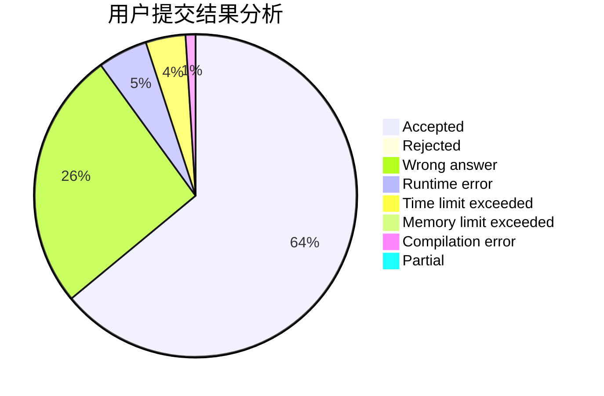
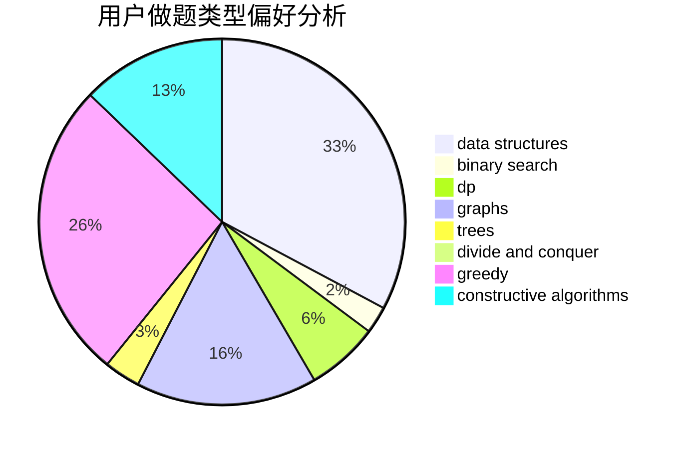

# Turkey

<!-- tabs:start -->

#### **用户提交结果分析**

#### **用户做题类型偏好分析**

#### **用户错题知识点分析**

<!-- tabs:end -->
# 推荐题目
[285E](https://codeforces.com/contest/285/problem/E)		combinatorics,
                        dp,
                        math		  
[12471](https://codeforces.com/contest/1247/problem/1)		dsu,graphs,sortings,trees		  
[22E](https://codeforces.com/contest/22/problem/E)		dfs and similar,
                        graphs,
                        trees		  
[708E](https://codeforces.com/contest/708/problem/E)		dp,
                        math		  
[1074B](https://codeforces.com/contest/1074/problem/B)		dsu,graphs,sortings,trees		  
[122C](https://codeforces.com/contest/122/problem/C)		dsu,graphs,sortings,trees		  
[11952](https://codeforces.com/contest/1195/problem/2)		dsu,graphs,sortings,trees		  
[508C](https://codeforces.com/contest/508/problem/C)		constructive algorithms,
                        greedy		  
[97C](https://codeforces.com/contest/97/problem/C)		binary search,
                        graphs,
                        math,
                        shortest paths		  
[1111A](https://codeforces.com/contest/1111/problem/A)		implementation,
                        strings		  
