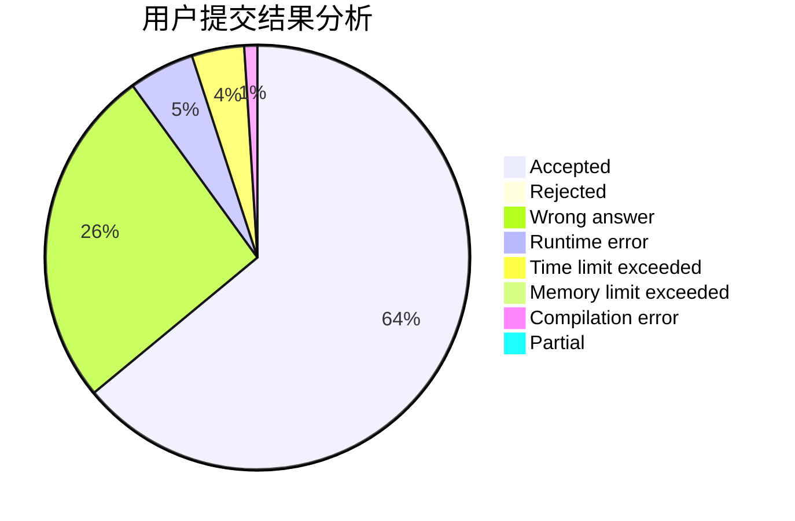
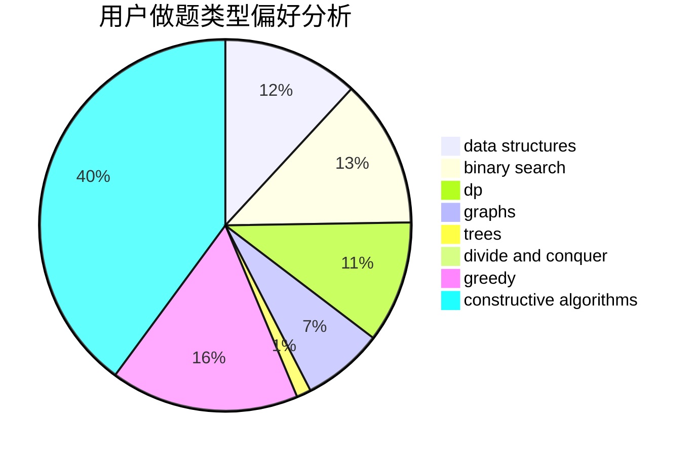
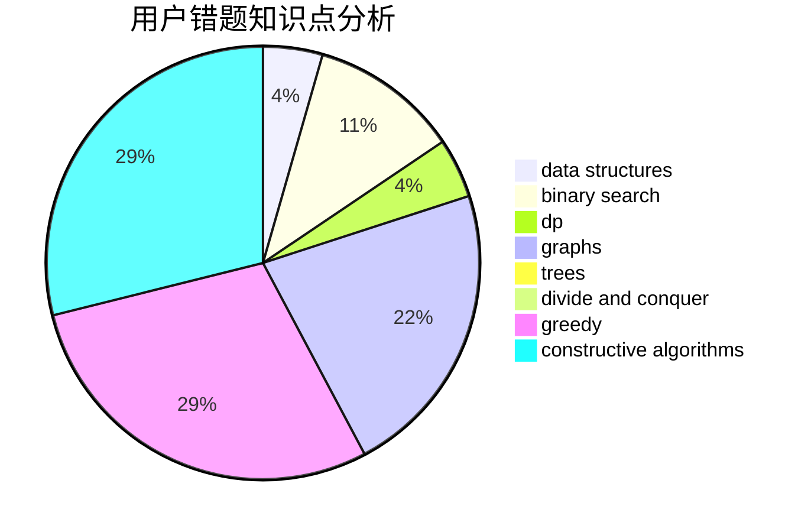

# Turkey

<!-- tabs:start -->

#### **用户提交结果分析**

#### **用户做题类型偏好分析**

#### **用户错题知识点分析**

<!-- tabs:end -->
# 推荐题目
[269D](https://codeforces.com/contest/269/problem/D)		data structures,
                        dp,
                        graphs,
                        sortings		  
[1241C](https://codeforces.com/contest/1241/problem/C)		dsu,graphs,sortings,trees		  
[208C](https://codeforces.com/contest/208/problem/C)		dp,
                        graphs,
                        shortest paths		  
[687A](https://codeforces.com/contest/687/problem/A)		dfs and similar,
                        graphs		  
[1073F](https://codeforces.com/contest/1073/problem/F)		dfs and similar,
                        dp,
                        greedy,
                        trees		  
[1221G](https://codeforces.com/contest/1221/problem/G)		bitmasks,
                        brute force,
                        combinatorics,
                        dp,
                        meet-in-the-middle		  
[1189E](https://codeforces.com/contest/1189/problem/E)		dsu,graphs,sortings,trees		  
[487C](https://codeforces.com/contest/487/problem/C)		constructive algorithms,
                        math,
                        number theory		  
[958C3](https://codeforces.com/contest/958C/problem/3)		data structures,
                        dp		  
[1110F](https://codeforces.com/contest/1110/problem/F)		data structures,
                        trees		  
