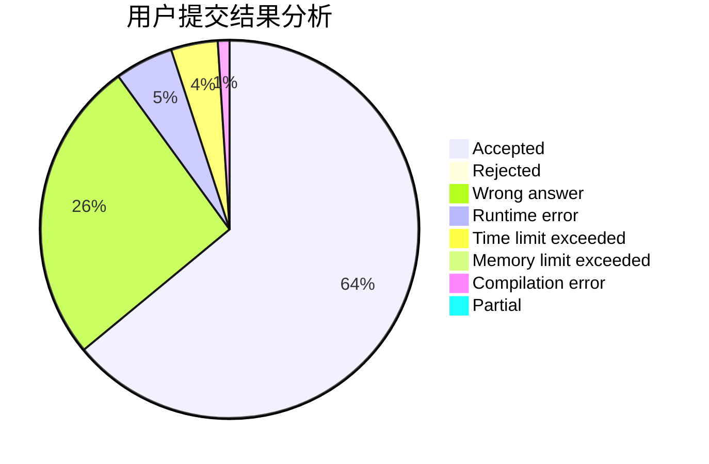
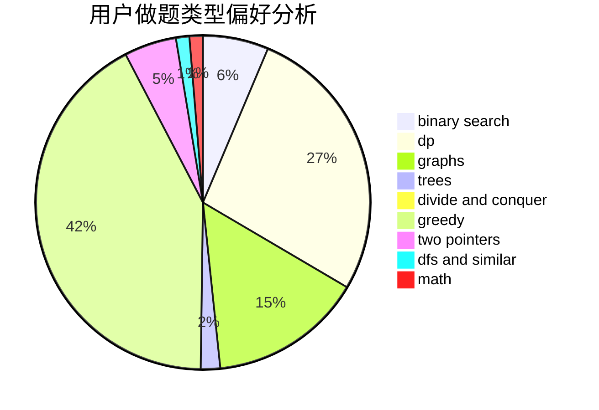

# Turkey

<!-- tabs:start -->

#### **用户提交结果分析**

#### **用户做题类型偏好分析**

<!-- tabs:end -->
# 推荐题目
[285E](https://codeforces.com/contest/285/problem/E)
[12471](https://codeforces.com/contest/1247/problem/1)
[22E](https://codeforces.com/contest/22/problem/E)
[708E](https://codeforces.com/contest/708/problem/E)
[1074B](https://codeforces.com/contest/1074/problem/B)
[122C](https://codeforces.com/contest/122/problem/C)
[11952](https://codeforces.com/contest/1195/problem/2)
[508C](https://codeforces.com/contest/508/problem/C)
[97C](https://codeforces.com/contest/97/problem/C)
[1111A](https://codeforces.com/contest/1111/problem/A)
