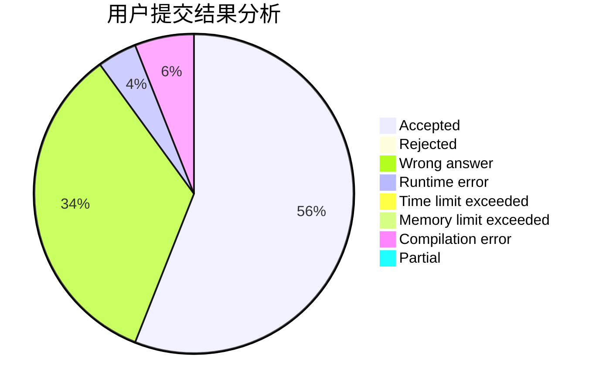
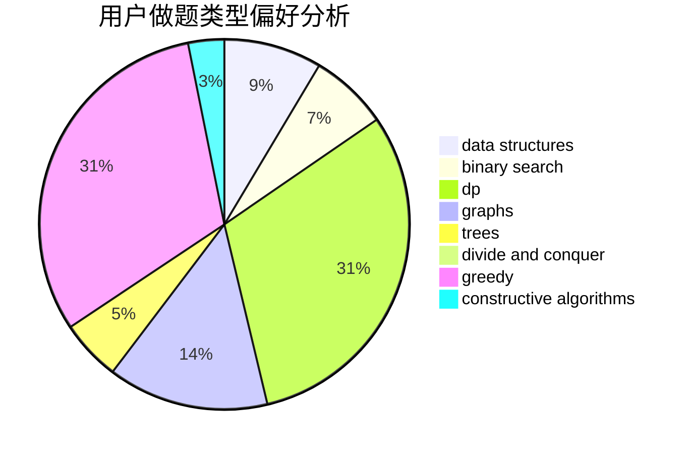
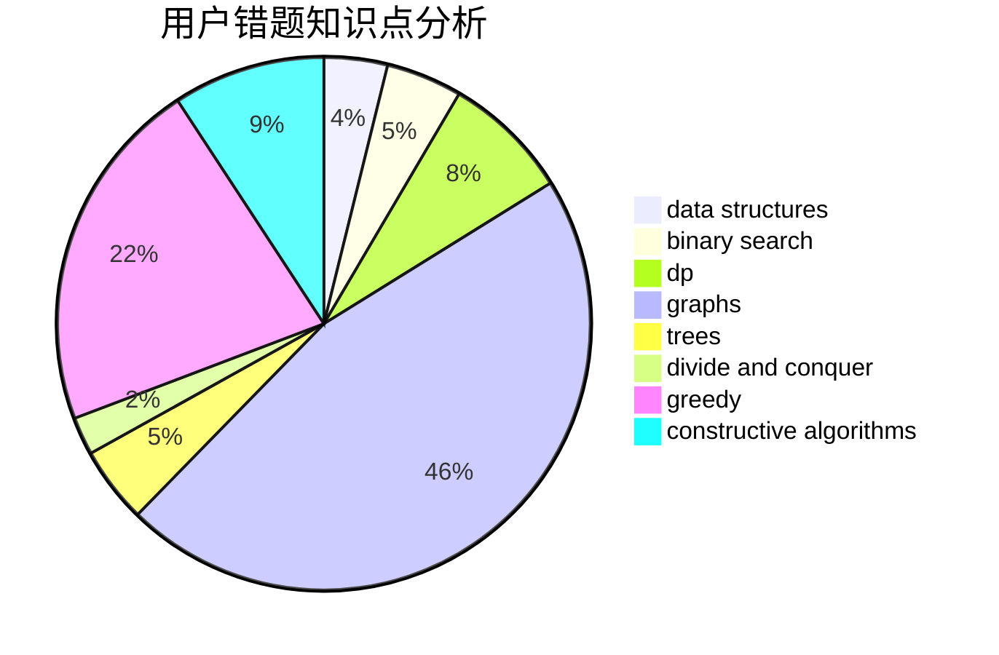

# TwilightShadow

<!-- tabs:start -->

#### **用户提交结果分析**

#### **用户做题类型偏好分析**

#### **用户错题知识点分析**

<!-- tabs:end -->
# 推荐题目
[77E](https://codeforces.com/contest/77/problem/E)		geometry		  
[1217A](https://codeforces.com/contest/1217/problem/A)		binary search,
                        math		  
[1375C](https://codeforces.com/contest/1375/problem/C)		constructive algorithms,
                        data structures,
                        greedy		  
[1129B](https://codeforces.com/contest/1129/problem/B)		constructive algorithms		  
[1033C](https://codeforces.com/contest/1033/problem/C)		brute force,
                        dp,
                        games		  
[981D](https://codeforces.com/contest/981/problem/D)		bitmasks,
                        dp,
                        greedy		  
[272E](https://codeforces.com/contest/272/problem/E)		combinatorics,
                        constructive algorithms,
                        graphs		  
[780B](https://codeforces.com/contest/780/problem/B)		binary search		  
[866D](https://codeforces.com/contest/866/problem/D)		dsu,graphs,sortings,trees		  
[18E](https://codeforces.com/contest/18/problem/E)		dp		  
