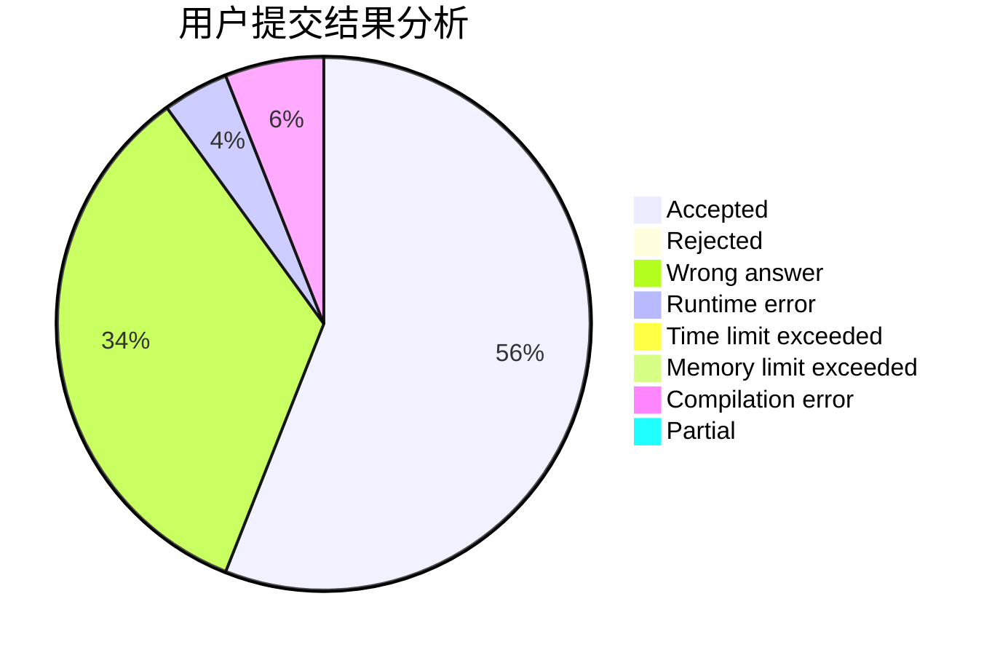
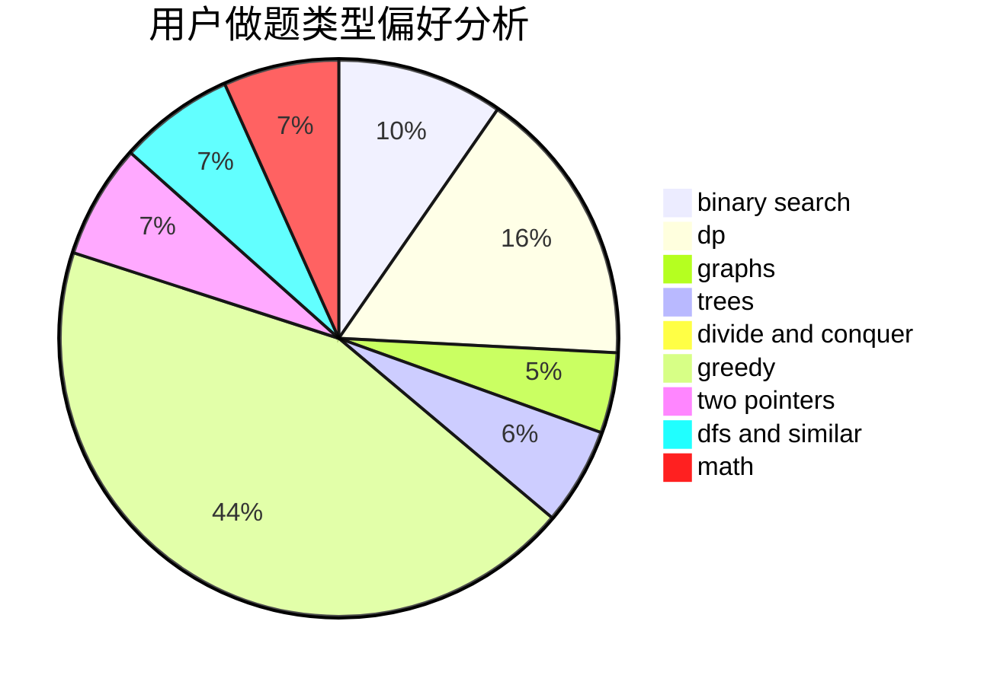

# TwilightShadow

<!-- tabs:start -->

#### **用户提交结果分析**

#### **用户做题类型偏好分析**

<!-- tabs:end -->
# 推荐题目
[798C](https://codeforces.com/contest/798/problem/C)
[1223E](https://codeforces.com/contest/1223/problem/E)
[1384A](https://codeforces.com/contest/1384/problem/A)
[1131B](https://codeforces.com/contest/1131/problem/B)
[1033F](https://codeforces.com/contest/1033/problem/F)
[996E](https://codeforces.com/contest/996/problem/E)
[288E](https://codeforces.com/contest/288/problem/E)
[798E](https://codeforces.com/contest/798/problem/E)
[886F](https://codeforces.com/contest/886/problem/F)
[215C](https://codeforces.com/contest/215/problem/C)
