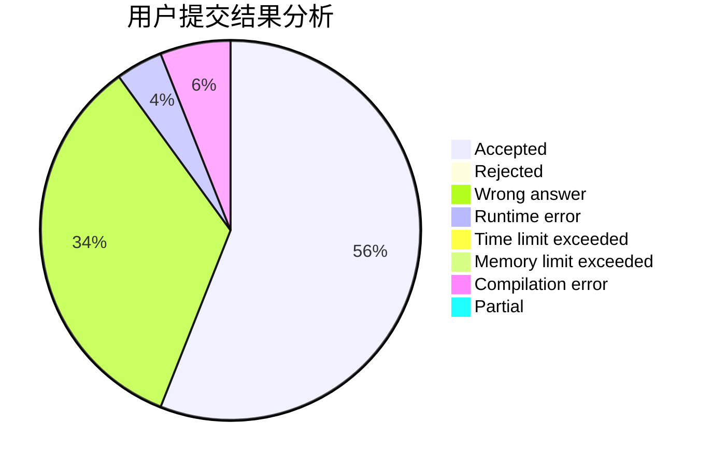
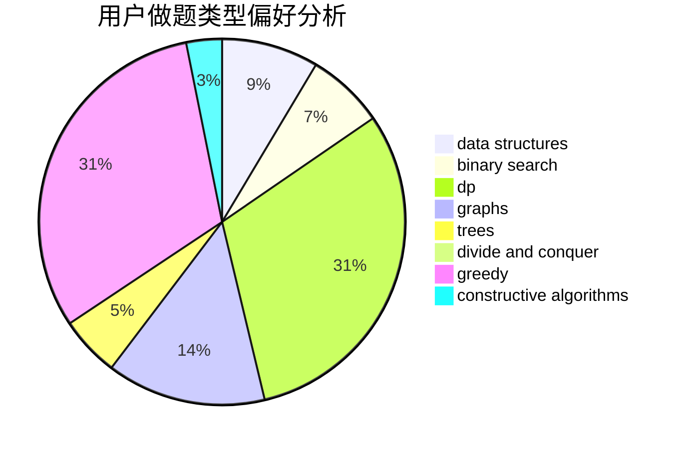
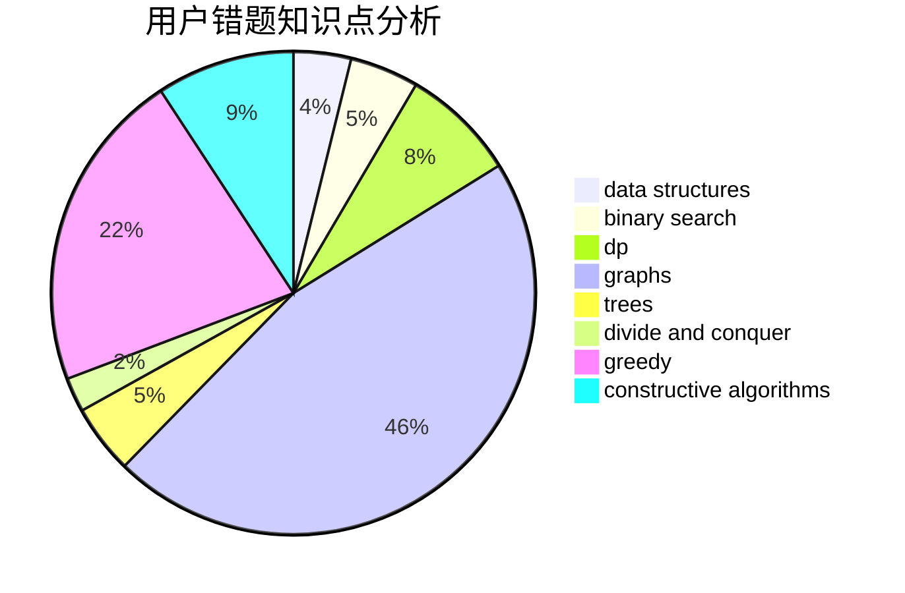

# TwilightShadow
<!-- tabs:start -->
#### **用户提交结果分析**

#### **用户做题类型偏好分析**

#### **用户错题知识点分析**

<!-- tabs:end -->
# 推荐题目
[Permutation Game](http://codeforces.com/problemset/problem/1033/C)		brute force,
                        dp,
                        games		  
[Flag 2](http://codeforces.com/problemset/problem/18/E)		dp		  
[Dima and Horses](http://codeforces.com/problemset/problem/272/E)		combinatorics,
                        constructive algorithms,
                        graphs		  
[Creating a Character](http://codeforces.com/problemset/problem/1217/A)		binary search,
                        math		  
[Martian Food](http://codeforces.com/problemset/problem/77/E)		geometry		  
[Two Policemen](http://codeforces.com/problemset/problem/1488/C)		*special problem,
                        binary search,
                        brute force,
                        math		  
[The Meeting Place Cannot Be Changed](http://codeforces.com/problemset/problem/780/B)		binary search		  
[Buy Low Sell High](https://codeforces.com/contest/866/problem/D)		constructive algorithms,
                        data structures,
                        greedy		  
[Frog Fights](http://codeforces.com/problemset/problem/625/E)		data structures,
                        greedy		  
[Vasya and Triangle](http://codeforces.com/problemset/problem/1030/D)		geometry,
                        number theory		  
<!-- tabs:start -->
#### **data structures**
[Permutation Game](https://codeforces.com/contest/866/problem/D)		constructive algorithms,
                        data structures,
                        greedy		  
[Flag 2](http://codeforces.com/problemset/problem/625/E)		data structures,
                        greedy		  
[Dima and Horses](http://codeforces.com/problemset/problem/1141/F2)		data structures,
                        greedy		  
[Creating a Character](http://codeforces.com/problemset/problem/1375/C)		constructive algorithms,
                        data structures,
                        greedy		  
[Martian Food](http://codeforces.com/problemset/problem/475/D)		brute force,
                        data structures,
                        math		  
[Two Policemen](http://codeforces.com/problemset/problem/1041/E)		constructive algorithms,
                        data structures,
                        graphs,
                        greedy		  
[The Meeting Place Cannot Be Changed](http://codeforces.com/problemset/problem/914/D)		data structures,
                        number theory		  
[Buy Low Sell High](http://codeforces.com/problemset/problem/1175/E)		data structures,
                        dfs and similar,
                        divide and conquer,
                        dp,
                        greedy,
                        implementation,
                        trees		  
[Frog Fights](http://codeforces.com/problemset/problem/1408/E)		data structures,
                        dsu,
                        graphs,
                        greedy,
                        sortings,
                        trees		  
[Vasya and Triangle](http://codeforces.com/problemset/problem/558/E)		data structures,
                        sortings,
                        strings		  
#### **binary search**
[Permutation Game](http://codeforces.com/problemset/problem/1217/A)		binary search,
                        math		  
[Flag 2](http://codeforces.com/problemset/problem/1488/C)		*special problem,
                        binary search,
                        brute force,
                        math		  
[Dima and Horses](http://codeforces.com/problemset/problem/780/B)		binary search		  
[Creating a Character](https://codeforces.com/contest/967/problem/D)		binary search,
                        implementation,
                        sortings		  
[Martian Food](http://codeforces.com/problemset/problem/938/C)		binary search,
                        brute force,
                        constructive algorithms		  
[Two Policemen](http://codeforces.com/problemset/problem/1129/E)		binary search,
                        interactive,
                        trees		  
[The Meeting Place Cannot Be Changed](http://codeforces.com/problemset/problem/1470/C)		binary search,
                        brute force,
                        constructive algorithms,
                        interactive		  
[Buy Low Sell High](http://codeforces.com/problemset/problem/1168/A)		binary search,
                        greedy		  
[Frog Fights](https://codeforces.com/contest/1020/problem/D)		binary search,
                        interactive		  
[Vasya and Triangle](http://codeforces.com/problemset/problem/1492/C)		binary search,
                        data structures,
                        dp,
                        greedy,
                        two pointers		  
#### **dp**
[Permutation Game](http://codeforces.com/problemset/problem/1033/C)		brute force,
                        dp,
                        games		  
[Flag 2](http://codeforces.com/problemset/problem/18/E)		dp		  
[Dima and Horses](https://codeforces.com/contest/701/problem/E)		dfs and similar,
                        dp,
                        graphs,
                        trees		  
[Creating a Character](http://codeforces.com/problemset/problem/1431/G)		*special problem,
                        dp,
                        games,
                        greedy		  
[Martian Food](http://codeforces.com/problemset/problem/981/D)		bitmasks,
                        dp,
                        greedy		  
[Two Policemen](http://codeforces.com/problemset/problem/1109/A)		dp,
                        implementation		  
[The Meeting Place Cannot Be Changed](http://codeforces.com/problemset/problem/908/D)		dp,
                        math,
                        probabilities		  
[Buy Low Sell High](http://codeforces.com/problemset/problem/1005/D)		dp,
                        greedy,
                        number theory		  
[Frog Fights](http://codeforces.com/problemset/problem/1175/E)		data structures,
                        dfs and similar,
                        divide and conquer,
                        dp,
                        greedy,
                        implementation,
                        trees		  
[Vasya and Triangle](http://codeforces.com/problemset/problem/837/D)		dp,
                        math		  
#### **graph**
[Permutation Game](http://codeforces.com/problemset/problem/272/E)		combinatorics,
                        constructive algorithms,
                        graphs		  
[Flag 2](https://codeforces.com/contest/701/problem/E)		dfs and similar,
                        dp,
                        graphs,
                        trees		  
[Dima and Horses](http://codeforces.com/problemset/problem/575/B)		dfs and similar,
                        graphs,
                        trees		  
[Creating a Character](http://codeforces.com/problemset/problem/1333/D)		brute force,
                        constructive algorithms,
                        games,
                        graphs,
                        greedy,
                        implementation,
                        sortings		  
[Martian Food](http://codeforces.com/problemset/problem/1283/D)		graphs,
                        greedy,
                        shortest paths		  
[Two Policemen](http://codeforces.com/problemset/problem/1041/E)		constructive algorithms,
                        data structures,
                        graphs,
                        greedy		  
[The Meeting Place Cannot Be Changed](http://codeforces.com/problemset/problem/976/F)		flows,
                        graphs		  
[Buy Low Sell High](http://codeforces.com/problemset/problem/1495/C)		constructive algorithms,
                        graphs		  
[Frog Fights](http://codeforces.com/problemset/problem/1408/E)		data structures,
                        dsu,
                        graphs,
                        greedy,
                        sortings,
                        trees		  
[Vasya and Triangle](http://codeforces.com/problemset/problem/1487/C)		brute force,
                        constructive algorithms,
                        dfs and similar,
                        graphs,
                        greedy,
                        implementation,
                        math		  
#### **trees**
[Permutation Game](https://codeforces.com/contest/701/problem/E)		dfs and similar,
                        dp,
                        graphs,
                        trees		  
[Flag 2](http://codeforces.com/problemset/problem/575/B)		dfs and similar,
                        graphs,
                        trees		  
[Dima and Horses](http://codeforces.com/problemset/problem/1129/E)		binary search,
                        interactive,
                        trees		  
[Creating a Character](http://codeforces.com/problemset/problem/1305/D)		constructive algorithms,
                        dfs and similar,
                        interactive,
                        trees		  
[Martian Food](http://codeforces.com/problemset/problem/1175/E)		data structures,
                        dfs and similar,
                        divide and conquer,
                        dp,
                        greedy,
                        implementation,
                        trees		  
[Two Policemen](http://codeforces.com/problemset/problem/1408/E)		data structures,
                        dsu,
                        graphs,
                        greedy,
                        sortings,
                        trees		  
[The Meeting Place Cannot Be Changed](http://codeforces.com/problemset/problem/1479/D)		binary search,
                        bitmasks,
                        brute force,
                        data structures,
                        probabilities,
                        trees		  
[Buy Low Sell High](http://codeforces.com/problemset/problem/1511/C)		brute force,
                        data structures,
                        implementation,
                        trees		  
[Frog Fights](http://codeforces.com/problemset/problem/1499/F)		combinatorics,
                        dfs and similar,
                        dp,
                        trees		  
[Vasya and Triangle](http://codeforces.com/problemset/problem/1491/E)		brute force,
                        dfs and similar,
                        divide and conquer,
                        number theory,
                        trees		  
#### **divide and conquer**
[Permutation Game](http://codeforces.com/problemset/problem/1175/E)		data structures,
                        dfs and similar,
                        divide and conquer,
                        dp,
                        greedy,
                        implementation,
                        trees		  
[Flag 2](http://codeforces.com/problemset/problem/1461/D)		binary search,
                        brute force,
                        data structures,
                        divide and conquer,
                        implementation,
                        sortings		  
[Dima and Horses](http://codeforces.com/problemset/problem/1466/G)		combinatorics,
                        divide and conquer,
                        hashing,
                        math,
                        string suffix structures,
                        strings		  
[Creating a Character](http://codeforces.com/problemset/problem/1490/D)		dfs and similar,
                        divide and conquer,
                        implementation		  
[Martian Food](https://codeforces.com/contest/1483/problem/C)		data structures,
                        divide and conquer,
                        dp		  
[Two Policemen](http://codeforces.com/problemset/problem/1491/E)		brute force,
                        dfs and similar,
                        divide and conquer,
                        number theory,
                        trees		  
[The Meeting Place Cannot Be Changed](http://codeforces.com/problemset/problem/1303/G)		data structures,
                        divide and conquer,
                        geometry,
                        trees		  
[Buy Low Sell High](http://codeforces.com/problemset/problem/1494/D)		constructive algorithms,
                        data structures,
                        dfs and similar,
                        divide and conquer,
                        dsu,
                        greedy,
                        sortings,
                        trees		  
[Frog Fights](http://codeforces.com/problemset/problem/1482/E)		data structures,
                        divide and conquer,
                        dp		  
[Vasya and Triangle](http://codeforces.com/problemset/problem/566/C)		dfs and similar,
                        divide and conquer,
                        trees		  
#### **greedy**
[Permutation Game](https://codeforces.com/contest/866/problem/D)		constructive algorithms,
                        data structures,
                        greedy		  
[Flag 2](http://codeforces.com/problemset/problem/625/E)		data structures,
                        greedy		  
[Dima and Horses](http://codeforces.com/problemset/problem/1141/F2)		data structures,
                        greedy		  
[Creating a Character](http://codeforces.com/problemset/problem/1333/D)		brute force,
                        constructive algorithms,
                        games,
                        graphs,
                        greedy,
                        implementation,
                        sortings		  
[Martian Food](http://codeforces.com/problemset/problem/337/B)		greedy,
                        math,
                        number theory		  
[Two Policemen](http://codeforces.com/problemset/problem/628/C)		greedy,
                        strings		  
[The Meeting Place Cannot Be Changed](http://codeforces.com/problemset/problem/1431/G)		*special problem,
                        dp,
                        games,
                        greedy		  
[Buy Low Sell High](http://codeforces.com/problemset/problem/1375/C)		constructive algorithms,
                        data structures,
                        greedy		  
[Frog Fights](http://codeforces.com/problemset/problem/981/D)		bitmasks,
                        dp,
                        greedy		  
[Vasya and Triangle](http://codeforces.com/problemset/problem/1283/D)		graphs,
                        greedy,
                        shortest paths		  
#### **constructive algorithms**
[Permutation Game](http://codeforces.com/problemset/problem/272/E)		combinatorics,
                        constructive algorithms,
                        graphs		  
[Flag 2](https://codeforces.com/contest/866/problem/D)		constructive algorithms,
                        data structures,
                        greedy		  
[Dima and Horses](http://codeforces.com/problemset/problem/1129/B)		constructive algorithms		  
[Creating a Character](http://codeforces.com/problemset/problem/633/B)		brute force,
                        constructive algorithms,
                        math,
                        number theory		  
[Martian Food](http://codeforces.com/problemset/problem/1333/D)		brute force,
                        constructive algorithms,
                        games,
                        graphs,
                        greedy,
                        implementation,
                        sortings		  
[Two Policemen](http://codeforces.com/problemset/problem/1375/C)		constructive algorithms,
                        data structures,
                        greedy		  
[The Meeting Place Cannot Be Changed](http://codeforces.com/problemset/problem/938/C)		binary search,
                        brute force,
                        constructive algorithms		  
[Buy Low Sell High](http://codeforces.com/problemset/problem/1400/A)		constructive algorithms,
                        strings		  
[Frog Fights](http://codeforces.com/problemset/problem/398/C)		constructive algorithms		  
[Vasya and Triangle](https://codeforces.com/contest/716/problem/C)		constructive algorithms,
                        math		  
#### **sortings**
[Permutation Game](http://codeforces.com/problemset/problem/12/B)		implementation,
                        sortings		  
[Flag 2](https://codeforces.com/contest/967/problem/D)		binary search,
                        implementation,
                        sortings		  
[Dima and Horses](http://codeforces.com/problemset/problem/1333/D)		brute force,
                        constructive algorithms,
                        games,
                        graphs,
                        greedy,
                        implementation,
                        sortings		  
[Creating a Character](http://codeforces.com/problemset/problem/378/B)		implementation,
                        sortings		  
[Martian Food](https://codeforces.com/contest/1362/problem/E)		greedy,
                        implementation,
                        math,
                        sortings		  
[Two Policemen](http://codeforces.com/problemset/problem/766/B)		constructive algorithms,
                        geometry,
                        greedy,
                        math,
                        number theory,
                        sortings		  
[The Meeting Place Cannot Be Changed](http://codeforces.com/problemset/problem/976/C)		greedy,
                        implementation,
                        sortings		  
[Buy Low Sell High](http://codeforces.com/problemset/problem/1408/E)		data structures,
                        dsu,
                        graphs,
                        greedy,
                        sortings,
                        trees		  
[Frog Fights](http://codeforces.com/problemset/problem/558/E)		data structures,
                        sortings,
                        strings		  
[Vasya and Triangle](https://codeforces.com/contest/1496/problem/C)		geometry,
                        greedy,
                        math,
                        sortings		  
<!-- tabs:end -->
