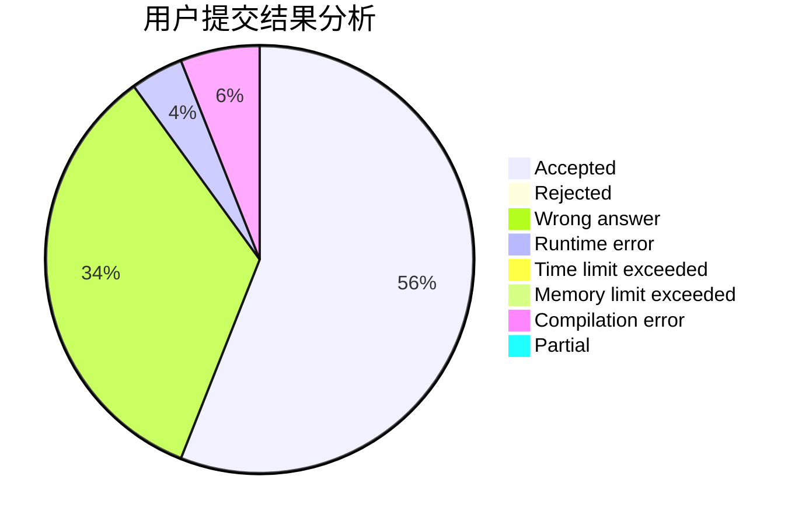
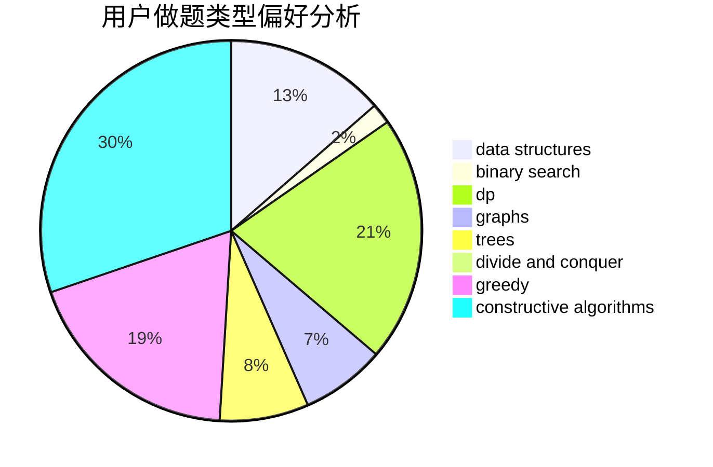
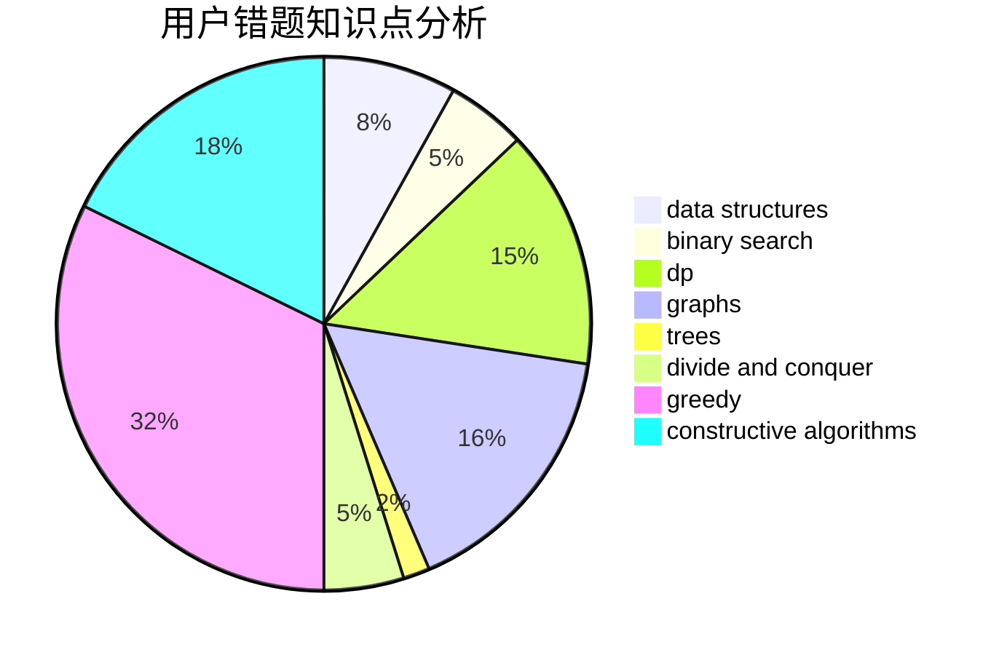

# TwilightShadow

<!-- tabs:start -->

#### **用户提交结果分析**

#### **用户做题类型偏好分析**

#### **用户错题知识点分析**

<!-- tabs:end -->
# 推荐题目
[798C](https://codeforces.com/contest/798/problem/C)		dp,
                        greedy,
                        number theory		  
[1223E](https://codeforces.com/contest/1223/problem/E)		dp,
                        sortings,
                        trees		  
[1384A](https://codeforces.com/contest/1384/problem/A)		constructive algorithms,
                        greedy,
                        strings		  
[1131B](https://codeforces.com/contest/1131/problem/B)		greedy,
                        implementation		  
[1033F](https://codeforces.com/contest/1033/problem/F)		bitmasks,
                        brute force,
                        fft,
                        math		  
[996E](https://codeforces.com/contest/996/problem/E)		dsu,graphs,sortings,trees		  
[288E](https://codeforces.com/contest/288/problem/E)		dp,
                        implementation,
                        math		  
[798E](https://codeforces.com/contest/798/problem/E)		constructive algorithms,
                        data structures,
                        graphs,
                        sortings		  
[886F](https://codeforces.com/contest/886/problem/F)		geometry		  
[215C](https://codeforces.com/contest/215/problem/C)		brute force,
                        implementation		  
