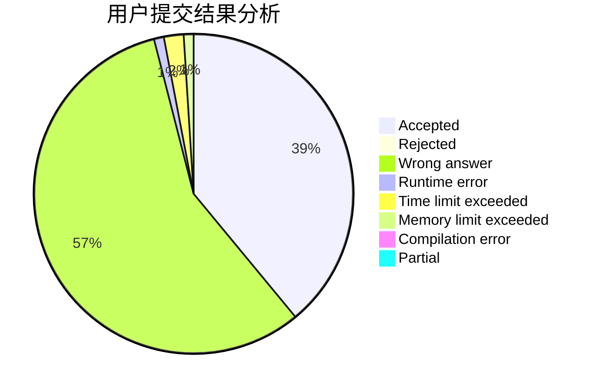
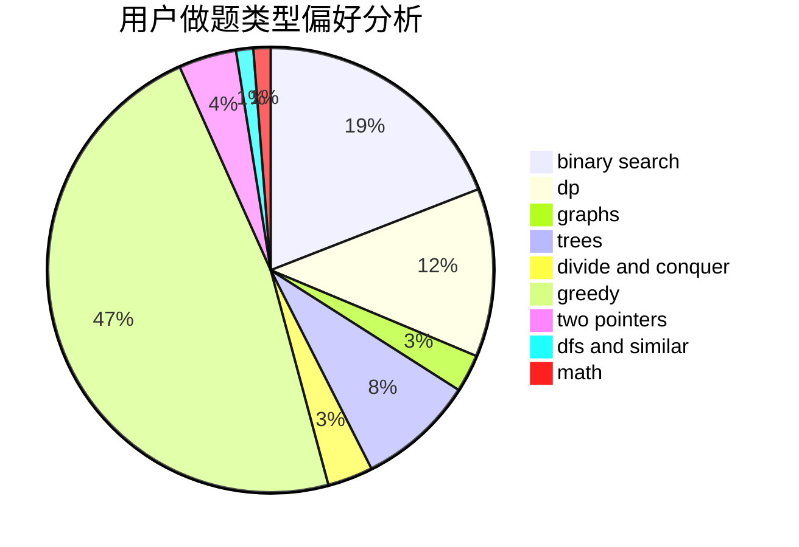

# ULIRE

<!-- tabs:start -->

#### **用户提交结果分析**

#### **用户做题类型偏好分析**

<!-- tabs:end -->
# 推荐题目
[897B](https://codeforces.com/contest/897/problem/B)
[1331A](https://codeforces.com/contest/1331/problem/A)
[189E](https://codeforces.com/contest/189/problem/E)
[1245C](https://codeforces.com/contest/1245/problem/C)
[160D](https://codeforces.com/contest/160/problem/D)
[813F](https://codeforces.com/contest/813/problem/F)
[516B](https://codeforces.com/contest/516/problem/B)
[418D](https://codeforces.com/contest/418/problem/D)
[1260F](https://codeforces.com/contest/1260/problem/F)
[1156E](https://codeforces.com/contest/1156/problem/E)
