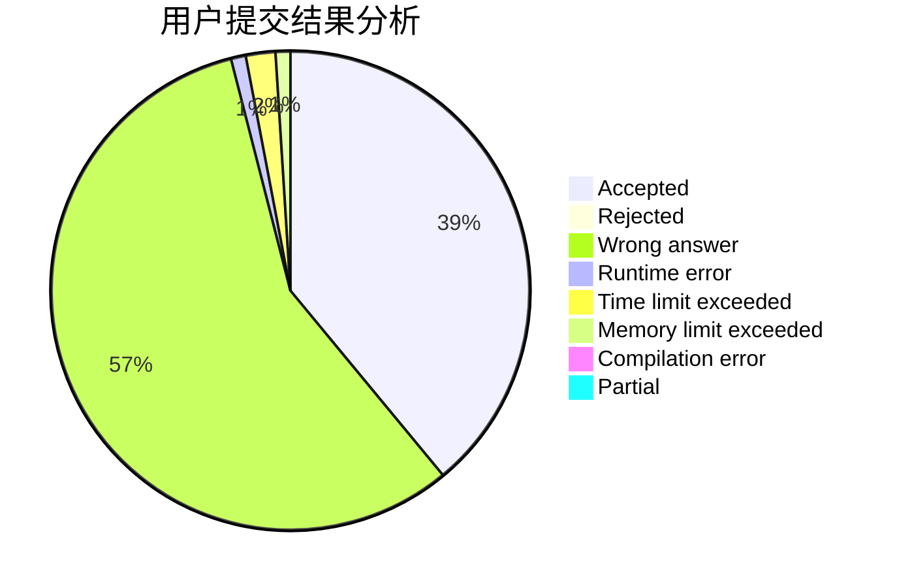
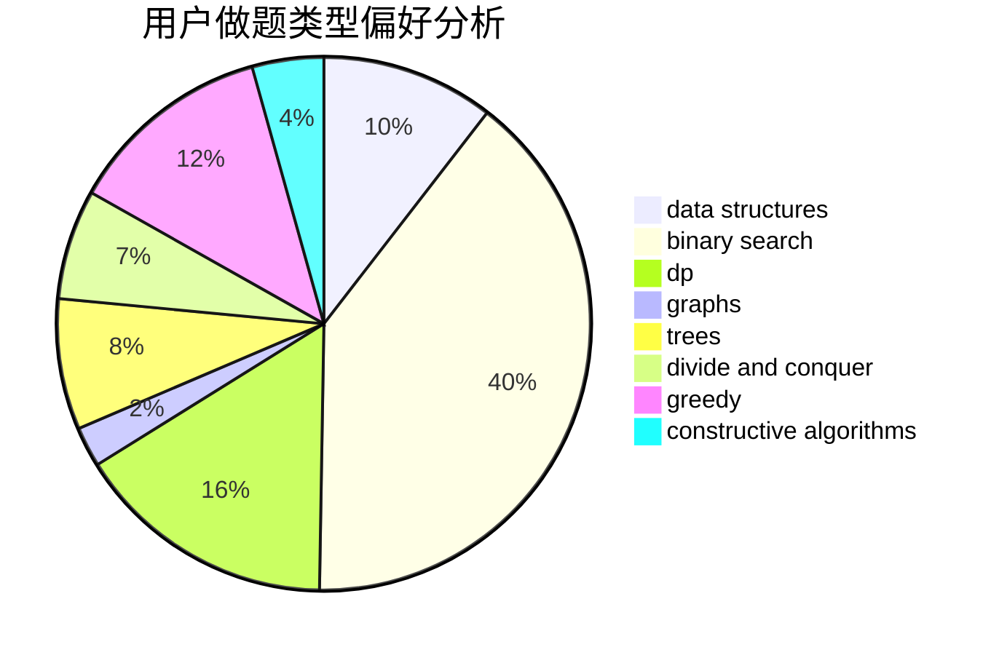
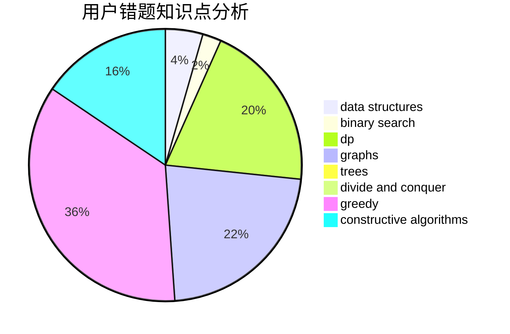

# ULIRE

<!-- tabs:start -->

#### **用户提交结果分析**

#### **用户做题类型偏好分析**

#### **用户错题知识点分析**

<!-- tabs:end -->
# 推荐题目
[897B](https://codeforces.com/contest/897/problem/B)		brute force		  
[1331A](https://codeforces.com/contest/1331/problem/A)		nan		  
[189E](https://codeforces.com/contest/189/problem/E)		dsu,graphs,sortings,trees		  
[1245C](https://codeforces.com/contest/1245/problem/C)		dp		  
[160D](https://codeforces.com/contest/160/problem/D)		dfs and similar,
                        dsu,
                        graphs,
                        sortings		  
[813F](https://codeforces.com/contest/813/problem/F)		data structures,
                        dsu,
                        graphs		  
[516B](https://codeforces.com/contest/516/problem/B)		dsu,graphs,sortings,trees		  
[418D](https://codeforces.com/contest/418/problem/D)		data structures,
                        graphs,
                        trees		  
[1260F](https://codeforces.com/contest/1260/problem/F)		data structures,
                        trees		  
[1156E](https://codeforces.com/contest/1156/problem/E)		data structures,
                        divide and conquer,
                        dsu,
                        two pointers		  
