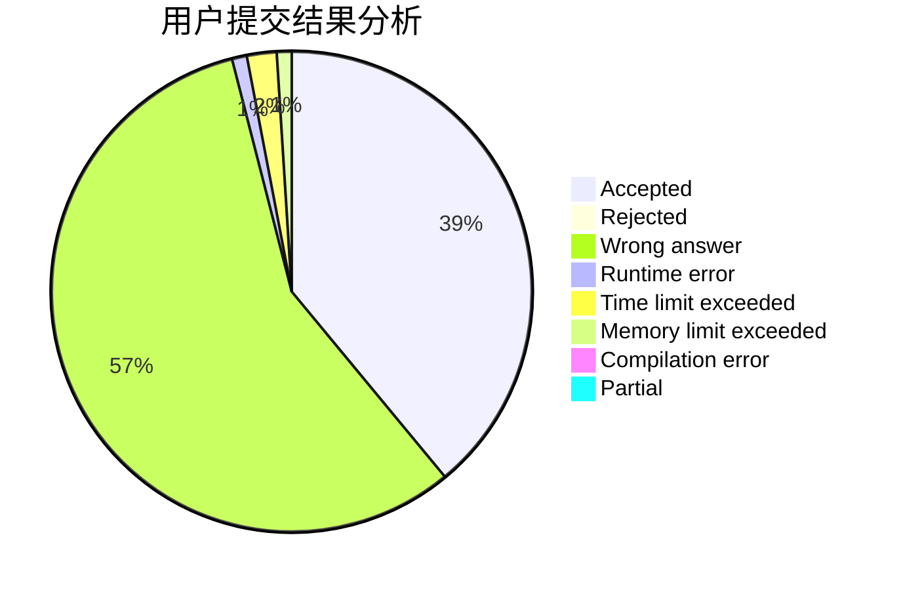
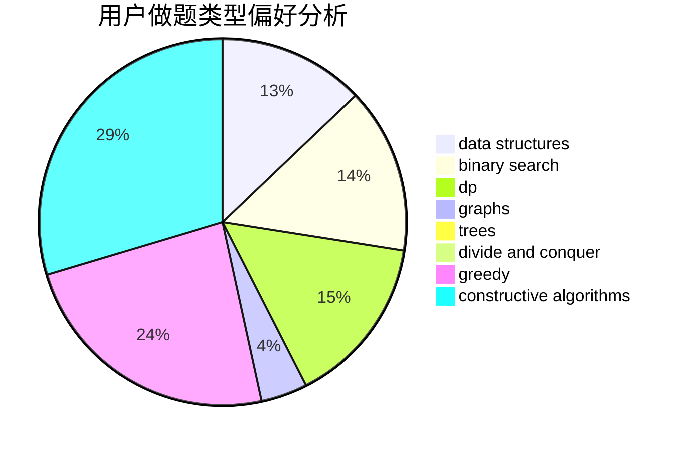
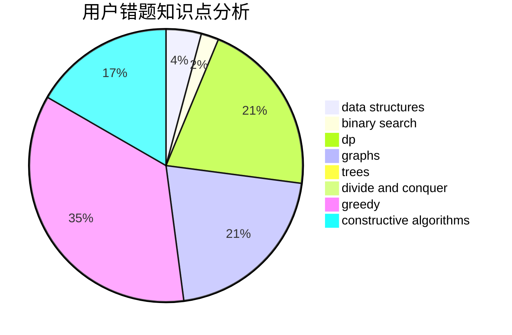

# ULIRE

<!-- tabs:start -->

#### **用户提交结果分析**

#### **用户做题类型偏好分析**

#### **用户错题知识点分析**

<!-- tabs:end -->
# 推荐题目
[876F](https://codeforces.com/contest/876/problem/F)		dsu,graphs,sortings,trees		  
[1324C](https://codeforces.com/contest/1324/problem/C)		binary search,
                        data structures,
                        dfs and similar,
                        greedy,
                        implementation		  
[163E](https://codeforces.com/contest/163/problem/E)		data structures,
                        dfs and similar,
                        dp,
                        strings,
                        trees		  
[123E](https://codeforces.com/contest/123/problem/E)		dfs and similar,
                        dp,
                        probabilities,
                        trees		  
[1509F](https://codeforces.com/contest/1509/problem/F)		dsu,graphs,sortings,trees		  
[799F](https://codeforces.com/contest/799/problem/F)		data structures		  
[497A](https://codeforces.com/contest/497/problem/A)		dsu,graphs,sortings,trees		  
[389B](https://codeforces.com/contest/389/problem/B)		greedy,
                        implementation		  
[1253D](https://codeforces.com/contest/1253/problem/D)		constructive algorithms,
                        dfs and similar,
                        dsu,
                        graphs,
                        greedy,
                        sortings		  
[1154E](https://codeforces.com/contest/1154/problem/E)		data structures,
                        implementation,
                        sortings		  
