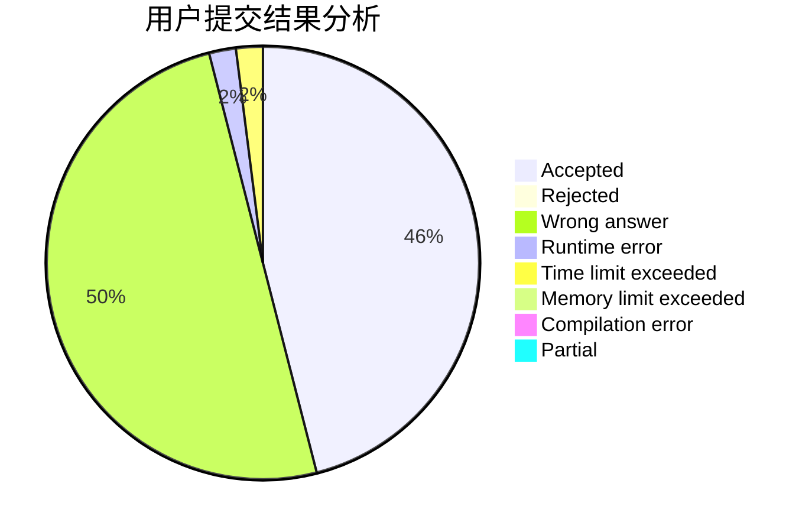
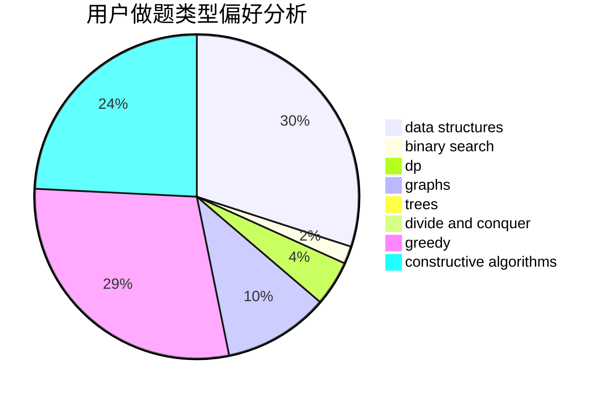
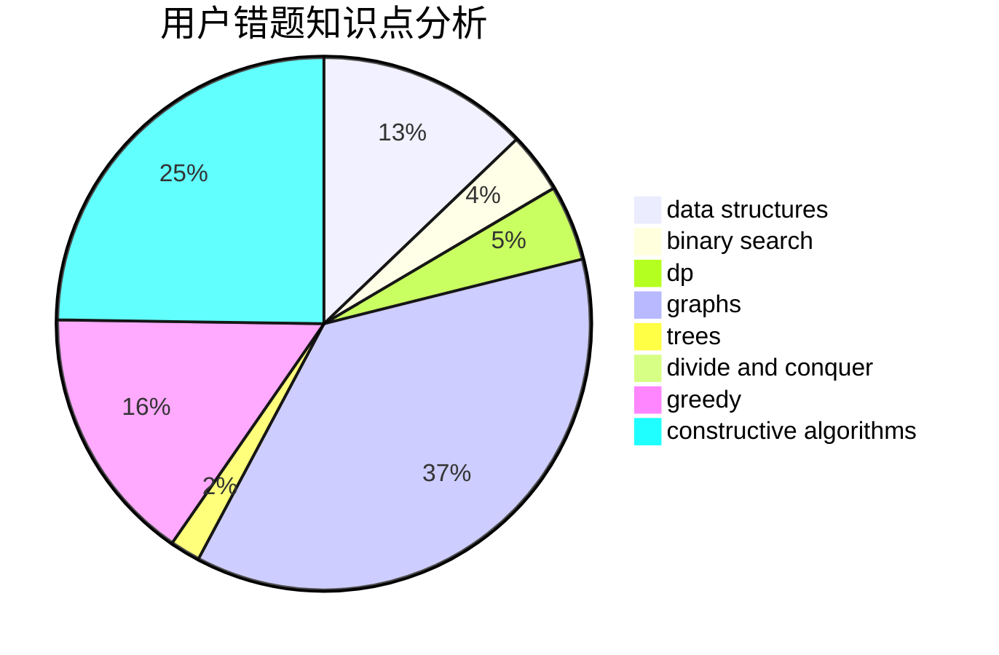

# UMadeleine

<!-- tabs:start -->

#### **用户提交结果分析**

#### **用户做题类型偏好分析**

#### **用户错题知识点分析**

<!-- tabs:end -->
# 推荐题目
[938B](https://codeforces.com/contest/938/problem/B)		brute force,
                        greedy		  
[1087A](https://codeforces.com/contest/1087/problem/A)		dsu,graphs,sortings,trees		  
[514C](https://codeforces.com/contest/514/problem/C)		binary search,
                        data structures,
                        hashing,
                        string suffix structures,
                        strings		  
[1044B](https://codeforces.com/contest/1044/problem/B)		dfs and similar,
                        interactive,
                        trees		  
[650C](https://codeforces.com/contest/650/problem/C)		dfs and similar,
                        dp,
                        dsu,
                        graphs,
                        greedy		  
[1083C](https://codeforces.com/contest/1083/problem/C)		data structures,
                        trees		  
[652E](https://codeforces.com/contest/652/problem/E)		dfs and similar,
                        dsu,
                        graphs,
                        trees		  
[26D](https://codeforces.com/contest/26/problem/D)		combinatorics,
                        math,
                        probabilities		  
[1084C](https://codeforces.com/contest/1084/problem/C)		combinatorics,
                        dp,
                        implementation		  
[1213C](https://codeforces.com/contest/1213/problem/C)		math		  
