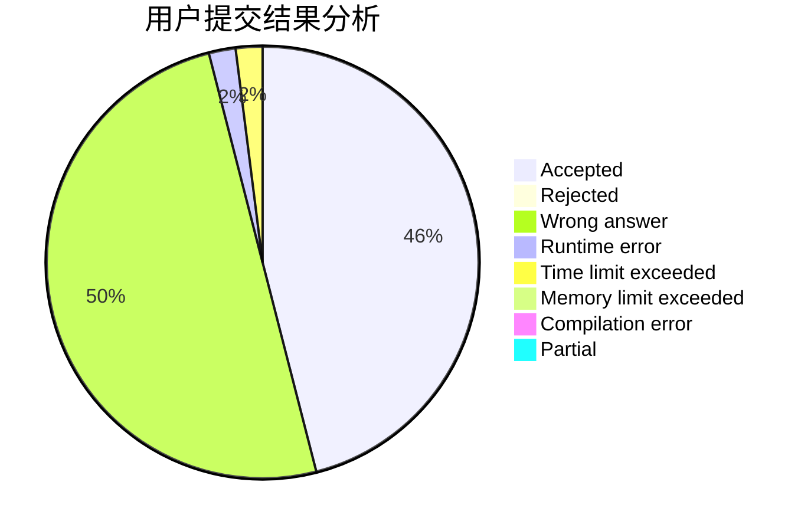
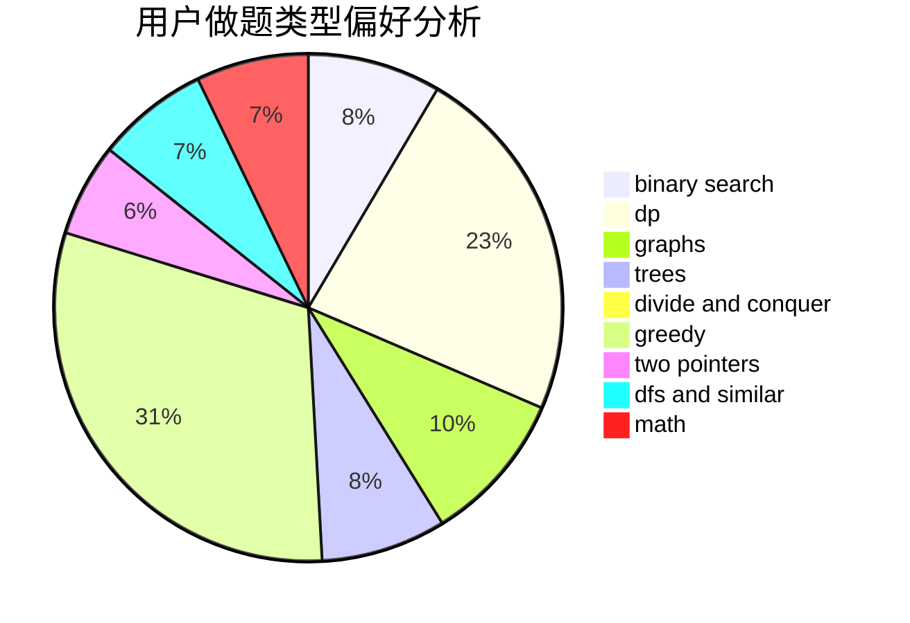

# UMadeleine

<!-- tabs:start -->

#### **用户提交结果分析**

#### **用户做题类型偏好分析**

<!-- tabs:end -->
# 推荐题目
[95A](https://codeforces.com/contest/95/problem/A)
[1087D](https://codeforces.com/contest/1087/problem/D)
[540A](https://codeforces.com/contest/540/problem/A)
[1045C](https://codeforces.com/contest/1045/problem/C)
[674D](https://codeforces.com/contest/674/problem/D)
[1083F](https://codeforces.com/contest/1083/problem/F)
[676D](https://codeforces.com/contest/676/problem/D)
[286D](https://codeforces.com/contest/286/problem/D)
[1085B](https://codeforces.com/contest/1085/problem/B)
[1217E](https://codeforces.com/contest/1217/problem/E)
