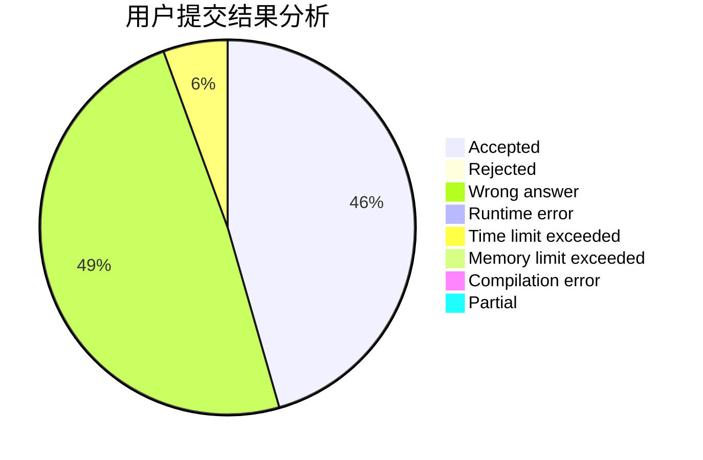
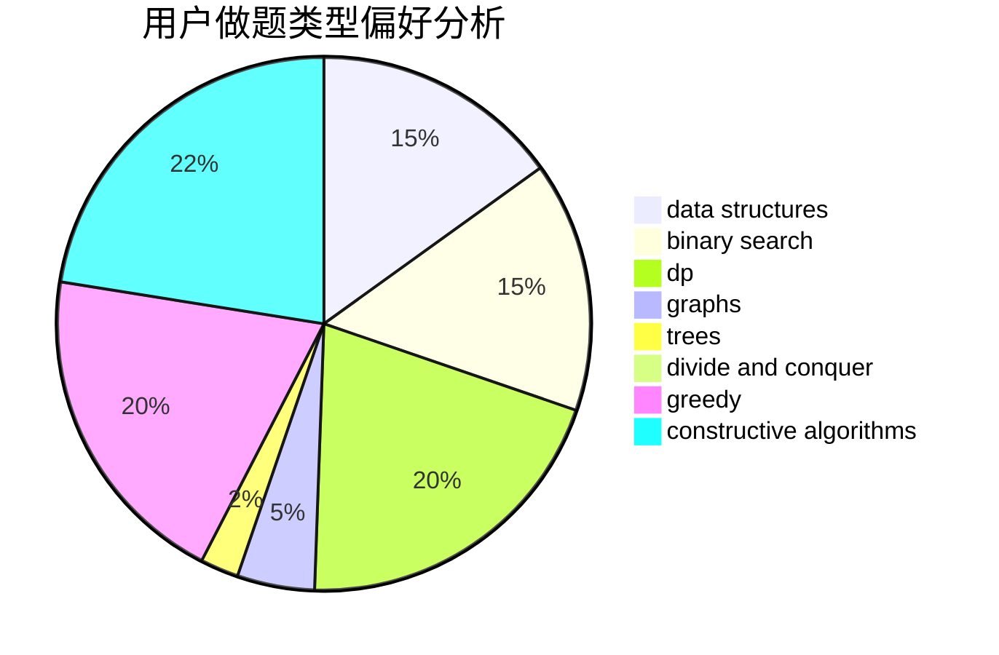
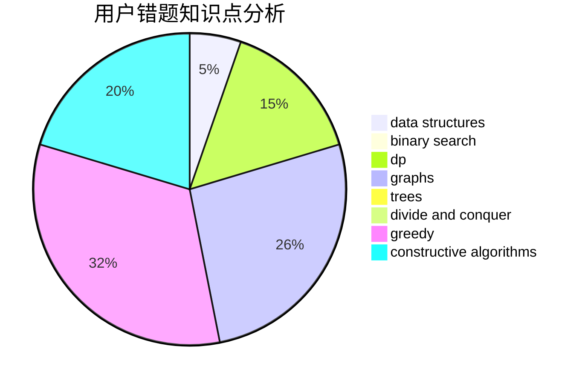

# UPCLDXXX

<!-- tabs:start -->

#### **用户提交结果分析**

#### **用户做题类型偏好分析**

#### **用户错题知识点分析**

<!-- tabs:end -->
# 推荐题目
[1483F](https://codeforces.com/contest/1483/problem/F)		dsu,graphs,sortings,trees		  
[1425A](https://codeforces.com/contest/1425/problem/A)		games,
                        greedy		  
[631D](https://codeforces.com/contest/631/problem/D)		data structures,
                        hashing,
                        implementation,
                        string suffix structures,
                        strings		  
[1272B](https://codeforces.com/contest/1272/problem/B)		constructive algorithms,
                        greedy,
                        implementation		  
[762B](https://codeforces.com/contest/762/problem/B)		greedy,
                        implementation,
                        sortings,
                        two pointers		  
[266B](https://codeforces.com/contest/266/problem/B)		constructive algorithms,
                        graph matchings,
                        implementation,
                        shortest paths		  
[295C](https://codeforces.com/contest/295/problem/C)		combinatorics,
                        dp,
                        graphs,
                        shortest paths		  
[738D](https://codeforces.com/contest/738/problem/D)		dsu,graphs,sortings,trees		  
[1335A](https://codeforces.com/contest/1335/problem/A)		math		  
[229D](https://codeforces.com/contest/229/problem/D)		dp,
                        greedy,
                        two pointers		  
