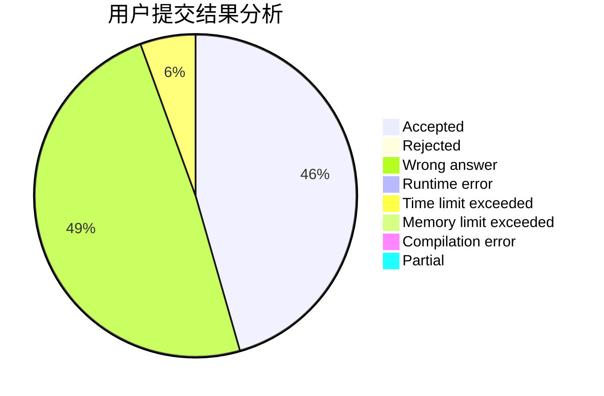
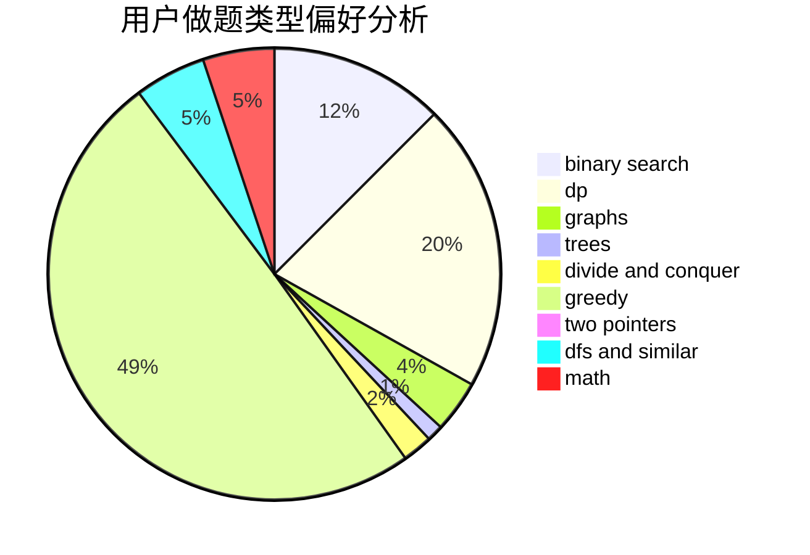

# UPCLDXXX

<!-- tabs:start -->

#### **用户提交结果分析**

#### **用户做题类型偏好分析**

<!-- tabs:end -->
# 推荐题目
[1491D](https://codeforces.com/contest/1491/problem/D)
[1433D](https://codeforces.com/contest/1433/problem/D)
[662C](https://codeforces.com/contest/662/problem/C)
[1281D](https://codeforces.com/contest/1281/problem/D)
[780F](https://codeforces.com/contest/780/problem/F)
[282A](https://codeforces.com/contest/282/problem/A)
[312A](https://codeforces.com/contest/312/problem/A)
[759D](https://codeforces.com/contest/759/problem/D)
[1342A](https://codeforces.com/contest/1342/problem/A)
[249E](https://codeforces.com/contest/249/problem/E)
