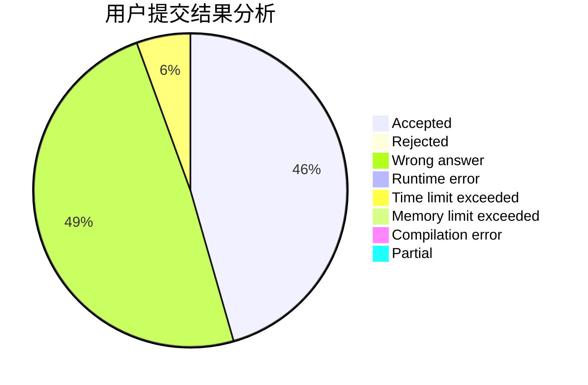
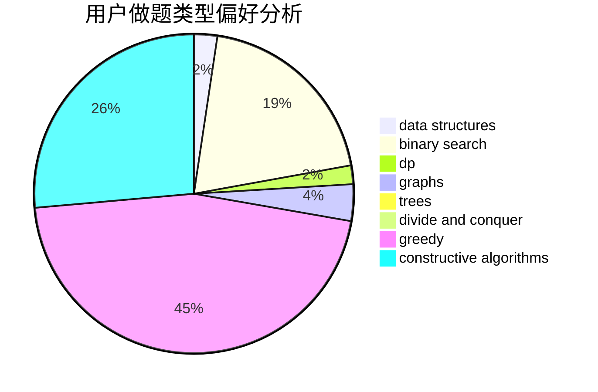
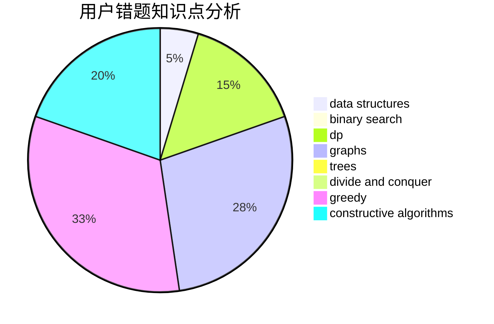

# UPCLDXXX

<!-- tabs:start -->

#### **用户提交结果分析**

#### **用户做题类型偏好分析**

#### **用户错题知识点分析**

<!-- tabs:end -->
# 推荐题目
[1491D](https://codeforces.com/contest/1491/problem/D)		bitmasks,
                        constructive algorithms,
                        dp,
                        greedy,
                        math		  
[1433D](https://codeforces.com/contest/1433/problem/D)		constructive algorithms,
                        dfs and similar		  
[662C](https://codeforces.com/contest/662/problem/C)		bitmasks,
                        brute force,
                        divide and conquer,
                        dp,
                        fft,
                        math		  
[1281D](https://codeforces.com/contest/1281/problem/D)		dsu,graphs,sortings,trees		  
[780F](https://codeforces.com/contest/780/problem/F)		bitmasks,
                        dp,
                        graphs,
                        matrices		  
[282A](https://codeforces.com/contest/282/problem/A)		implementation		  
[312A](https://codeforces.com/contest/312/problem/A)		implementation,
                        strings		  
[759D](https://codeforces.com/contest/759/problem/D)		dsu,graphs,sortings,trees		  
[1342A](https://codeforces.com/contest/1342/problem/A)		greedy,
                        math		  
[249E](https://codeforces.com/contest/249/problem/E)		math		  
