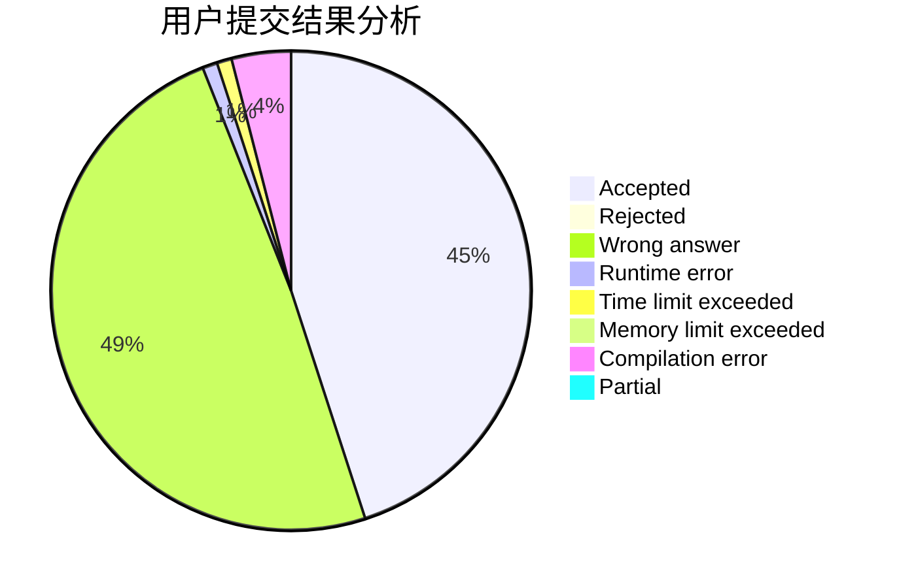
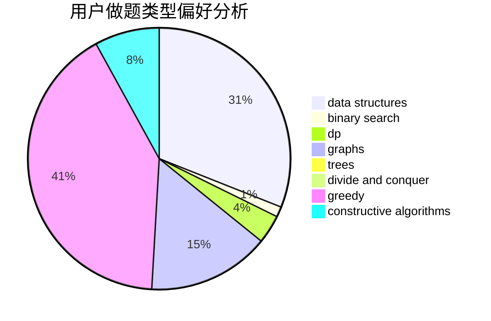

# UTix

<!-- tabs:start -->

#### **用户提交结果分析**

#### **用户做题类型偏好分析**

#### **用户错题知识点分析**

<!-- tabs:end -->
# 推荐题目
[1434E](https://codeforces.com/contest/1434/problem/E)		dsu,
                        games		  
[1197B](https://codeforces.com/contest/1197/problem/B)		greedy,
                        implementation		  
[1129B](https://codeforces.com/contest/1129/problem/B)		constructive algorithms		  
[1423I](https://codeforces.com/contest/1423/problem/I)		bitmasks		  
[358D](https://codeforces.com/contest/358/problem/D)		dp,
                        greedy		  
[500B](https://codeforces.com/contest/500/problem/B)		dfs and similar,
                        dsu,
                        graphs,
                        greedy,
                        math,
                        sortings		  
[343B](https://codeforces.com/contest/343/problem/B)		data structures,
                        greedy,
                        implementation		  
[1217B](https://codeforces.com/contest/1217/problem/B)		greedy,
                        math		  
[1339E](https://codeforces.com/contest/1339/problem/E)		dsu,graphs,sortings,trees		  
[729B](https://codeforces.com/contest/729/problem/B)		dp,
                        implementation		  
