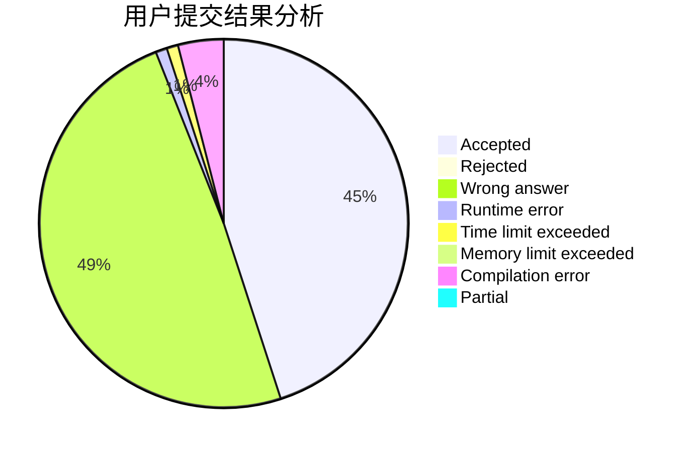
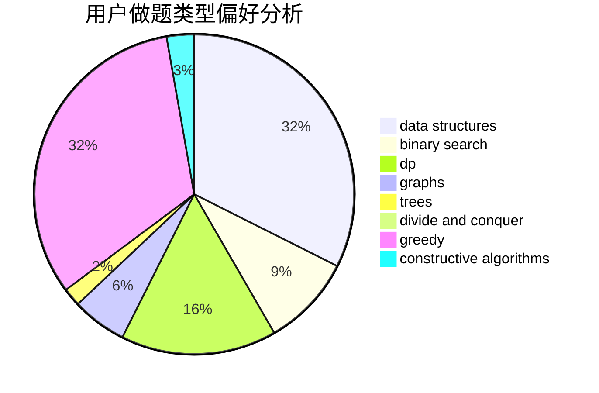

# UTix

<!-- tabs:start -->

#### **用户提交结果分析**

#### **用户做题类型偏好分析**

#### **用户错题知识点分析**

<!-- tabs:end -->
# 推荐题目
[1444E](https://codeforces.com/contest/1444/problem/E)		brute force,
                        dfs and similar,
                        dp,
                        interactive,
                        trees		  
[1200D](https://codeforces.com/contest/1200/problem/D)		brute force,
                        data structures,
                        dp,
                        implementation,
                        two pointers		  
[1131B](https://codeforces.com/contest/1131/problem/B)		greedy,
                        implementation		  
[1431D](https://codeforces.com/contest/1431/problem/D)		*special problem,
                        greedy		  
[383E](https://codeforces.com/contest/383/problem/E)		combinatorics,
                        divide and conquer,
                        dp		  
[521B](https://codeforces.com/contest/521/problem/B)		dsu,graphs,sortings,trees		  
[36C](https://codeforces.com/contest/36/problem/C)		geometry,
                        implementation		  
[1223F](https://codeforces.com/contest/1223/problem/F)		data structures,
                        divide and conquer,
                        dp,
                        hashing		  
[1346E](https://codeforces.com/contest/1346/problem/E)		*special problem,
                        dp,
                        graphs		  
[746B](https://codeforces.com/contest/746/problem/B)		implementation,
                        strings		  
