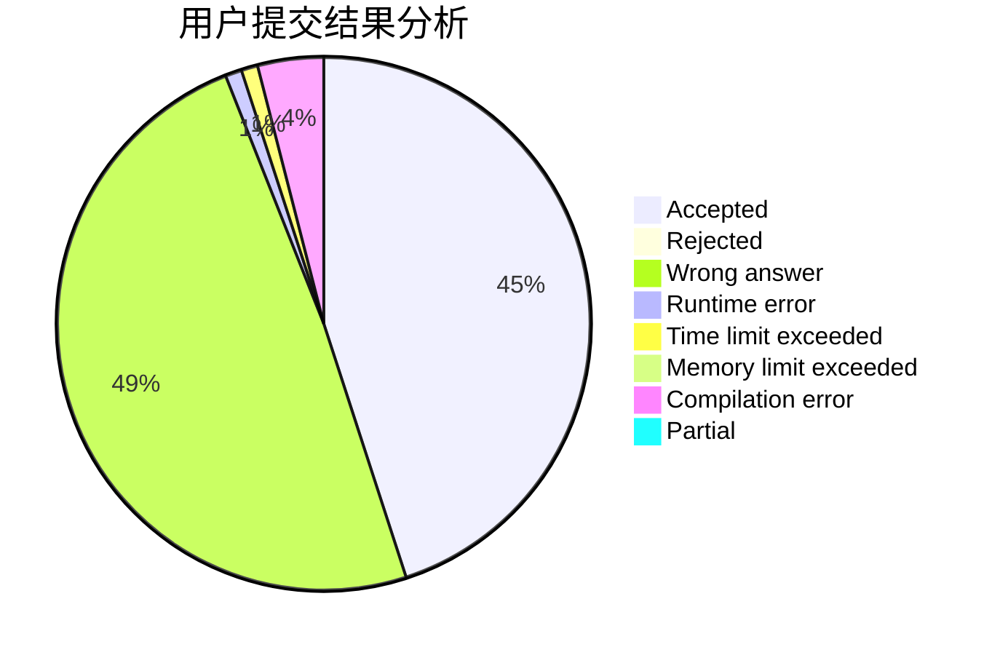
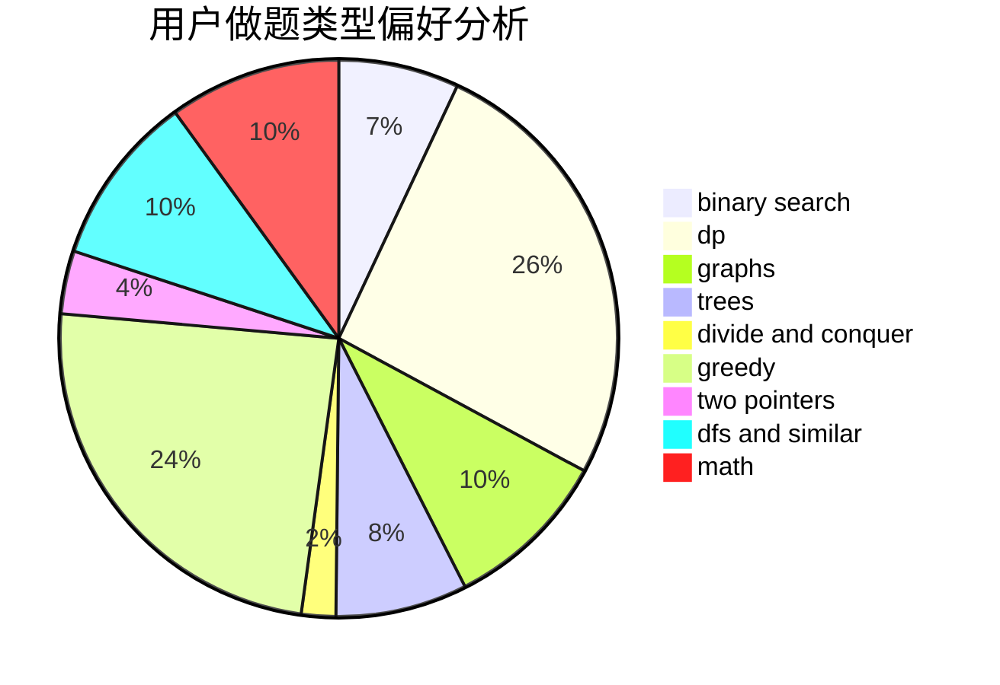

# UTix

<!-- tabs:start -->

#### **用户提交结果分析**

#### **用户做题类型偏好分析**

<!-- tabs:end -->
# 推荐题目
[1444E](https://codeforces.com/contest/1444/problem/E)
[1200D](https://codeforces.com/contest/1200/problem/D)
[1131B](https://codeforces.com/contest/1131/problem/B)
[1431D](https://codeforces.com/contest/1431/problem/D)
[383E](https://codeforces.com/contest/383/problem/E)
[521B](https://codeforces.com/contest/521/problem/B)
[36C](https://codeforces.com/contest/36/problem/C)
[1223F](https://codeforces.com/contest/1223/problem/F)
[1346E](https://codeforces.com/contest/1346/problem/E)
[746B](https://codeforces.com/contest/746/problem/B)
