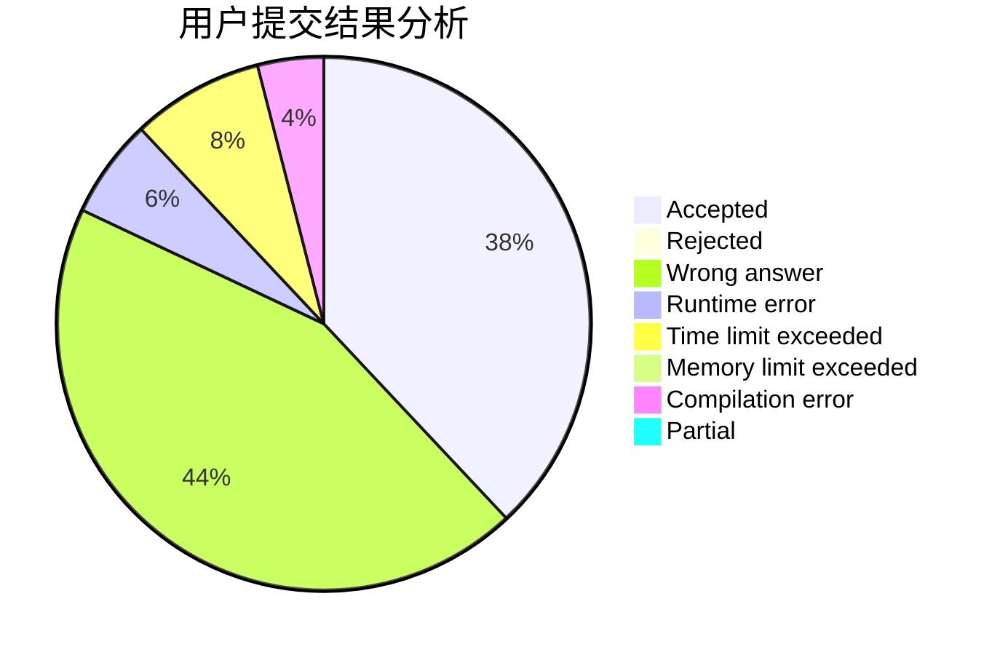
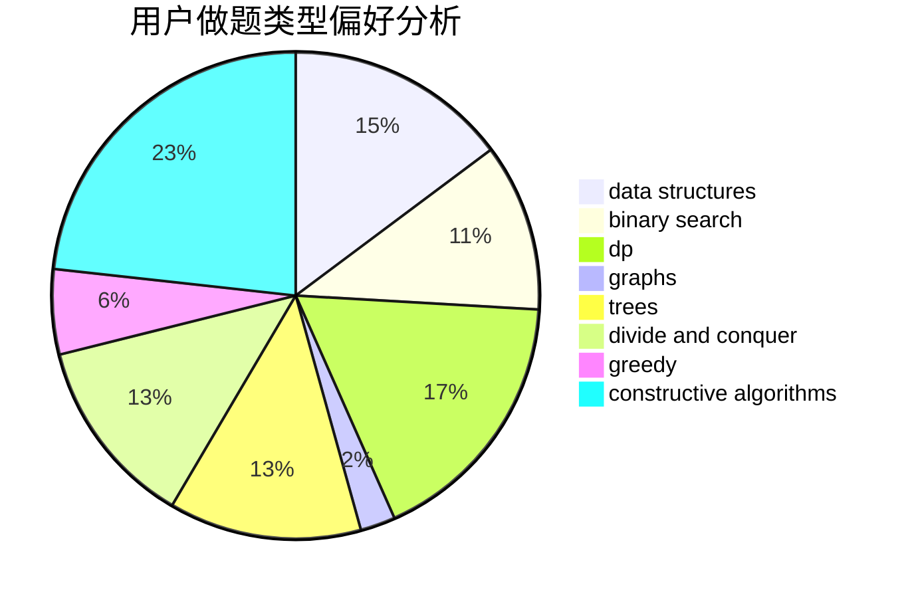
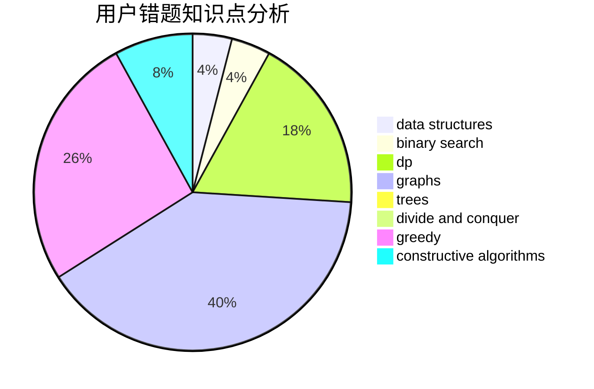

# UltiMadow

<!-- tabs:start -->

#### **用户提交结果分析**

#### **用户做题类型偏好分析**

#### **用户错题知识点分析**

<!-- tabs:end -->
# 推荐题目
[559A](https://codeforces.com/contest/559/problem/A)		brute force,
                        geometry,
                        math		  
[896A](https://codeforces.com/contest/896/problem/A)		binary search,
                        dfs and similar		  
[1220E](https://codeforces.com/contest/1220/problem/E)		dfs and similar,
                        dp,
                        dsu,
                        graphs,
                        greedy,
                        trees		  
[279B](https://codeforces.com/contest/279/problem/B)		binary search,
                        brute force,
                        implementation,
                        two pointers		  
[582A](https://codeforces.com/contest/582/problem/A)		constructive algorithms,
                        greedy,
                        number theory		  
[732B](https://codeforces.com/contest/732/problem/B)		dp,
                        greedy		  
[36B](https://codeforces.com/contest/36/problem/B)		implementation		  
[496B](https://codeforces.com/contest/496/problem/B)		brute force,
                        constructive algorithms,
                        implementation		  
[600C](https://codeforces.com/contest/600/problem/C)		constructive algorithms,
                        greedy,
                        strings		  
[715A](https://codeforces.com/contest/715/problem/A)		constructive algorithms,
                        math		  
