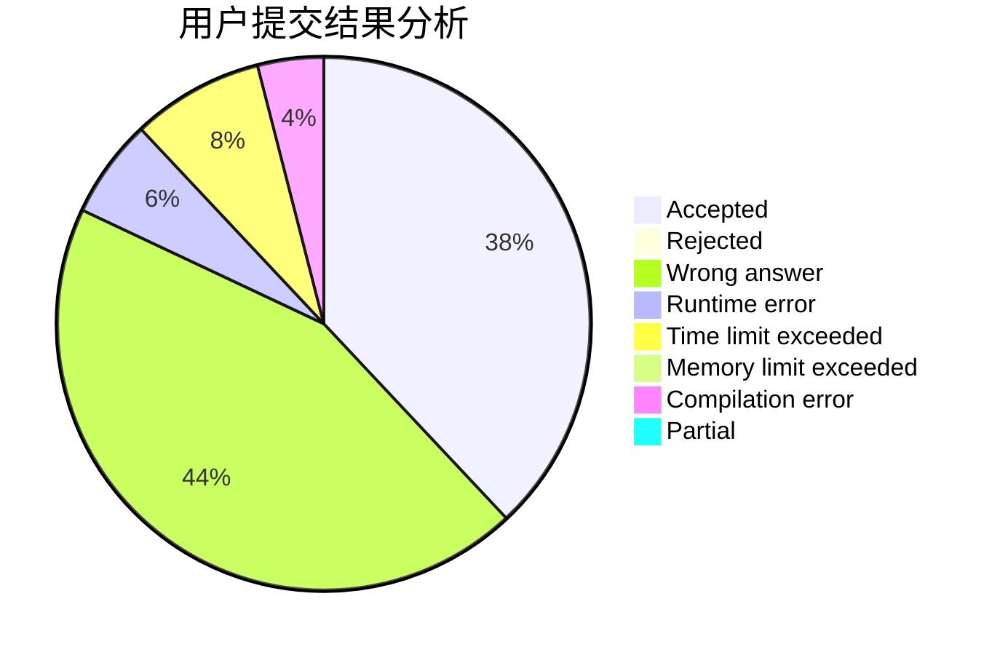
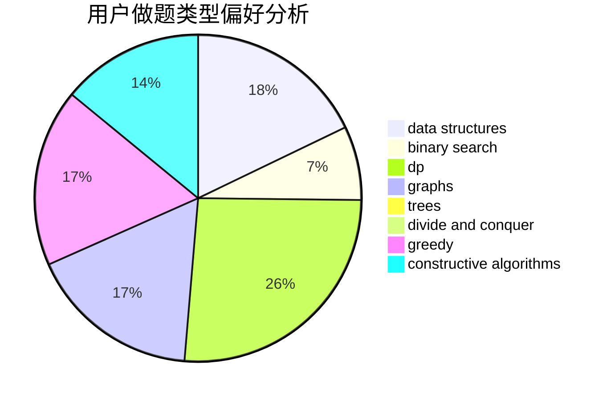
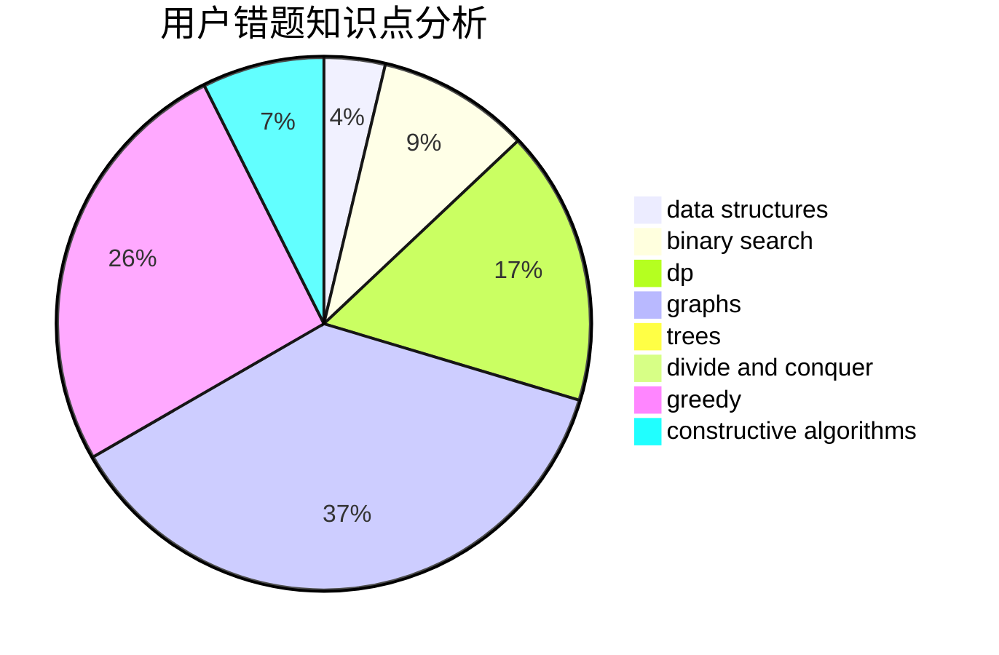

# UltiMadow

<!-- tabs:start -->

#### **用户提交结果分析**

#### **用户做题类型偏好分析**

#### **用户错题知识点分析**

<!-- tabs:end -->
# 推荐题目
[536D](https://codeforces.com/contest/536/problem/D)		dp,
                        games		  
[875F](https://codeforces.com/contest/875/problem/F)		dsu,
                        graphs,
                        greedy		  
[1215A](https://codeforces.com/contest/1215/problem/A)		greedy,
                        implementation,
                        math		  
[260D](https://codeforces.com/contest/260/problem/D)		constructive algorithms,
                        dsu,
                        graphs,
                        greedy,
                        trees		  
[559C](https://codeforces.com/contest/559/problem/C)		combinatorics,
                        dp,
                        math,
                        number theory		  
[713A](https://codeforces.com/contest/713/problem/A)		data structures,
                        implementation		  
[343A](https://codeforces.com/contest/343/problem/A)		math,
                        number theory		  
[476D](https://codeforces.com/contest/476/problem/D)		constructive algorithms,
                        greedy,
                        math		  
[580A](https://codeforces.com/contest/580/problem/A)		brute force,
                        dp,
                        implementation		  
[698C](https://codeforces.com/contest/698/problem/C)		bitmasks,
                        dp,
                        math,
                        probabilities		  
