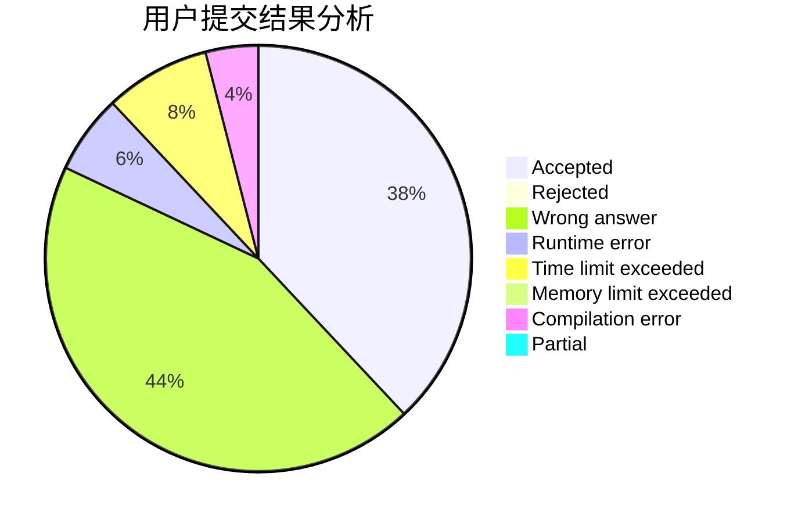
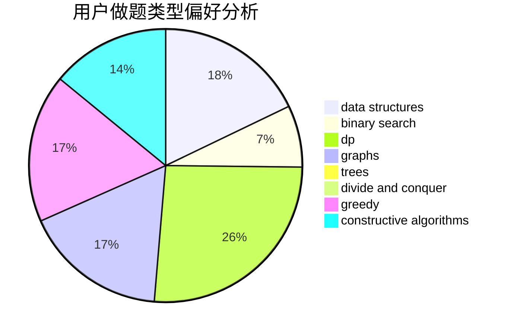
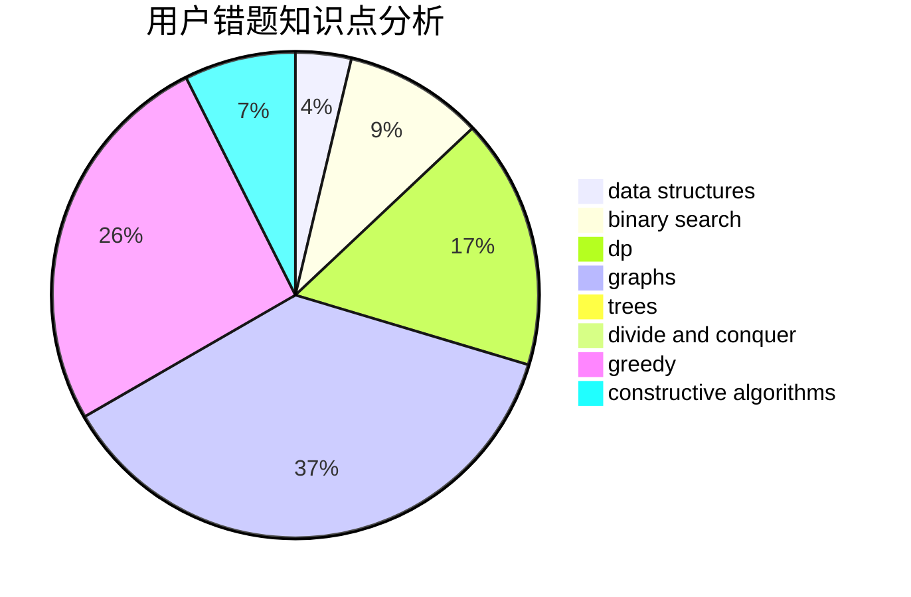

# UltiMadow
<!-- tabs:start -->
#### **用户提交结果分析**

#### **用户做题类型偏好分析**

#### **用户错题知识点分析**

<!-- tabs:end -->
# 推荐题目
[Royal Questions](http://codeforces.com/problemset/problem/875/F)		dsu,
                        graphs,
                        greedy		  
[Yellow Cards](http://codeforces.com/problemset/problem/1215/A)		greedy,
                        implementation,
                        math		  
[Tavas in Kansas](http://codeforces.com/problemset/problem/536/D)		dp,
                        games		  
[Black and White Tree](http://codeforces.com/problemset/problem/260/D)		constructive algorithms,
                        dsu,
                        graphs,
                        greedy,
                        trees		  
[Sonya and Queries](http://codeforces.com/problemset/problem/713/A)		data structures,
                        implementation		  
[Rational Resistance](http://codeforces.com/problemset/problem/343/A)		math,
                        number theory		  
[Multiplicity](http://codeforces.com/problemset/problem/1061/C)		data structures,
                        dp,
                        implementation,
                        math,
                        number theory		  
[The World Is Just a Programming Task (Hard Version)](https://codeforces.com/contest/1248/problem/D2)		implementation		  
[Mishka and trip](http://codeforces.com/problemset/problem/703/B)		implementation,
                        math		  
[Circles of Waiting](http://codeforces.com/problemset/problem/963/E)		math		  
<!-- tabs:start -->
#### **data structures**
[Royal Questions](http://codeforces.com/problemset/problem/713/A)		data structures,
                        implementation		  
[Yellow Cards](http://codeforces.com/problemset/problem/1061/C)		data structures,
                        dp,
                        implementation,
                        math,
                        number theory		  
[Tavas in Kansas](http://codeforces.com/problemset/problem/913/D)		binary search,
                        brute force,
                        data structures,
                        greedy,
                        sortings		  
[Black and White Tree](http://codeforces.com/problemset/problem/1051/G)		data structures,
                        dsu,
                        greedy		  
[Sonya and Queries](http://codeforces.com/problemset/problem/1446/D1)		data structures,
                        greedy		  
[Rational Resistance](http://codeforces.com/problemset/problem/1454/F)		binary search,
                        data structures,
                        greedy,
                        two pointers		  
[Multiplicity](http://codeforces.com/problemset/problem/1288/E)		data structures		  
[The World Is Just a Programming Task (Hard Version)](http://codeforces.com/problemset/problem/1089/K)		data structures		  
[Mishka and trip](http://codeforces.com/problemset/problem/1393/B)		constructive algorithms,
                        data structures,
                        greedy,
                        implementation		  
[Circles of Waiting](http://codeforces.com/problemset/problem/1080/F)		data structures,
                        interactive,
                        sortings		  
#### **binary search**
[Royal Questions](http://codeforces.com/problemset/problem/913/D)		binary search,
                        brute force,
                        data structures,
                        greedy,
                        sortings		  
[Yellow Cards](http://codeforces.com/problemset/problem/1323/B)		binary search,
                        greedy,
                        implementation		  
[Tavas in Kansas](http://codeforces.com/problemset/problem/1454/F)		binary search,
                        data structures,
                        greedy,
                        two pointers		  
[Black and White Tree](http://codeforces.com/problemset/problem/1492/C)		binary search,
                        data structures,
                        dp,
                        greedy,
                        two pointers		  
[Sonya and Queries](http://codeforces.com/problemset/problem/1463/D)		binary search,
                        constructive algorithms,
                        greedy,
                        two pointers		  
[Rational Resistance](http://codeforces.com/problemset/problem/1490/G)		binary search,
                        data structures,
                        math		  
[Multiplicity](http://codeforces.com/problemset/problem/1479/D)		binary search,
                        bitmasks,
                        brute force,
                        data structures,
                        probabilities,
                        trees		  
[The World Is Just a Programming Task (Hard Version)](http://codeforces.com/problemset/problem/1436/E)		binary search,
                        data structures,
                        two pointers		  
[Mishka and trip](http://codeforces.com/problemset/problem/1461/D)		binary search,
                        brute force,
                        data structures,
                        divide and conquer,
                        implementation,
                        sortings		  
[Circles of Waiting](http://codeforces.com/problemset/problem/1493/C)		binary search,
                        brute force,
                        constructive algorithms,
                        greedy,
                        strings		  
#### **dp**
[Royal Questions](http://codeforces.com/problemset/problem/536/D)		dp,
                        games		  
[Yellow Cards](http://codeforces.com/problemset/problem/1061/C)		data structures,
                        dp,
                        implementation,
                        math,
                        number theory		  
[Tavas in Kansas](http://codeforces.com/problemset/problem/580/A)		brute force,
                        dp,
                        implementation		  
[Black and White Tree](http://codeforces.com/problemset/problem/559/C)		combinatorics,
                        dp,
                        math,
                        number theory		  
[Sonya and Queries](http://codeforces.com/problemset/problem/159/D)		*special problem,
                        brute force,
                        dp,
                        strings		  
[Rational Resistance](http://codeforces.com/problemset/problem/1303/E)		dp,
                        strings		  
[Multiplicity](http://codeforces.com/problemset/problem/698/C)		bitmasks,
                        dp,
                        math,
                        probabilities		  
[The World Is Just a Programming Task (Hard Version)](http://codeforces.com/problemset/problem/1077/F1)		dp		  
[Mishka and trip](http://codeforces.com/problemset/problem/1467/D)		combinatorics,
                        dp,
                        math		  
[Circles of Waiting](https://codeforces.com/contest/480/problem/C)		combinatorics,
                        dp		  
#### **graph**
[Royal Questions](http://codeforces.com/problemset/problem/875/F)		dsu,
                        graphs,
                        greedy		  
[Yellow Cards](http://codeforces.com/problemset/problem/260/D)		constructive algorithms,
                        dsu,
                        graphs,
                        greedy,
                        trees		  
[Tavas in Kansas](http://codeforces.com/problemset/problem/723/D)		dfs and similar,
                        dsu,
                        graphs,
                        greedy,
                        implementation		  
[Black and White Tree](http://codeforces.com/problemset/problem/571/C)		constructive algorithms,
                        dfs and similar,
                        graphs,
                        greedy		  
[Sonya and Queries](http://codeforces.com/problemset/problem/1214/E)		constructive algorithms,
                        graphs,
                        math,
                        sortings,
                        trees		  
[Rational Resistance](http://codeforces.com/problemset/problem/160/D)		dfs and similar,
                        dsu,
                        graphs,
                        sortings		  
[Multiplicity](http://codeforces.com/problemset/problem/1473/E)		graphs,
                        shortest paths		  
[The World Is Just a Programming Task (Hard Version)](http://codeforces.com/problemset/problem/1487/C)		brute force,
                        constructive algorithms,
                        dfs and similar,
                        graphs,
                        greedy,
                        implementation,
                        math		  
[Mishka and trip](http://codeforces.com/problemset/problem/1437/C)		dp,
                        flows,
                        graph matchings,
                        greedy,
                        math,
                        sortings		  
[Circles of Waiting](http://codeforces.com/problemset/problem/1470/D)		constructive algorithms,
                        dfs and similar,
                        graph matchings,
                        graphs,
                        greedy		  
#### **trees**
[Royal Questions](http://codeforces.com/problemset/problem/260/D)		constructive algorithms,
                        dsu,
                        graphs,
                        greedy,
                        trees		  
[Yellow Cards](http://codeforces.com/problemset/problem/1214/E)		constructive algorithms,
                        graphs,
                        math,
                        sortings,
                        trees		  
[Tavas in Kansas](http://codeforces.com/problemset/problem/1479/D)		binary search,
                        bitmasks,
                        brute force,
                        data structures,
                        probabilities,
                        trees		  
[Black and White Tree](http://codeforces.com/problemset/problem/1511/C)		brute force,
                        data structures,
                        implementation,
                        trees		  
[Sonya and Queries](http://codeforces.com/problemset/problem/1499/F)		combinatorics,
                        dfs and similar,
                        dp,
                        trees		  
[Rational Resistance](http://codeforces.com/problemset/problem/1491/E)		brute force,
                        dfs and similar,
                        divide and conquer,
                        number theory,
                        trees		  
[Multiplicity](http://codeforces.com/problemset/problem/1466/D)		data structures,
                        greedy,
                        sortings,
                        trees		  
[The World Is Just a Programming Task (Hard Version)](http://codeforces.com/problemset/problem/1495/D)		combinatorics,
                        dfs and similar,
                        graphs,
                        math,
                        shortest paths,
                        trees		  
[Mishka and trip](http://codeforces.com/problemset/problem/1303/G)		data structures,
                        divide and conquer,
                        geometry,
                        trees		  
[Circles of Waiting](http://codeforces.com/problemset/problem/1454/E)		combinatorics,
                        dfs and similar,
                        graphs,
                        trees		  
#### **divide and conquer**
[Royal Questions](http://codeforces.com/problemset/problem/1461/D)		binary search,
                        brute force,
                        data structures,
                        divide and conquer,
                        implementation,
                        sortings		  
[Yellow Cards](http://codeforces.com/problemset/problem/1466/G)		combinatorics,
                        divide and conquer,
                        hashing,
                        math,
                        string suffix structures,
                        strings		  
[Tavas in Kansas](http://codeforces.com/problemset/problem/1490/D)		dfs and similar,
                        divide and conquer,
                        implementation		  
[Black and White Tree](https://codeforces.com/contest/1483/problem/C)		data structures,
                        divide and conquer,
                        dp		  
[Sonya and Queries](http://codeforces.com/problemset/problem/1491/E)		brute force,
                        dfs and similar,
                        divide and conquer,
                        number theory,
                        trees		  
[Rational Resistance](http://codeforces.com/problemset/problem/1303/G)		data structures,
                        divide and conquer,
                        geometry,
                        trees		  
[Multiplicity](http://codeforces.com/problemset/problem/1494/D)		constructive algorithms,
                        data structures,
                        dfs and similar,
                        divide and conquer,
                        dsu,
                        greedy,
                        sortings,
                        trees		  
[The World Is Just a Programming Task (Hard Version)](http://codeforces.com/problemset/problem/1482/E)		data structures,
                        divide and conquer,
                        dp		  
[Mishka and trip](http://codeforces.com/problemset/problem/566/C)		dfs and similar,
                        divide and conquer,
                        trees		  
[Circles of Waiting](http://codeforces.com/problemset/problem/1428/F)		binary search,
                        data structures,
                        divide and conquer,
                        dp,
                        two pointers		  
#### **greedy**
[Royal Questions](http://codeforces.com/problemset/problem/875/F)		dsu,
                        graphs,
                        greedy		  
[Yellow Cards](http://codeforces.com/problemset/problem/1215/A)		greedy,
                        implementation,
                        math		  
[Tavas in Kansas](http://codeforces.com/problemset/problem/260/D)		constructive algorithms,
                        dsu,
                        graphs,
                        greedy,
                        trees		  
[Black and White Tree](http://codeforces.com/problemset/problem/723/D)		dfs and similar,
                        dsu,
                        graphs,
                        greedy,
                        implementation		  
[Sonya and Queries](http://codeforces.com/problemset/problem/571/C)		constructive algorithms,
                        dfs and similar,
                        graphs,
                        greedy		  
[Rational Resistance](http://codeforces.com/problemset/problem/913/D)		binary search,
                        brute force,
                        data structures,
                        greedy,
                        sortings		  
[Multiplicity](http://codeforces.com/problemset/problem/1051/G)		data structures,
                        dsu,
                        greedy		  
[The World Is Just a Programming Task (Hard Version)](http://codeforces.com/problemset/problem/1375/E)		constructive algorithms,
                        greedy,
                        sortings		  
[Mishka and trip](http://codeforces.com/problemset/problem/476/D)		constructive algorithms,
                        greedy,
                        math		  
[Circles of Waiting](http://codeforces.com/problemset/problem/1323/B)		binary search,
                        greedy,
                        implementation		  
#### **constructive algorithms**
[Royal Questions](http://codeforces.com/problemset/problem/260/D)		constructive algorithms,
                        dsu,
                        graphs,
                        greedy,
                        trees		  
[Yellow Cards](http://codeforces.com/problemset/problem/571/C)		constructive algorithms,
                        dfs and similar,
                        graphs,
                        greedy		  
[Tavas in Kansas](http://codeforces.com/problemset/problem/1214/E)		constructive algorithms,
                        graphs,
                        math,
                        sortings,
                        trees		  
[Black and White Tree](http://codeforces.com/problemset/problem/1166/B)		constructive algorithms,
                        math,
                        number theory		  
[Sonya and Queries](http://codeforces.com/problemset/problem/1375/E)		constructive algorithms,
                        greedy,
                        sortings		  
[Rational Resistance](http://codeforces.com/problemset/problem/476/D)		constructive algorithms,
                        greedy,
                        math		  
[Multiplicity](http://codeforces.com/problemset/problem/1375/A)		constructive algorithms,
                        math		  
[The World Is Just a Programming Task (Hard Version)](https://codeforces.com/contest/1173/problem/F)		constructive algorithms		  
[Mishka and trip](http://codeforces.com/problemset/problem/1393/B)		constructive algorithms,
                        data structures,
                        greedy,
                        implementation		  
[Circles of Waiting](http://codeforces.com/problemset/problem/1364/C)		brute force,
                        constructive algorithms,
                        greedy		  
#### **sortings**
[Royal Questions](http://codeforces.com/problemset/problem/1214/E)		constructive algorithms,
                        graphs,
                        math,
                        sortings,
                        trees		  
[Yellow Cards](http://codeforces.com/problemset/problem/913/D)		binary search,
                        brute force,
                        data structures,
                        greedy,
                        sortings		  
[Tavas in Kansas](http://codeforces.com/problemset/problem/1375/E)		constructive algorithms,
                        greedy,
                        sortings		  
[Black and White Tree](http://codeforces.com/problemset/problem/160/D)		dfs and similar,
                        dsu,
                        graphs,
                        sortings		  
[Sonya and Queries](http://codeforces.com/problemset/problem/1080/F)		data structures,
                        interactive,
                        sortings		  
[Rational Resistance](https://codeforces.com/contest/1496/problem/C)		geometry,
                        greedy,
                        math,
                        sortings		  
[Multiplicity](http://codeforces.com/problemset/problem/1495/A)		geometry,
                        greedy,
                        math,
                        sortings		  
[The World Is Just a Programming Task (Hard Version)](http://codeforces.com/problemset/problem/1497/A)		brute force,
                        data structures,
                        greedy,
                        sortings		  
[Mishka and trip](http://codeforces.com/problemset/problem/1427/A)		math,
                        sortings		  
[Circles of Waiting](http://codeforces.com/problemset/problem/1461/D)		binary search,
                        brute force,
                        data structures,
                        divide and conquer,
                        implementation,
                        sortings		  
<!-- tabs:end -->
